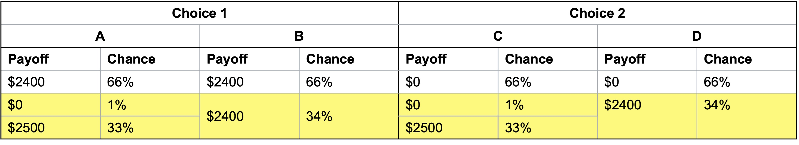

# Anomalies of expected utility theory

## The Allais Paradox {#sec-allais}

**Choice 1**: Choose one of the following bets:

Bet A:

-   \$2500 with probability: 33%
-   \$2400 with probability: 66%
-   \$0 with probability: 1%

Bet B:

-   \$2400 with probability: 100%

**Choice 2**: Choose one of the following bets:

Bet C:

-   \$2500 with probability: 33%\
-   \$0 with probability: 67%

Bet D:

-   \$2400 with probability: 34%
-   \$0 with probability: 66%

When @kahneman1979 ran this experiment 82% of participants chose option B and 83% of participants chose option C.

According to Expected Utility Theory, if an agent selects B:

$$
U(2400)>0.33U(2500)+0.66U(2400)+0.01U(0)
$$

$$
0.34U(2400)>0.33U(2500)+0.01U(0)
$$

According to Expected Utility Theory, if an agent selects C:

$$
0.33U(2500)+0.67U(0)> 0.34U(2400)+ 0.66U(0)
$$

$$
0.33U(2500)+0.01U(0)> 0.34U(2400)
$$

This is a contradiction. Under expected utility theory, if an agent chooses A it should choose C. And if the agent chooses B it should choose D. This phenomena is called the Allais Paradox after Maurice @allais1953, who first identified it.

Why does this occur? What axiom is being breached?

Here is another representation of the choices.

This second tabular representation is equivalent. I have split the outcomes in options B and C.

You can see that the bets contained in the bottom two rows are the same. For choice 1, they are paired with a 66% chance of winning \$2400, and for choice 2 a 66% chance of winning \$0.

Preferring B to A and C to D is a violation of the axiom of the [independence of irrelevant alternatives](@sec-independence): Under that axiom, two gambles mixed with an irrelevant third gamble will maintain the same order of preference as when the two are presented independently of the third gamble.

Recall that the formal definition for the independence of irrelevant alternatives axiom is that if:

-   $x$ and $y$ are lotteries with $x\succcurlyeq y$ and
-   $p$ is the probability that a third option $z$ is present, then:

$$pz+(1-p)x\succcurlyeq pz+(1-p)y$$

For each of the choices in our lottery:

-   $p=66%$

-   $x$ is a 100% chance of \$2400

-   $y$ is a 0.01/(1−0.66) chance of \$0 and 0.33/(1−0.66) chance of \$2500

-   $z$ is \$2400 in choice 1 and \$0 in choice 2, although $z$'s value should not matter due to its assumed irrelevance.

## Absurd rates of risk aversion {#sec-absurd}

I offer you the following one-off bet by flipping a coin:

> Head: You win \$550
>
> Tail: You lose \$500

Would you accept this bet?

@barberis2006 offered a real \$550:\$500 bet to experimental participants including those with substantial wealth (MBA students, hedge fund managers, etc.).

70% of the sample turned down the bet, included professional investors with wealth above \$10 million.

Under the axiom of diminishing marginal utility, we would conclude people are risk averse to small bets.

But, for sufficiently high levels of wealth, $U(x)$ is approximately linear and people always take favourable bets.

The minimum $U(x)$ curvature required to reconcile an investor with \$10 million investor downing a 50:50 bet as small as +\$550 or -\$500 would imply that agents reject immensely favourable bets, which is not realistic.

@rabin2000 showed that rejection of bets over moderate stakes can require absurd rates of risk aversion. For instance, if a person who acts consistent with expected utility theory always turns down a 50:50 bet to win \$110 or lose \$100 whatever their initial level of wealth, they will also turn down a 50:50 bet to win \$1 billion, lose \$1,000.

## Framing

@kahneman1984 reported the following experiment.

> A group of experimental participants were shown the following:
>
> Imagine that the U.S. is preparing for the outbreak of an unusual Asian disease, which is expected to kill 600 people. Two alternative programs to combat the disease have been proposed. Assume that the exact scientific estimates of the consequences of the programs are as follows:
>
> If Program A is adopted, 200 people will be saved.
>
> If Program B is adopted, there is a one-third probability that 600 people will be saved and a two-thirds probability that no people will be saved.
>
> Which of the two programs would you favour?

72% of participants chose option A.

Another group of experimental participants were shown the following:

> Imagine that the U.S. is preparing for the outbreak of an unusual Asian disease, which is expected to kill 600 people. Two alternative programs to combat the disease have been proposed. Assume that the exact scientific estimates of the consequences of the programs are as follows:
>
> If Program C is adopted, 400 people will die.
>
> If Program D is adopted, there is a one-third probability that nobody will die and a two-thirds probability that 600 people will die.
>
> Which of the two programs would you favour?

22% of participants chose option C.

72% of participants chose A and 22% of participants chose option C. Yet these two are equivalent.

## Reference points

Consider the following two scenarios:

-   You have not checked your share portfolio in a while. You expect it is worth around \$40,000. Today when you check, it is worth \$30,000. Do you feel rich or poor?

-   You have not checked your share portfolio in a while. You expect it is worth around \$20,000. Today when you check, it is worth \$30,000. Do you feel rich or poor?

Under expected utility theory, those two scenarios should feel the same as you have $U$(\$30,000) in both cases.
