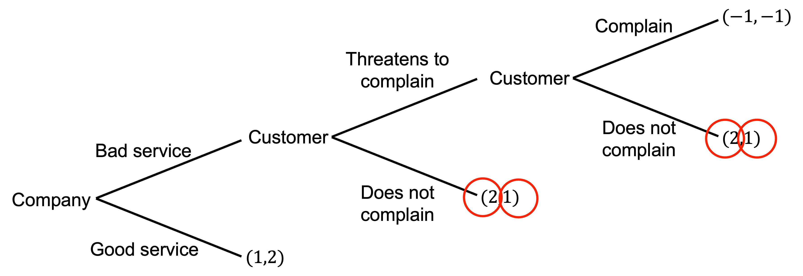
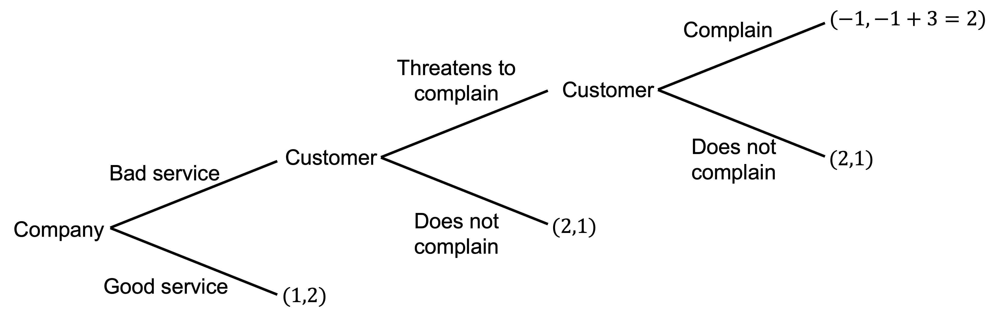
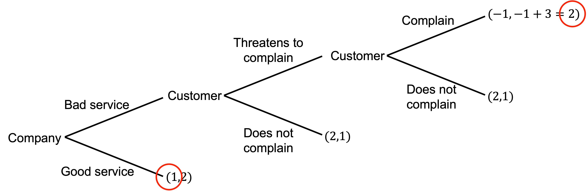
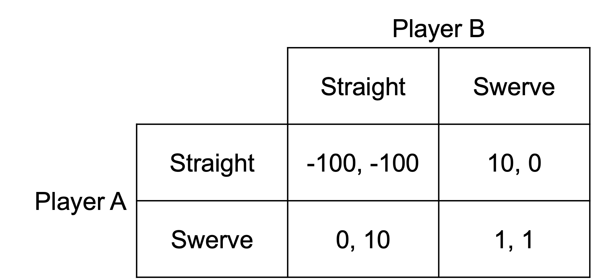
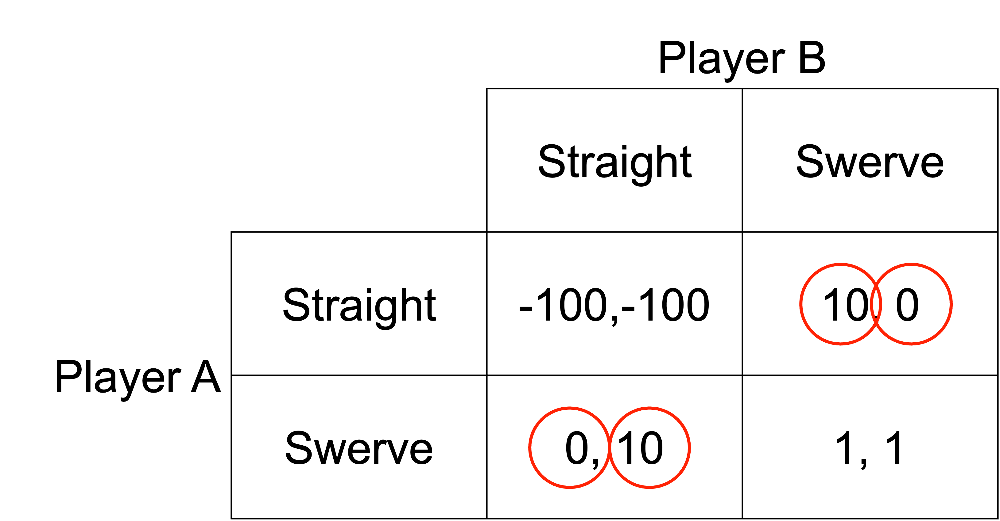
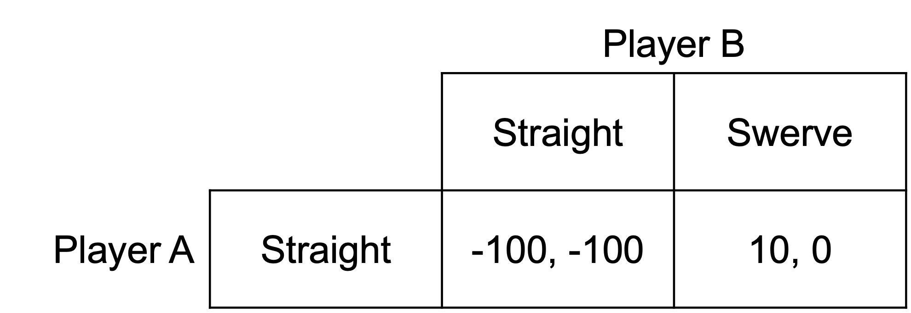

# Emotions

Emotions are mental states that signal positive or negative outcomes.

One function of emotions may be to act as a commitment device:

- The emotion of guilt can constrain a desire to “cheat” where cheating delivers a higher pay-off. This in turn may allow people to trust you.

- The emotion of anger may lead you to punish someone even where delivering the punishment also harms you. This in turn may lead people to be less likely to cheat you.

While this behaviour may appear “irrational”, it allows people to make credible commitments that in turn allow them to enter beneficial trades and cooperative arrangements, while being less likely to being cheated.

## Commitment

Consider the following quote from Richard Nixon:

>I call it the Madman Theory, Bob. I want the North Vietnamese to believe I've reached the point where I might do anything to stop the war. We'll just slip the word to them that, "for God's sake, you know Nixon is obsessed about communism. We can't restrain him when he's angry—and he has his hand on the nuclear button" and Ho Chi Minh himself will be in Paris in two days begging for peace.

Pushing the nuclear button is not in Nixon's interest, and from a purely rational perspective may not be a credible threat. But if a madman has his finger on the button, the calculation changes.

Recall our earlier example of a customer threatening to complain if they receive bad service. Complaining is costly.

We work through this problem by backward induction. At the final node for the customer, they can complain for a payoff of -1 or not complain for a payoff of 1. They will not complain.

The company, therefore, has a choice between providing good service for a payoff of 1 or bad service for a payoff of 2. They will provide bad service. The company has the same payoff for bad service regardless of the presence of the threat to complain as the threat is not credible.

For the customer's initial choice of whether to threaten to complain, it does not matter either way. Regardless of their threat, they receive bad service.

But what if the customer gets a strong sense of satisfaction from complaining worth +3? Then their payoffs become as follows:

The threat to complain is now credible. If they receive bad service, they complain for a payoff of 2 rather than not complain for a payoff of 1.image.png

The company now provides good service following a threat to complain. Absent that threat, they would provide bad service.

## Chicken

As another example, recall the game of chicken. Two players are driving toward each other. Whoever swerves first loses. If neither swerves, they crash and die.

There are two pure-strategy Nash equilibria: (Straight, Swerve) and (Swerve, Straight). If the other player swerves, they want to go straight. If the other player goes straight, they want to swerve. 

Now suppose player A is crazy. They are afraid of nothing and will never swerve. Player B knows this.

Player A’s craziness acts as a commitment device similar to that of removing the Steering Wheel. If player A will not swerve, Player B will.

The Nash equilibrium is (Straight, Swerve). The crazy player A wins the game of chicken.

