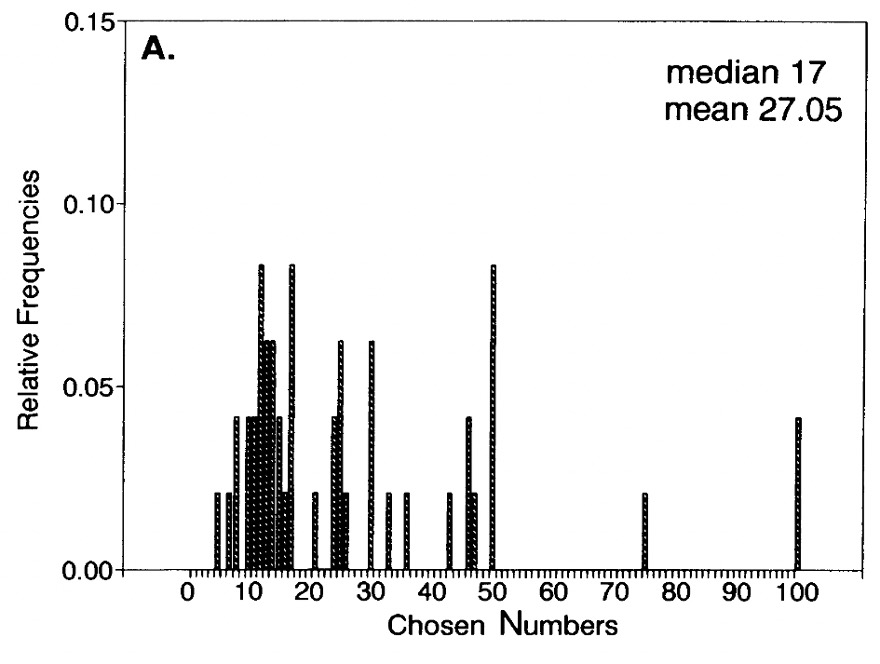
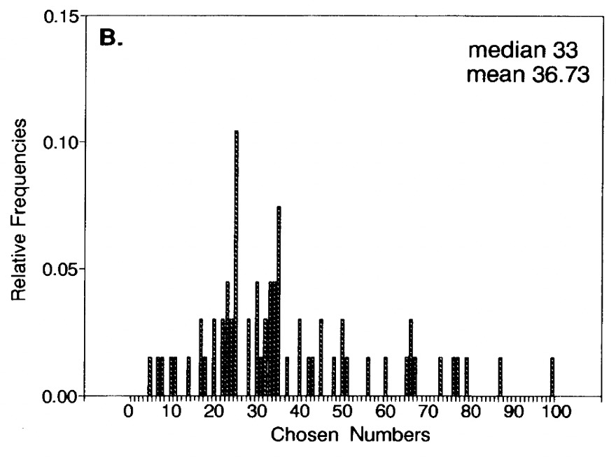
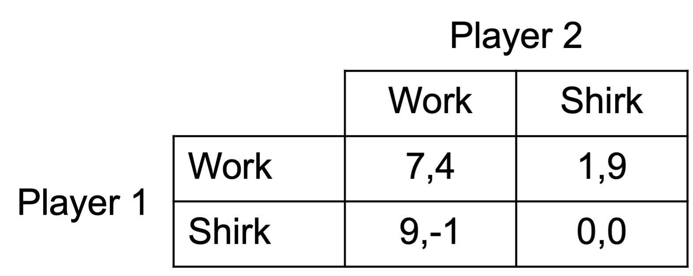
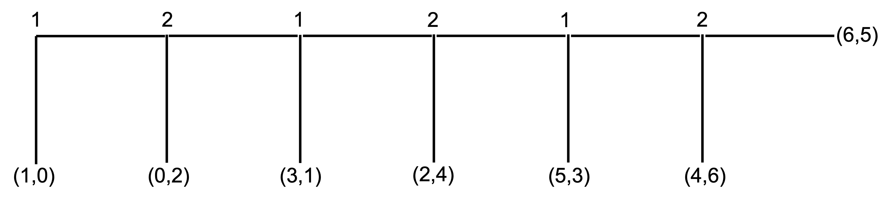
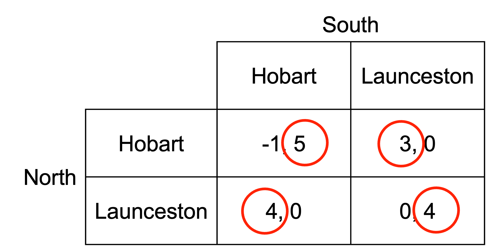

# Level-k thinking

The idea behind level-k thinking is that a player forms an expectation of what others will do and tries to be "one step ahead".

That is, a level-k player plays the best response to level-(k-1) players.

Level-0 players do not engage in strategic thinking. This is usually modelled as randomisation across all strategies.

Level-1 players assume other players are level-0 and act optimally conditional on this assumption.

Level-2 players assume other players are level-1 and act optimally conditional on this assumption.

And so on.

## Examples

### The beauty contest

To understand level-k thinking, consider the following thought experiment from @keynes1936.

> \[P\]rofessional investment may be likened to those newspaper competitions in which the competitors have to pick out the six prettiest faces from a hundred photographs, the prize being awarded to the competitor whose choice most nearly corresponds to the average preferences of the competitors as a whole; so that each competitor has to pick, not those faces which he himself finds prettiest, but those which he thinks likeliest to catch the fancy of the other competitors, all of whom are looking at the problem from the same point of view. It is not a case of choosing those which, to the best of one's judgment, are really the prettiest, nor even those which average opinion genuinely thinks the prettiest. We have reached the third degree where we devote our intelligences to anticipating what average opinion expects the average opinion to be. And there are some, I believe, who practise the fourth, fifth and higher degrees.

This thought experiment has since been developed into a game, the p-beauty contest (@moulin1986).

In the p-beauty contest, each of $n$ players pick a number $y\in[0,100]$.

The winner is the player whose chosen number is closest to the mean of all the chosen numbers ($\bar y$) multiplied by a parameter $p$. That is, the winner is the player with their chosen number closest to $p\bar y$.

$p$ is typically chosen such $0\leq p\leq 1$, with $p=1/2$ and $p=2/3$ common.

How might level-k players play this game?

Suppose $p=2/3$.

A level-0 player does not think strategically. We will have the level-0 player randomly select a number between 0 and 100.

The level-1 player will play the best response to level-0 players. If level-0 players select across the interval \[0, ..., 100\], the best response is:

$$
y_1=\frac{2}{3}\bar y=\frac{2}{3}\times 50=33.3
$$

The level-2 player will play the best response to level-1 players. If all other players are level-1 and select 33.3, the best response is:

$$
y_2=\frac{2}{3}\bar y=2/3\times 33.3=22.2
$$

The level-3 player will play the best response to level-2 players. If all other players are level-2 and select 22.2, the best response is:

$$
y_3=\frac{2}{3}\bar y=2/3\times 22.2=14.8
$$

And so on.

The following charts come from @nagel1995, with $p=1/2$ and $p=2/3$. The charts show the distribution of chosen numbers in the p-beauty contest.

In the chart with $p=2/3$, you can see spikes at 22.2 and 33.3, suggesting players are playing at level-2 and level-1 respectively. This matches with other experimental evidence on the p-beauty game, where there are few level-0 players. Most are level-1, level-2 and level-3.

::: {#fig-nagel1 layout-ncol="2"}

Choices by players of the p-beauty game
:::

The lab evidence doesn't necessarily imply that level-k is the "right model". Data and theory appear to match, but it is hard to know whether this is how subjects are thinking.

Finally, it is worth noting that in the Nash equilibrium, each player picks 0. This is because the best response to all other players picking 0 is to pick 0. For any higher number, everyone has an incentive to lower their choice. However, if playing against level-k players, selecting 0 is not the best approach.

### The assignment game with level-k thinking

Let's consider another example of level-k thinking involving a game called the assignment game.

Each player needs to decide if they will work or shirk. If they both work, they receive a good payoff. They receive an ever better payoff, however, if they shirk while the other works.

{width=60%}

Working through the payoffs for each player, if player B works, player A is better off shirking, receiving payoff of 9. If player B shirks, player 1 is better off working, receiving payoff of 1. If player A works, player 2 is better off shirking, receiving payoff of 9. If player A shirks, player B is still better off shirking, receiving payoff of 0.

There is a unique Nash equilibrium (work, shirk), with shirk the dominant strategy for Player B.

Consider, however, if instead of fully rational agents, we have level-k thinkers playing the game.

In this case, the outcome of the game will depend on the level of thinking of each player.

If both players are level-0, they will each play randomly.

At level-1, each player will play the best response to level-0 players. Each player determines this by calculating their best response to the random strategy of the other player.

For player A, their expected payoffs are calculated using the 50% probability with which player B could play each action.

The expected payoff from playing work is:

$$
\frac{1}{2}\times 7+\frac{1}{2}\times 1=4
$$

The expected payoff from playing shirk is:

$$
\frac{1}{2}\times 9+\frac{1}{2}\times 0=4.5
$$

A level-1 player A chooses to shirk.

For player B, their expected payoff from playing work is:

$$
\frac{1}{2}\times 4+\frac{1}{2}\times -1=1.5
$$

Their expected payoff from playing shirk is:

$$
\frac{1}{2}\times 9+\frac{1}{2}\times 0=4.5
$$

A level-1 player B also chooses to shirk.

If a player has a dominant strategy, they discover it at $k=1$. Any level-k thinker will always uses the dominant strategy for $k\geq 1$. In that case, we know that any player B with $k\geq 1$ will shirk.

What if each player is level 2?

Player A calculates their best response to a level-1 player B. A level-1 player B always plays shirk. Player A's best response to shirk is to work. The level-2 player A works.

Although we know a level-2 player B will shirk as as shirk is their dominant strategy, we can show this by considering their best response to a level-1 player A. A level-1 player A always plays shirk. Player B's best response to shirk is to shirk. The level-2 player B shirks.

At a certain level of thinking, the players will discover the Nash equilibrium. Here they have discovered it at level-2 thinking. For any higher level of thinking, they will remain at the Nash equilibrium. That is, if players endowed with level $k=\bar k$ rationality play Nash, all players with $k>\bar k$ play Nash.

| Level-k | Player A | Player B |
|---------|----------|----------|
| $k=0$   | Random   | Random   |
| $k=1$   | Shirk    | Shirk    |
| $k=2$   | Work     | Shirk    |
| $k=3$   | Work     | Shirk    |
| $k=4$   | Work     | Shirk    |

### Centipede game

Another example of level-k thinking is the centipede game.

This centipede game has six stages. At each stage, a player can “take” and end the game or they can “pass”, increasing the total payoff. The other player then has a move.

The numbers 1 and 2 along the top of the centipede represent the decision nodes for two players. At the first node, player 1 has the choice to take or pass. If player 1 passes, player 2 has the choice to take or pass, and so on. At the final node, the game ends regardless of what player 2 chooses.

The payoff when a player takes and ends the game is represented by the numbers in the brackets. The first number is the payoff for player 1 and the second number is the payoff for player 2.

There is a unique subgame perfect equilibrium for the centipede game: $S_1=(\text{take, take, take})$ and $S_2=(\text{take, take, take})$, where $S_1$ and $S_2$ are the set of strategies for player 1 and player 2 respectively. We solve for this in @sec-solving-the-centipede-game.

What do people do when playing the centipede game in the lab?

People tend to pass until a few stages before the end (depending on the length of the centipede) and then take. They do not play the Nash equilibrium strategy.

Can level-k thinking provide an insight into this behaviour?

Suppose a level-0 player passes until the end. They are possibly lucky if they are player 1 playing against another level-0 player.

A level-1 player 2 would take at (4,6) as the level-0 player 1 would pass until then. A Level-1 player 1 would be planning to take (6,5) at the end as they believe the level-0 player 2 will keep passing.

A level-2 player 2 would plan to take at the final stage (4,6) as they believe the level-1 player 1 passes. A level-2 player 1 would take the payoff at (5,3) as they believe a level-1 player 2 would take at (4,6).

A level-3 player 2 would plan to take at (2,4) as they believe the level-1 player 1 will take at (5,3). A level-3 player 1 would plan to take at (5,3) as they believe a level-2 player 2 would take at (4,6).

And so on.

### A military attack

An army from the North is about to attack the South.

The North can attack one of two cities: Hobart or Launceston. Launceston is easier to attack as it is closer.

The South needs to decide which city it will plan to defend.

If the North attacks an undefended city, it will win. The South can repel any attack on a city it has chosen to defend.

The expected payoffs for each combination of actions are as follows, with the payoff ($x,y$) being the payoffs for the North and South respectively.

{width=80%}

a\) Are there any pure-strategy Nash equilibria? If so, what are they?

We determine the pure-strategy Nash equilibria by considering the best response of each player to each of the other player's strategies.

If the South defends Hobart, North can choose Hobart for a payoff of -1 or Launceston for a payoff of 4. Launceston is the best response.

If the South defends Launceston, North can choose Hobart for a payoff of 4 or Launceston for a payoff of 0. Hobart is the best response.

If the North attacks Hobart, South can defend Hobart for a payoff of 4 or Launceston for a payoff of 0. Hobart is the best response.

If the North attacks Launceston, South can defend Hobart for a payoff of 0 or Launceston for a payoff of 4. Launceston is the best response.

There is no pure-strategy Nash equilibrium. For any combination of choices, one of the armies has an incentive to change their choice.

{width=80%}

b\) Suppose the commanders of the North and South are level-k thinkers.

If they were level-0, both would choose Hobart or Launceston with equal probability.

What would each player do if they were a level-1 thinker?

A level-1 thinker assumes that the other player is a level-0 thinker. Each level-1 thinker plays the optimal strategy on this assumption.

A level-1 North plays the optimal strategy against a level-0 South. A level-0 South plays Hobart or Launceston with equal probability. The payoffs to North from each option are:

\begin{align*}
U_N(\text{Hobart})=0.5\times -1+0.5\times 4=1.5 \\
\\
U_N(\text{Launceston})=0.5\times 4+0.5\times 0=2
\end{align*}

North attacks Launceston.

\begin{align*}
U_S(\text{Hobart})=0.5\times 4+0.5\times 0=2 \\
\\
U_S(\text{Launceston})=0.5\times 4+0.5\times 0=2
\end{align*}

South is indifferent between defending Hobart and Launceston. They can choose either.

c\) What would each player do if they were a level-2 thinker?

A level-2 thinker assumes that the other player is a level-1 thinker. Each level-2 thinker plays the optimal strategy on this assumption.

A level-2 North knows that the level-1 South is indifferent between defending Hobart and Launceston. If North assumes that South will defend each with equal probability, the payoffs to North from each option are:

\begin{align*}
U_N(\text{Hobart})=0.5\times -1+0.5\times 4=1.5 \\
\\
U_N(\text{Launceston})=0.5\times 4+0.5\times 0=2
\end{align*}

North attacks Launceston.

A level-2 South knows that the level-1 North attacks Launceston. The South defends Launceston for payoff of 4 (rather than Hobart for payoff of 0).
