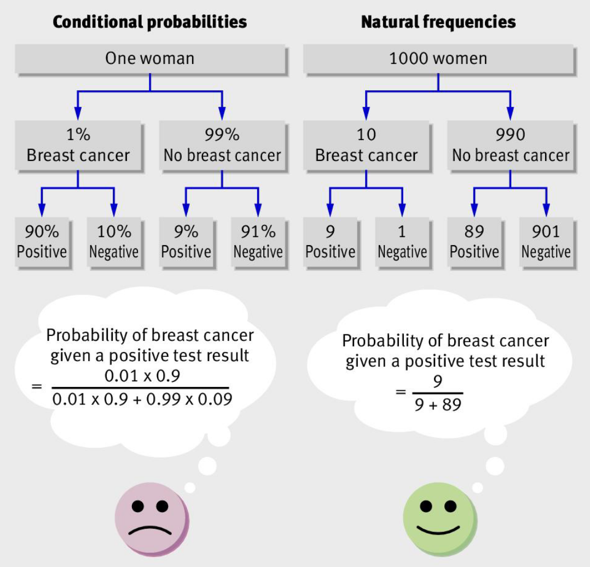
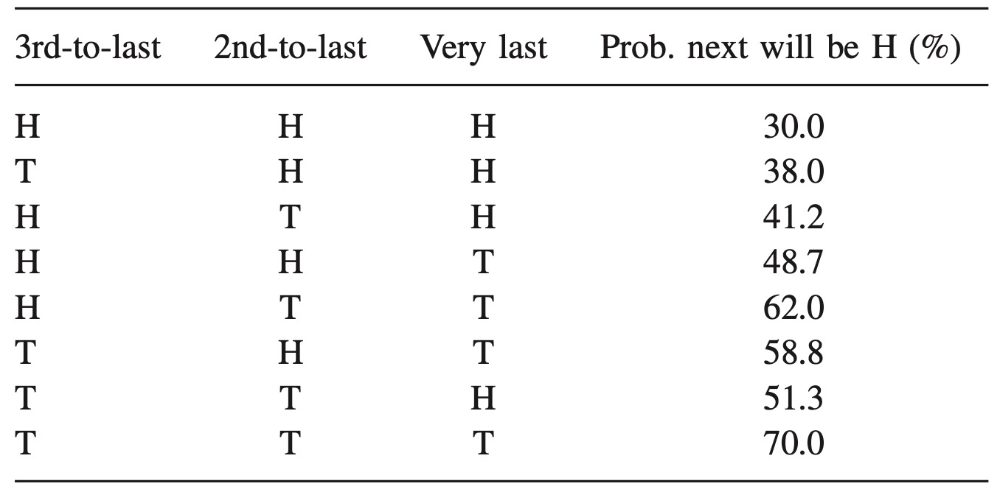
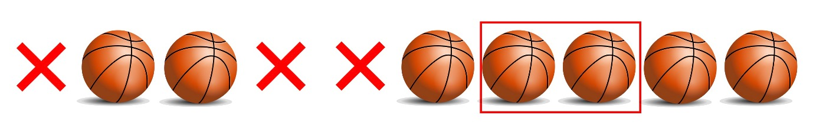

# Biases in probability judgment

## The conjunction fallacy

Tversky and Kahneman [-@tversky1983] asked students to read the following statement:

> Linda is 31 years old, single, outspoken, and very bright. She majored in philosophy. As a student, she was deeply concerned with issues of discrimination and social justice, and also participated in anti-nuclear demonstrations.

The students were asked to rank the following statements from most (1) to least (8) probable:

1.  Linda is a teacher in elementary school.
2.  Linda works in a bookstore and takes Yoga classes.
3.  Linda is active in the feminist movement.
4.  Linda is a psychiatric social worker.
5.  Linda is a member of the League of Women Voters.
6.  Linda is a bank teller.
7.  Linda is an insurance salesperson.
8.  Linda is a bank teller and is active in the feminist movement.

Note that "8. Linda is a bank teller and is active in the feminist movement" is a conjunction of "3. Linda is active in the feminist movement" and "6. Linda is a bank teller".

Tversky and Kahneman found in a sample of students that 88% had 3 before 8 before 6. "6. Linda is a bank teller" was rated less probable than "8. Linda is a bank teller and is active in the feminist movement".

To understand why this is an error, recall that the probability of the conjunction of two outcomes equals:

$$
P(A\cap B)=P(A|B)P(B)=P(B|A)P(A)
$$

As $P(A|B)\leq 1$ and $P(B|A)\leq 1$, $P(A\cap B)$ must be less than or equal to $P(A)$ or $P(B)$. If $P(A|B)<1$ and $P(B|A)<1$, $P(A\cap B)$ must be less than $P(A)$ or $P(B)$.

Why do people make this error?

The description of Linda was constructed to be representative of a feminist and unrepresentative of a bank teller.

If people used the representativeness heuristic to order the statements, they would likely rank 8 above 6.

The Linda Problem is one of the most heavily debated experiments in the social sciences.

For example, Hertwig and Gigerenzer [-@hertwig1999] argue that people infer nonmathematical meaning to the word "probability", taking it to mean "plausible" or "credible".

While possibly a fair critique of the Linda problem, other illustrations of the conjunction fallacy appear more robust.

From Tversky and Kahneman [-@tversky1983]:

> Consider a regular six-sided die with four green faces and two red faces. The die will be rolled 20 times and the sequence of greens (G) and reds (R) will be recorded. You are asked to select one sequence, from a set of three, and you will win \$25 if the sequence you chose appears on successive rolls of the die. Please check the sequence of greens and reds on which you prefer to bet.
>
> 1.  RGRRR
>
> 2.  GRGRRR
>
> 3.  GRRRRR

65% of experimental subjects chose sequence 2. It appears more "representative" of a die with four green faces and two red faces. But note that 1 is contained within 2 and strictly more likely. The fact subjects are betting on the outcome should remove questions about interpretation.

## Base rate neglect

### The cab problem

The cab problem from Tversky and Kahneman [-@tversky1982] involves the following story:

> A cab was involved in a hit and run accident at night. Two cab companies, the Green and the Blue, operate in the city. Participants are given the following data:
>
> 1.  85% of the cabs in the city are Green, 15% are Blue
>
> 2.  A witness identified the cab as Blue. The court tested the reliability of the witness under the same circumstances that existed on the night of the accident and concluded that the witness correctly identified each one of the two colours 80% of the time.
>
> What is the probability that the cab involved in the accident was Blue rather than Green?

In the experiment, the median and modal answer was 80%.

The correct answer is 41%.

The experimental result indicates a confusion between conditional probabilities.

$$
\underbrace{P(\text{claim blue}|\text{blue})}_{80\%}\neq \underbrace{P(\text{blue}|\text{claim blue})}_{\text{Requires Bayes' rule}}
$$

The experimental subjects were effectively neglecting the base rate (the relative rarity) of blue cabs. A witness seeing a blue cab is representative of what would occur if the cab were blue.

The correct answer is as follows:

```{=tex}
\begin{align*}
P(\text{blue}|\text{claim blue})&=\frac{P(\text{claim blue}|\text{blue})P(\text{blue})}{P(\text{claim blue}|\text{blue})P(\text{blue})+P(\text{claim blue}|\neg\text{blue})P(\neg\text{blue})} \\[12pt]
&=\frac{0.8\times 0.15}{0.8\times 0.1+0.2\times 0.85} \\[12pt]
&=0.41
\end{align*}
```
### Medical diagnosis

Consider the following problem:

> You test yourself for COVID-19. The following information is known:
>
> -   The probability that a person has COVID-19 is 1% (the prevalence)
>
> -   If a person has COVID-19, the probability that they test positive is 90% (the sensitivity)
>
> -   If a person does not have COVID-19, the probability that they nevertheless test positive is 9% (the false positive rate).
>
> You test positive. What is the chance that you have COVID-19?

When problems of this nature are given to physicians, only around 10 to 20% reason according to Bayes' rule (for example, see @hoffrage2015).

The most common answers approximate the sensitivity (\~90% for this example).

As for the cab problem, there is a confusion about sensitivity.

$$
P(\text{COVID}|\text{positive})\neq P(\text{positive}|\text{COVID})
$$

A positive test is "representative" of someone with COVID-19, so is given greater weight than the more general information about the base rate.

The correct answer is:

```{=tex}
\begin{align*}
P(\text{COVID}|\text{positive})&=\frac{P(\text{positive}|\text{COVID})P(\text{COVID})}{P(\text{positive})} \\[12pt]
&=\frac{P(\text{positive}|\text{COVID})P(\text{COVID})}{P(\text{positive}|\text{COVID})P(\text{COVID})+P(\text{positive}|\neg\text{COVID})P(\neg\text{COVID})} \\[12pt]
&=\frac{0.9\times 0.01}{0.9\times 0.01 + 0.09\times 0.99} \\[12pt]
&=`r round((0.9*0.01)/(0.9*0.01 + 0.09*0.99), 3)`
\end{align*}
```
The correct answer becomes more apparent if I show an alternative representation, such as the following:

> You test yourself with a rapid antigen test for COVID-19. The following information is known:
>
> -   Ten in every 1000 people have COVID-19 (the prevalence)
> -   Of these 10 people with COVID-19, nine will test positive (the sensitivity)
> -   Of the 990 people without COVID-19, about 89 nevertheless test positive (the false positive rate).
>
> You test positive. What is the chance that you have COVID-19?

Use of natural frequencies in this way was first proposed by Cosmides and Tooby [-@cosmides1996]. Natural frequencies are derived from observing cases that have been representatively sampled from a population.

@hoffrage1998 report that this change in representation increased the proportion of correct answers among physicians from 10% to 46%.

There is some evidence that you can get further gains through a frequency tree representation (e.g. @spiegelhalter2015). Below is one such tree from @gigerenzer2011.



The numbers at the bottom of the conditional probability tree do not contain the base rate information. You can't simply compare across them in calculating conditional probabilities. You also need to refer back to the middle layer. Conversely, the natural frequency tree contains all you need in the bottom row.

Note that we could convert the numbers in the bottom of the conditional probability tree into frequencies: 900 in 1000, 10 in 1000, 90 in 1000 and 910 in 1000. Gigerenzer calls these simple frequencies.

There are many scenarios where simple frequencies can make a problem more tractable, but they do not solve the computational complexity here. Simple frequencies are just a restatement of the probabilities. In contrast, natural frequencies are joint frequencies, such as the number of people who test positive and who have COVID-19.

### The Quasi-Bayesian approach

We can introduce base-rate neglect into Bayes' formula by assuming people put the same probability on all possible hypotheses (uniform priors).

For example, base-rate neglect implies we assume the COVID-19 and non-COVID-19 population have the same size. The two possible states of the world (COVID-19+, COVID-19−) are assumed to have the same probability ($p=0.5$, $1−p=0.5$).

By introducing the base-rate neglect in Bayes' rule we match the empirical result:

```{=tex}
\begin{align*}
P(\text{COVID}|\text{positive})&=\frac{P(\text{positive}|\text{COVID})P(\text{COVID})}{P(\text{positive})} \\[12pt]
&=\frac{P(\text{positive}|\text{COVID})P(\text{COVID})}{P(\text{positive}|\text{COVID})P(\text{COVID})+P(\text{positive}|\neg\text{COVID})P(\neg\text{COVID})} \\[12pt]
&=\frac{0.9\times 0.5}{0.9\times 0.5 + 0.09\times 0.5} \\[12pt]
&=`r round((0.9*0.5)/(0.9*0.5 + 0.09*0.5), 3)`
\end{align*}
```
## Probability matching

Consider the following experimental setup:

-   A red lamp that turns on with probability $p=0.70$
-   A green lamp that turns on with probability $p=0.30$

Participants are required top predict which light will turn on after observing a series of flashes.

What do participants do?

The proportions of predictions reflect the actual probabilities of the two light bulbs being turned on (i.e. $p=0.30$ for green lamps, $p=0.70$ for red lamps)

Probability matching is the tendency of humans and animals to mirror the probability distributions of presented stimuli in their response probabilities. The strategy of probability matching is not optimal for minimizing prediction error.

With probability matching, the probability of a successful guess is:

```{=tex}
\begin{align*}
P(\text{success})&=0.7\times 0.7+0.3\times0.3 \\
&=`r 0.7*0.7+0.3*0.3`
\end{align*}
```
A better strategy is to always select the event with the highest probability. In this example, participants should always predict that the red light will be turned on, giving them a 70% probability of a successful guess.

## The gambler's fallacy

The gambler's fallacy is the false belief that in a sequence of independent draws from a distribution an outcome that has not realized for a while is more likely to occur on the next draw.

For example, following three flips of a coin that all come up heads, a person experiencing the gambler's fallacy would believe that a tail is more likely on the next flip.

Using data from @rapoport1997, @rabin2010 derived the probability with which the next flip of a coin will be heads given the last three flips being heads or tails.



One explanation for the gambler's fallacy is representativeness. For example, the sequence of coin flips HHHHHH is not seen as representative of flipping a fair coin six times. HHTTHH is seen as more representative.

An alternative explanation is that people believe in the "law of small numbers". They overestimate the degree to which a small sample will resemble the population from which it is drawn. For example, if a fair coin is flipped six times, they will overestimate the likelihood the result will be three heads and three tails.

### The law of small numbers

The following model of the law of small numbers comes from @rabin2002.

Imagine an urn filled with red balls and black balls. You draw balls from the urn with replacement. The red balls are drawn with probability $p$ and the black balls are drawn with probability $1−p$.

Assume Freddy knows the probabilities $p$ and $1−p$ but (wrongly) assumes balls are drawn from the urn without replacement. That is, the outcomes are subject to the law of small numbers. If he assumes there are $N$ balls in the urn, he expects a sample of $N$ balls to match $p$ and $1−p$.

For small $N$, each draw from the urn without replacement is informative about future draws. For large $N$, a single draw without replacement does not materially affect the probability of the next ball.

Under Freddy's beliefs, outcomes must be correlated, rather than the true process where balls are replaced and the outcomes are uncorrelated.

Imagine Freddy plays roulette. The roulette wheel contains 36 slots, 18 black and 18 red.

Freddy observes 4 spins of the wheel before betting. He observes the sequence RRRR.

We assume a bias of $N=36$. Given $p=0.5$, this implies 18 red, 18 black balls in the urn.

An unbiased belief would be that the sequence of reds tells them nothing about future draws because the outcomes are uncorrelated.

Freddy's belief is that, after four reds, black is more likely on next spin.

Freddy is suffering from the Gambler’s Fallacy. He’s wrongly computing:

\begin{align*}
\hat P(R)&=\frac{\text{total reds}}{\text{total reds}+\text{total blacks}} \\
&=\frac{18}{18+18} \\
&=0.5 \\
\hat P(RR|R)&=\frac{18-1}{(18-1)+18} \\
&=`r round((18-1)/(18-1+18), 3)` \\
\hat P(RRR|RR)&=\frac{18-2}{(18-2)+18} \\
&=`r round((18-2)/(18-2+18), 3)` \\
\hat P(RRRR|RRR)&=\frac{18-3}{(18-3)+18} \\
&=`r round((18-3)/(18-3+18), 3)`
\end{align*}

In reality $P(RR|R)=P(RRR|RR)=P(RRRR|RRR)=0.5$.

## Hot hand fallacy

A person subject to the hot hand fallacy believes a streak will persist despite the process being random and each outcome being independent of the last.

For example:

1.  Commentators observe player performing a series of shots during a game.
2.  The commentators compound the series of shots into a single judgment (the streak).
3.  The commentators make predictions based upon the observed streak: "The player has a hot hand".
4.  Good shots are considered more likely conditional on observing the streak.

An example comes from @gilovich1985.

Imagine a person who took ten shots in a basketball game. A ball is a hit, an X is a miss.

What would count as evidence of a hot hand? What we can do is look at shots following a previous hit. For instance, in this sequence of shots there are 6 occasions where we have a shot following a previous hit. Five of those shots, such as the seventh here, are followed by another hit.



We can then compare their normal shooting percentage with the proportion of shots they hit if the shot immediately before was a hit. If their hit rate after a hit is higher than their normal shot probability, then we might say they get a hot hand.

Using this methodology, Gilovich et al TO ADD took shot data from a variety of sources, including the Philadelphia 76ers and Boston Celtics, and examined it for evidence of a hot hand. They also looked at whether there was a hit or miss after longer streaks of hits or misses.

From this data, they argued that the hot hand was an illusion.

The existence of the hot hand is disputed (e.g. @bar-eli2006).

### A bias in sequences

@miller2018 provide the most compelling critique. They found a statistical bias in the analysis by Gilovich et al. Correcting for the bias they found that the probability of hitting a shot following a sequence of three previous hits is 13 percentage points higher than after a sequence of three misses.

The intuition behind @miller2018 is as follows.

Suppose you flip a coin three times. There are eight possible sequences of heads and tails. Each sequence has an equal probability of occurring.

What if I asked you: if you were to flip a coin three times, and there is a heads followed by another flip in that sequence, what is the expected probability that another heads will follow that heads?

In @tbl-hothand below is the proportion of heads following a previous flip of heads for each sequence. In the first row of the table, the first flip is a head. That first flip is followed by another head. After the second flip, a head, we also have a head. There is no flip after the third head. 100% of the heads in that sequence followed by another flip are followed by a head.

In the second row of the table, 50% of the heads are followed by a head. In the last two rows, there are no heads followed by another flip.

Now, back to our question: if you were to flip a coin three times, and there is a heads followed by another flip in that sequence, what is the expected probability that another heads will follow that heads? It turns out it is 42%, which I can get by averaging those proportions.

| Flips              | $p(H_{t+1}|H_t)$ |
|:-------------------|:-----------------|
| HHH                | 100%             |
| HHT                | 50%              |
| HTH                | 0%               |
| HTT                | 0%               |
| THH                | 100%             |
| THT                | 0%               |
| TTH                | \-               |
| TTT                | \-               |
| **Expected value** | **42%**          |

: Eight possible combinations of heads and tales across three flips {#tbl-hothand}

That contrasts with what we get we count across all the sequences, where we see that there are 8 flips of heads that are followed by another flip. Of the subsequent flips, 4 are heads and 4 are tails, which is the 50% you expect.

Why that difference? By looking at these short sequences, we are introducing a bias. The cases of heads following heads tend to cluster together, such as in the first sequence which has two cases of a heads following a heads. Yet the sequence THT, which has only one shot occurring after a heads, is equally likely to occur as HHH. The reason a tails appears more likely to follow a heads is because of this bias whereby the streaks tend to cluster together. The expected value I get when taking a series of three flips is 42%, when in fact the actual probability of a heads following a heads is 50%. As the sequence of flips gets longer, the size of the bias is reduced, although it is increased if we examine longer streaks, such as the probability of a heads after three previous heads.

This bias is relevant to the analysis of the hot hand as it is present in the methodology of the papers that purportedly demonstrated that there was no hot hand in basketball. Because of this bias, the proportion of hits following a hit or sequence of hits is biased downwards. Like our calculation using coins, the expected proportion of hits following a hit in a sequence is lower than the actual probability of hitting a shot.

Conversely the hot hand pushes the probability of hitting a shot after a previous hit up. Together, the downward bias and the hot hand roughly cancelled each other out, leading to the conclusion by researchers that each shot is independent of the last.

The result is, that when you correct for the bias, there actually is a hot hand in basketball.

### Alternative intuition

Here is another intuition for why there is a bias in this sequence.

We flip three coins and select at random one of the flips that follows a heads. This means that if we select a flip that follows a head we will select either flip 2 or flip 3.

If we select flip 2, we know that flip 1 was a head. The first two flips in the sequence are either HT or HH.

However, we can also say that if we select flip 2, HT is twice as likely as HH. Why? Because if the first two coins were HH we could also have selected flip 3.

That is, if the first two flips are HT, we can only select flip 2. We select flip 2 with 100% probability. If the first two flips are HH, we select flip 2 with 50% probability and flip 3 with 50% probability.

The result is that we are twice as likely to observe HT as HH given we selected flip 2.

Using Bayes' rule:

\begin{align*}
P(HT|\text{flip 2})&=\frac{P(\text{flip 2}|HT)P(HT)}{P(\text{flip 2})} \\[6pt]
&=\frac{P(\text{flip 2}|HT)P(HT)}{P(\text{flip 2}|HT)P(HT)+P(\text{flip 2}|HH)P(HH)} \\[6pt]
&=\frac{1\times 0.5}{1\times 0.5+0.5\times 0.5} \\[6pt]
=\frac{2}{3} \\[6pt]
\\
P(HH|\text{flip 2})&=\frac{P(\text{flip 2}|HH)P(HH)}{P(\text{flip 2})} \\[6pt]
&=\frac{P(\text{flip 2}|HH)P(HH)}{P(\text{flip 2}|HH)P(HH)+P(\text{flip 2}|HT)P(HT)} \\[6pt]
&=\frac{0.5\times 0.5}{0.5\times 0.5+1\times 0.5} \\[6pt]
=\frac{1}{3} \\[6pt]
\end{align*}

### The hot hand fallacy for truly random sequences

However, there is strong evidence that people see streaks in processes that are truly random, with each outcome independent of the last.
For example, Ayton and Fisher (2004) find that when people are predicting the results of the spins of a roulette wheel, they increase the confidence of their predictions after a series of successes. This occurs despite the outcome being random. (Note: they also exhibit the gambler’s fallacy in what they predict.)
