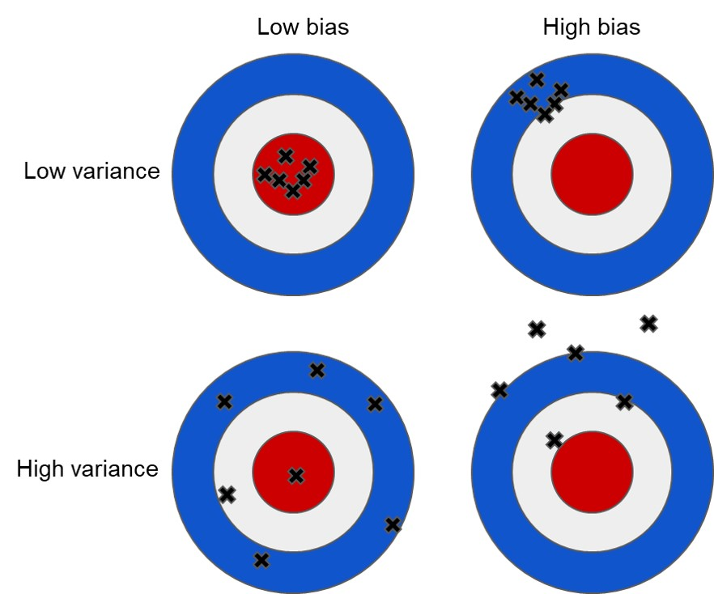
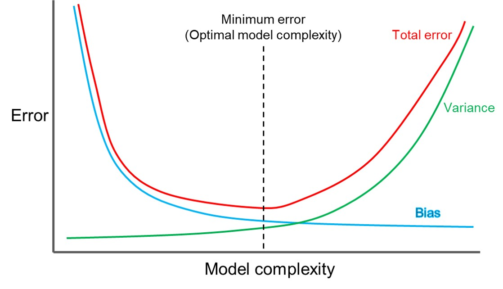
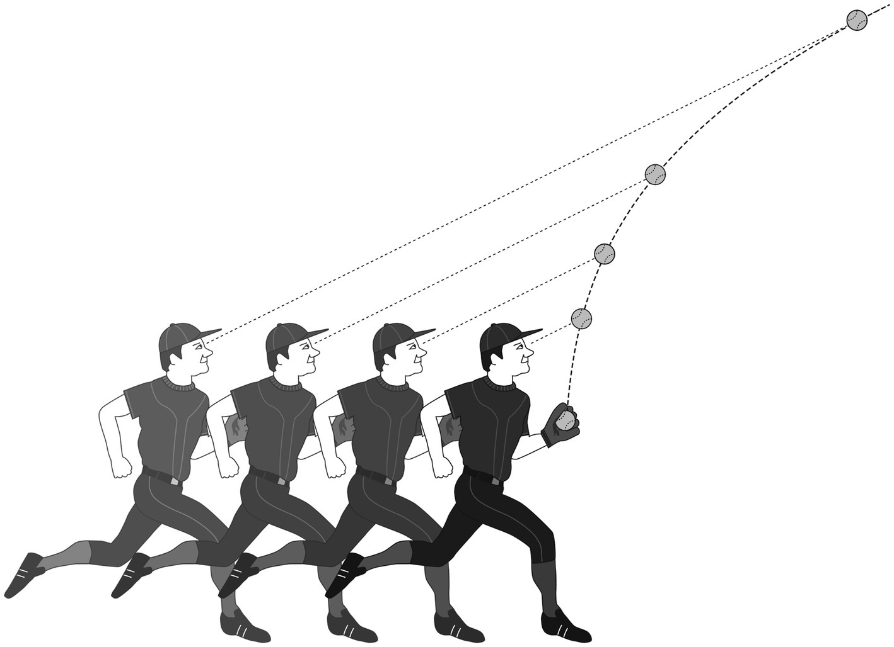

# Heuristics and the bias-variance trade-off

While much of the heuristics and biases literature of Kahneman, Tversky and those who followed in their footsteps focuses on the errors that can be caused by the use of heuristics, there are also powerful reasons for their use.

One of the strongest arguments for the use of simple heuristics relates to what is called the bias-variance trade-off.

Suppose you are trying to make a prediction or develop an estimate based on historical data. There is a true underlying process that is generating the data. You plan to build a predictive model that should approximate the underlying process. You have a noisy data sample with which to develop it and you are trying to decide which predictors to include.

An example of this could be that you want to predict the level of drop out in a school. You have possible predictors such as attendance rates, family socio-economic status, the school's average SAT score, and the degree of parental involvement in the child's schooling. Which of those should you include in your model?

Bias is the degree to which there are erroneous assumptions in your model. The classic case of bias is when you have failed to include a relevant predictor. If you exclude relevant predictors, you introduce bias as your predictive model will not include relevant relations between the predictors and the target output you are trying to predict. On the school example above, to the extent any of these factors are linked to drop out rates, excluding them can bias your prediction.

However, inclusion of too many predictors can lead to what is called variance, which is an error that arises because of the sensitivity of the model to fluctuations in the data you use to develop the model. It ultimately involves giving too much weight to irrelevant or marginally relevant information.

For example, if you included the school colours in your model, it may appear to give you a better model due to noise. But as soon as you used it to make a new prediction, it would likely backfire.

The following image gives on conception of bias and variance. An unbiased predictor will tend to centre on the target. A low variance predictor will tend to cluster. A low variance, low bias estimate is the best outcome.

However, as the term bias-variance trade-off suggests, it is not that simple. There is a trade-off between the two. As model complexity increases, bias tends to decrease, but variance tends to go up. There is an optimal level of complexity.

The result of this bias-variance trade-off means that simple heuristics can sometimes be better than more complex decision making strategies. This is not just because they are tractable for the human mind, but also because they find a better bias-variance trade-off, which also leads to better performance. Despite our focus on how heuristics can backfire in corporate decision-making environments, there can be a power to them.

## Example: The gaze heuristic

The gaze heuristic is a tool that people -- and dogs -- use to catch balls. The heuristic is simply this -- maintain the ball at a constant angle of gaze. If you move to keep this angle constant, you will end up where the ball lands. Obviously, this is easier than calculating where you should be from the velocity of the ball, angle of flight, the effect of wind resistance and so on.

But it results in a strange pattern of movement. Suppose you are close to the point where the ball is first hit into the air. As it rises you will tend to back away from the ball. As it then starts to fall, you will move back in. If it is hit up to the side of you, you will move to the ball in a curve. Now, if you had a behavioural economist look at the path you took to catch the ball, they might call it the curve bias or something like that -- but it is actually the result of a very effective decision making tool.

There are also some circumstances where it works better, and some where it fails. It tends to work best when the ball is already high in the air. If you catch sight of a ball hit straight up before it has risen far, using the heuristic for its entire flight could require first running away from the ball and then toward it.

Understanding this is a much richer understanding than saying that the fielder is biased because they did not run straight to where the ball was going to land. It also points to the power of heuristics. Try to train someone to run straight to where a ball will land and watch them fail. Don't see heuristics as poor cousins of "more rational" approaches.
