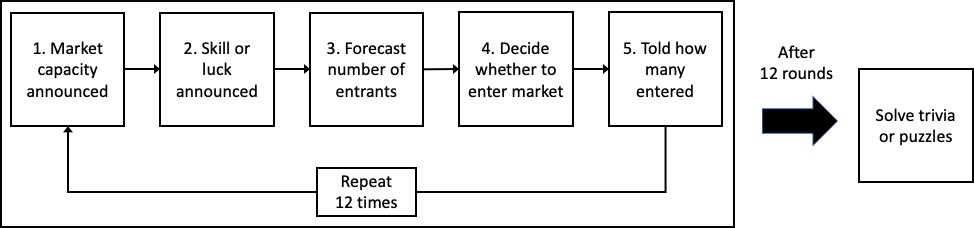

# Overconfidence

@debondt1995 wrote "Perhaps the most robust finding in the psychology of judgment and choice is that people are overconfident." Take the following examples:

-   When asked to estimate the length of the Nile by providing a range the respondent is 90% sure contains the correct answer, the estimate typically contains the correct answer only 50% of the time.

-   PGA golfers typically believe they sink around 75% of 6 foot putts -- some even believe they sink as many as 85% -- when the average is closer to 55%.

-   93% of American drivers rate themselves as better than average. 25% of high school seniors believe they are in the top 1% in ability to get along with others.

There are many similar examples, all making the case that people are generally overconfident.

But despite each being labelled as overconfidence, note that these examples are actually three different phenomena.

**Overprecision** is the tendency to believe that our predictions or estimates are more accurate than they actually are. The typical study seeking to show overprecision asks for someone to give confidence ranges for their estimates, such as estimating the length of the Nile. The questions asking for confidence intervals above were designed to test your precision.

**Overestimation** is the belief that we can perform at a level beyond that which we realistically can. The evidence here is mixed. When attempting a difficult task such as a six foot putt, we typically overestimate. But on easy tasks, the opposite is often the case -- we tend underestimate our performance. Whether over or underestimation occurs depends upon the domain.

**Overplacement** is the erroneous relative judgement that we are better than others. Obviously, we cannot all be better than average. But this relative judgement, like overestimation, tends to vary with task difficulty. For easy tasks, such as driving a car, we overplace and consider ourselves better than most. But ask people where they rate for a skill such as drawing, and most people will rate themselves as below average. People don't suffer from pervasive overplacement. Whether they overplace depends on what the situation is. The questions rating your relative skill above were a test of overplacement.

You might note that we tend to both underestimate and overplace our performance on easy tasks. We can also overestimate but underplace our performance on difficult tasks.

So are we both underconfident and overconfident at the same time? The blanket term of overconfidence does little justice to what is actually occurring.

The conflation of these different effects under the umbrella of overconfidence often plays out in stories of how overconfidence (rarely assessed before the fact) led to someone's fall. For instance, evidence that people tend to believe they are better drivers than average (overplacement) is not evidence that overconfidence led someone to pursue a disastrous corporate merger (overestimation).

## Firm entry

Most new businesses fail within a few years. For example, one study of US manufacturers found over 60% of entrants had exited within five years and almost 80% within 10 years.

@camerer1999 ran an experiment to test whether business failure may be due to optimism about their relative skill.

The lab experiment involved a set of markets in which market entrants were paid a set amount according to their rank within the market. Those ranked within the "market capacity" would share a payment of \$50. Those beyond the market capacity would be penalised \$10. Accordingly, if there are 5 entrants above market capacity, the expected payoff of all entrants is zero. More than that and it is negative.

The rank in the market was determined by either luck, through a random draw, or a test of skill involving logic puzzles or trivia questions about sports or current events.

In each round of the experiment, the market capacity was announced to the players, along with whether the payoffs in the market were based on luck or skill. The participants were then asked to forecast the expected number of entrants (for which they earn a payment if correct) and decide simultaneously and without communicating whether to enter into the market. Subjects were then told how many participants had entered.

After all of the rounds, students solved puzzles or took the trivia quiz to determine their skill rank.

The results of the experiment showed that more participants entered the market when the ranking was based on skill than if based on random draw. This indicates a belief that their skill level will rank them higher than a random draw: they are above average.

An interesting element to this experiment was that for some of the markets the participants were recruited by being asked if they would like to volunteer for an experiment in which performance would depend on their performance on sports or current event trivia questions. Hence the pool in those markets would be stronger than typical.

In those markets with self-selected participants, market entry was even higher, and payoffs were negative in most rounds. This suggests the self-selected entrants were overconfident in their skill due to what Camerer and Lovallo call "reference group neglect". The participants seem to neglect that the others in the reference group also self-selected in to the experiment and think they are skilled too.

@moore2007 ran an experiment on firm entry and found, like Camerer and Lovallo, that entrepreneurs overweight personal factors and underweight competitors when making entry decisions. However, when they varied the task difficulty, they found excess entry only when the industry appeared an easy one in which to compete. When it appeared difficult, too few entered.

## Trading

@barber2001 write:

> Theoretical models predict that overconfident investors trade excessively. We test this prediction by partitioning investors on gender. Psychological research demonstrates that, in areas such as finance, men are more overconfident than women. Thus, theory predicts that men will trade more excessively than women. Using account data for over 35,000 households from a large discount brokerage, we analyze the common stock investments of men and women from February 1991 through January 1997. We document that men trade 45 percent more than women. Trading reduces men's net returns by 2.65 percentage points a year as opposed to 1.72 percentage points for women.

The evidence they adduce in support of the gender differences is a mix of overprecision, overplacement and overestimation.

## Investment decisions

@malmendier2005 write:

> We argue that managerial overconfidence can account for corporate investment distortions. Overconfident managers overestimate the returns to their investment projects and view external funds as unduly costly. Thus, they overinvest when they have abundant internal funds, but curtail investment when they require external financing. We test the overconfidence hypothesis, using panel data on personal portfolio and corporate investment decisions of Forbes 500 CEOs. We classify CEOs as overconfident if they persistently fail to reduce their personal exposure to company-specific risk. We find that investment of overconfident CEOs is significantly more responsive to cash flow, particularly in equity-dependent firms.
