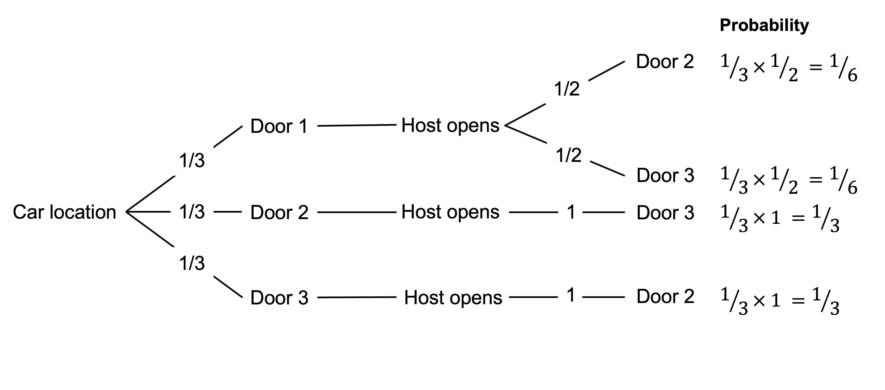

# Probability foundations

In this part, I introduce some basic concepts in probability theory.

## The probability function

The probability of an outcome is the chance with which it occurs. We denote the probability of outcome $A$ as $P(A)$, where $P(\cdot)$ represents a probability function that assigns a real number to each event.

The probability function has the following features.

First, the probability of outcome $A$ lies between 0 and 1. That is:

$$
0 \leq P(A) \leq 1
$$

For example, the probability of drawing the Ace of Spades from a full deck of 52 cards is 1 in 52 or \~0.02.

The probability of flipping a head with a fair coin is 1 in 2 or 0.5.

Second, the probability of the entire outcome space equals 1.

For example, suppose we have 52 possible cards we can draw from the deck, each with 1 in 52 probability. If we draw a single card, the probability that we draw one of those cards is:

```{=tex}
\begin{align*}
\frac{1}{52}+\frac{1}{52}+\frac{1}{52}+...+\frac{1}{52}&=\sum_{n=1}^{n=52}\frac{1}{52} \\[12pt]
&=1
\end{align*}
```

Third, suppose outcomes $A$ and $B$ are mutually exclusive. In that case, the probability of $A$ or $B$ is the sum of the probability of $A$ and the probability of $B$. That is:

```{=tex}
\begin{align*}
P(A \text{ or } B)&=P(A \cup B) \\[6pt]
&=P(A)+P(B)
\end{align*}
```

For example, if we have a deck with 52 cards, the probability of pulling out an Ace with a single draw is as follows.

```{=tex}
\begin{align*}
P(A\spadesuit \cup A\heartsuit \cup A\diamondsuit \cup A\clubsuit)&=P(A\spadesuit)+P(A\heartsuit)+P(A\diamondsuit)+P(A\clubsuit) \\[6pt]
&=\frac{1}{52}+\frac{1}{52}+\frac{1}{52}+\frac{1}{52} \\[6pt]
&=\frac{4}{52}
\end{align*}
```

Alternatively, suppose outcomes $A$ and $B$ are not mutually exclusive. In that case, the probability of one or the other is the sum of the probability of $A$ and the probability of $B$ minus the probability of both occurring. That is:

$$
P(A \cup B)=P(A)+P(B)-P(A\cap B)
$$

where $P(A \cap B)$ is the probability of both outcome $A$ and $B$.

For example, if we have a deck with 52 cards, the probability of pulling out an Ace or a Diamond with a single draw is as follows.

```{=tex}
\begin{align*}
P(A \cup \diamondsuit)&=P(A)+P(\diamondsuit)-P(A \cap \diamondsuit) \\[6pt]
&=\frac{4}{52}+\frac{1}{4}-\frac{1}{52} \\[6pt]
&=\frac{16}{52}
\end{align*}
```

Finally, if outcomes $A$ and $B$ are independent, the conjunction of the two independent outcomes is the product of their probabilities. That is

$$
P(A \cap B)=P(A)\cdot P(B)
$$

For example, suppose we draw a single card from a deck of cards, place that card back in the deck, and then make another draw. The probability of drawing the Ace of Spades in either draw is 1⁄52. The probability of drawing the Ace of Spades twice is:

```{=tex}
\begin{align*}
P(A\spadesuit \cap A\spadesuit)&=P(A\spadesuit)\cdot P(A\spadesuit) \\[6pt]
&=\frac{1}{52}\times \frac{1}{52} \\[12pt]
&=\frac{1}{2704}
\end{align*}
```
Note that if $A$ and $B$ are mutually exclusive, they are not independent and $P(A \cap B)=0$.

## Conditional probability

Conditional probability concerns the probability of an outcome given another outcome.

For example, drawing a card from a deck of cards with replacement - that is, putting back each card after it is drawn - means that whatever card was drawn in the first draw does not affect the probability of the outcome of the second draw. Each draw is independent of the other.

But what if you draw two cards from the same deck without replacement?

In that case, the two draws are not independent of each other. For instance, if you pull out the Ace of Spades first, the second card cannot be the Ace of Spades.

We say here that the probability of drawing an Ace of Spades on the second draw is conditional on the result of the first draw.

When one outcome is conditional on another, such as the probability of outcome $A$ conditional on outcome $B$ occurring, we write this conditional probability as $P(A|B)$.

Suppose I draw two cards from a deck without replacement. What is the probability of drawing an Ace for both draws?

We know that the first draw affects the probability of drawing an Ace on the second draw. If the first card is an Ace, one less Ace is in the deck for the second draw.

The probability of drawing an Ace on the first draw is 4 in 52. If I draw an Ace in the first draw, the probability of drawing an Ace on the second is 3 in 51. There is one less Ace and one less card than for the first draw. By multiplying the probability of these two events together, we can get the probability of an Ace on both draws.

```{=tex}
\begin{align*}
P(\text{Ace 1st}\cap\text{Ace 2nd})&=P(\text{Ace 1st})\cdot P(\text{Ace 2nd}|\text{Ace 1st}) \\[6pt]
&=\frac{4}{52}\times \frac{3}{51} \\[12pt] % <1>
&=\frac{1}{221}
\end{align*}
```

1. Testing annotation

### Formula for conditional probability

We can see that the solution to this problem has taken the form:

$$
P(A\cap B)=P(A|B)P(B)
$$

The joint probability of two outcomes equals the probability of $A$ conditional on $B$ multiplied by the probability of $B$.

We can rearrange this formula to determine the probability of $A$ given outcome $B$.

$$
P(A|B)=\frac{P(A\cap B)}{P(B)}
$$

If $A$ and $B$ are independent, $P(A|B)=P(A)$. In that case, the formula simplifies to that for calculating the probability of the conjunction of independent outcomes we saw earlier, $P(A \cap B)=P(A)\cdot P(B)$. The equation $P(A\cap B)=P(A|B)P(B)$ is a more general version of how to calculate the conjunction of two events.

Due to symmetry, we can also write the conditional probability as:

$$
P(A\cap B)=P(A|B)P(B)=P(B|A)P(A)
$$

### Example

As a test of this formula, let's take our previous example of drawing two Aces from the same deck. What is the probability of drawing an Ace on the second draw if you drew an Ace on the first?

```{=tex}
\begin{align*}
P(\text{Ace 2nd}|\text{Ace 1st})&=\frac{P(\text{Ace 1st}\cap\text{Ace 2nd})}{P(\text{Ace 1st})} \\[12pt]
&=\cfrac{\cfrac{1}{221}}{\cfrac{4}{52}} \\[24pt]
&=\frac{3}{51}
\end{align*}
```
### The Monty Hall problem

Consider the following problem as answered by Maryln vos Savant in her column Ask Marilyn in Parade magazine [@vossavant1990]:

> Suppose you're on a game show and you're given the choice of three doors: Behind one door is a car; behind the others, goats. You pick a door, say No. 1, and the host, who knows what's behind the doors, opens another door, say No. 3, which has a goat. He then says to you, "Do you want to pick door No. 2?" Is it to your advantage to switch your choice?

This problem is known as the Monty Hall problem as it is loosely based on the American game show Let's Make a Deal. Monty Hall was the original host of the show.

Assume that the rules of this game show are that:

-   The host must always open a door that you did not choose.

-   The host must always open a door to reveal a goat and never the car.

-   The host must always offer you the choice to switch between the chosen door and the remaining closed door.

For this question, you are effectively being asked: what is the probability that the car is behind Door 2 conditional on the host opening door 3.

To help us think about this problem, consider the following tree that maps the possible outcomes after you select Door 1. The first split of the tree represents the 1/3 probability that the car is behind each of the three doors. Given the car's location, the next split represents the probability that the host opens each door. The final column indicates the probability of each combination of car location and door opened.



If the car is behind Door 1, which you have selected, the host could open either Door 2 or Door 3 with equal probability. If the car is behind Door 2, the host must open Door 3. If the car is behind Door 3, the host must open Door 2.

Given the host opened Door 3, we can calculate the conditional probability that the car is behind door 2 as follows:

```{=tex}
\begin{align*}
P(C2|D3)&=\frac{P(C2\cap D3)}{P(D3)} \\[12pt]
&=\frac{\frac{1}{3}}{\frac{1}{3}+\frac{1}{6}} \\[12pt]
&=\frac{2}{3}
\end{align*}
```

You should switch to door 2.

## Bayes' rule

Bayes' rule is a method for estimating the conditional probability of an event.

Specifically, Bayes' rule allows us to use the following information to estimate the conditional probability of outcome $A$ given outcome $B$:

-   The unconditional probability of outcome $A$
-   The probability of observing outcome $B$ given outcome $A$
-   The total probability of outcome $B$.

The formula for Bayes' rule is:

```{=tex}
\begin{align*}
P(A|B)&=\frac{P(A\cap B)}{P(B)} \\[12pt]
&=\frac{P(B|A)P(A)}{P(B)}
\end{align*}
```

The denominator $P(B)$ is the total probability of event $B$. If the total probability of event $B$ is not directly available, we can often calculate it with information concerning the conditional probabilities of $B$ given the occurrence (or not) of $A$.

$$
P(B)=P(B|A)P(A)+P(B|\neg A)P(\neg A)
$$

The symbol $\neg$ represents "not".

We can therefore write Bayes' rule as follows:

```{=tex}
\begin{align*}
P(A|B)&=\frac{P(B|A)P(A)}{P(B)} \\[12pt]
&=\frac{P(B|A)P(A)}{P(B|A)P(A)+P(B|\neg A)P(\neg A)}
\end{align*}
```

### Updating beliefs

We can think of Bayes' rule as how we should update our beliefs in light of a new event.

Rational agents should update their beliefs using Bayes' rule.

In this case, the following elements are involved:

-   A hypothesis, $H$. For example, "the coin is fair" or "the coin is rigged".

-   The prior probability of the hypothesis $H$ being true, $P(H)$. For example, "the coin is fair" has a prior probability of 0.5.

-   The probability of observing event $E$ given a hypothesis $H$, $P(E|H)$. For example, "the coin shows a head" has a probability of 0.5 given that the coin is fair.

-   The posterior probability of the belief $H$ given the event $E$, $P(H|E)$. For example, we would have an updated probability in our hypothesis that "the coin is fair" based on the coin showing a head.

Under this framing, Bayes' rule is formulated as follows:

```{=tex}
\begin{align*}
\underbrace{P(H|E)}_\text{Posterior belief}&=\frac{P(E|H)\overbrace{P(H)}^\text{Prior belief}}{P(E)} \\[12pt]
&=\frac{P(E|H)P(H)}{P(E|H)P(H)+P(E|\neg H)P(\neg H)}
\end{align*}
```

### Bayes' rule example 1

Suppose your friend has two coins. One is a fair coin with a head on one side and a tail on the other. The second coin is a rigged coin with a head on both sides.

Your friend takes one of the coins and flips it. The coin shows a head. What is the probability that this coin is the rigged coin?

We will assume that he randomly selected either coin with a probability of 50%. We take that as our prior belief:

$$
P(\text{rigged})=0.5
$$

The probability of a head if it is the rigged coin is 1.

$$
P(\text{head}|\text{rigged})=1
$$

To use Bayes' rule, we need the total probability that a head comes up, $P(\text{head})$.

Here we will use the formula for total probability.

```{=tex}
\begin{align*}
P(\text{head})&=P(\text{head}|\text{rigged})P(\text{rigged})+P(\text{head}|\text{fair})P(\text{fair}) \\[6pt]
&=1\times 0.5+0.5\times 0.5 \\[6pt]
&=0.75
\end{align*}
```

Putting this into Bayes' rule:

```{=tex}
\begin{align*}
P(\text{rigged}|\text{head})&=\frac{P(\text{head}|\text{rigged})P(\text{rigged})}{P(\text{head})} \\[12pt]
&=\frac{1\times 0.5}{0.75} \\[6pt]
&=\frac{2}{3}
\end{align*}
```

Your friend flips the coin again and gets another head. What is the updated probability that the coin is rigged?

The  prior belief is now $P(\text{rigged})=\frac{2}{3}$.

The total probability of flipping a head is:

```{=tex}
\begin{align*}
P(\text{head})&=P(\text{head}|\text{rigged})P(\text{rigged})+P(\text{head}|\text{fair})P(\text{fair}) \\[6pt]
&=1\times \frac{2}{3}+0.5\times \frac{1}{3} \\[6pt]
&=\frac{5}{6}
\end{align*}
```

Putting this into Bayes rule:

```{=tex}
\begin{align*}
P(\text{rigged}|\text{head})&=\frac{P(\text{head}|\text{rigged})P(\text{rigged})}{P(\text{head})} \\[12pt]
&=\frac{1\times \frac{2}{3}}{\frac{5}{6}} \\[6pt]
&=\frac{4}{5}
\end{align*}
```

Your belief that the coin is rigged has now increased to 80%.

Your friend flips the coin 10 more times and gets 10 more heads. What is the updated probability that the coin is rigged?

We use our prior belief of $P(\text{rigged})=\frac{4}{5}$.

The total probability of flipping 10 heads is:

```{=tex}
\begin{align*}
P(\text{10 heads})&=P(\text{10 heads}|\text{rigged})P(\text{rigged})+P(\text{10 heads}|\text{fair})P(\text{fair}) \\[6pt]
&=1\times \frac{4}{5}+\bigg(\frac{1}{2}\bigg)^{10}\times \frac{1}{5} \\[6pt]
&=`r heads<-1*4/5+(1/2)^10*1/5; heads`
\end{align*}
```

Putting this into Bayes' rule:

```{=tex}
\begin{align*}
P(\text{rigged}|\text{10 heads})&=\frac{P(\text{10 heads}|\text{rigged})P(\text{rigged})}{P(\text{10 heads})} \\[12pt]
&=\frac{1\times \frac{4}{5}}{`r heads`} \\[12pt]
&=`r (1*4/5)/(1*4/5+0.5^10*1/5)`
\end{align*}
```

We now believe the coin is rigged with greater than 99.9% probability.

### Bayes' rule example 2

You have two urns filled with balls. Urn 1 has 30% black balls and 70% yellow balls. Urn 2 has 70% black balls and 30% yellow balls. The labels have fallen off the urns, so you do not know which urn is which.

You reach into one of the urns and pull out a yellow ball. What is the probability that you have drawn the ball from urn 1?

The Bayes' rule formula to solve this problem is:

```{=tex}
\begin{align*}
P(\text{urn 1}|\text{yellow})=\frac{P(\text{yellow}|\text{urn 1})P(\text{urn 1})}{P(\text{yellow})}
\end{align*}
```

We take the prior probability of the ball coming from urn 1 to be 50%. The probability of drawing a yellow ball from urn 1 is 70%.

The total probability of drawing a yellow ball is:

```{=tex}
\begin{align*}
P(\text{yellow})&=P(\text{yellow}|\text{urn 1})P(\text{urn 1})+P(\text{yellow}|\text{urn 2})P(\text{urn 2}) \\[6pt]
&=0.3\times 0.5+0.7\times 0.5 \\[6pt]
&=0.5
\end{align*}
```

Putting this into Bayes' rule:

```{=tex}
\begin{align*}
P(\text{urn 1}|\text{yellow})&=\frac{P(\text{yellow}|\text{urn 1})P(\text{urn 1})}{P(\text{yellow})} \\[12pt]
&=\frac{P(\text{yellow}|\text{urn 1})P(\text{urn 1})}{P(\text{yellow}|\text{urn 1})P(\text{urn 1})+P(\text{yellow}|\text{urn 2})P(\text{urn 2})} \\[12pt]
&=\frac{0.7\times 0.5}{0.7\times 0.5+0.3\times 0.5} \\[12pt]
&=0.7
\end{align*}
```

You put the first ball back in the urn, reach in again and pull out a black ball. What is the probability that you have drawn the ball from urn 1?

Given we have already drawn one ball and updated our probability, we will use the prior probability of $P(\text{urn 1})=0.7$.

The total probability of drawing a black ball is:

```{=tex}
\begin{align*}
P(\text{black})&=P(\text{black}|\text{urn 1})P(\text{urn 1})+P(\text{black}|\text{urn 2})P(\text{urn 2}) \\[6pt]
&=0.3\times 0.7+0.7\times 0.3 \\[6pt]
&=0.42
\end{align*}
```

Putting this into Bayes rule:

```{=tex}
\begin{align*}
P(\text{urn 1}|\text{black})&=\frac{P(\text{black}|\text{urn 1})P(\text{urn 1})}{P(\text{black})} \\[12pt]
&=\frac{0.3\times 0.7}{0.42} \\[12pt]
&=0.5
\end{align*}
```

The answer of 0.5 should seem intuitive. We have now drawn one black and one yellow ball. In combination, this is uninformative and we are back at our initial prior of 0.5.

### Bayes' rule example 3

Recall the Monty Hall problem:

> Suppose you're on a game show and you're given the choice of three doors: Behind one door is a car; behind the others, goats. You pick a door, say No. 1, and the host, who knows what's behind the doors, opens another door, say No. 3, which has a goat. He then says to you, "Do you want to pick door No. 2?" Is it to your advantage to switch your choice?

Assume that the rules of this game show are that:

-   The host must always open a door that you did not choose.

-   The host must always open a door to reveal a goat and never the car.

-   The host must always offer you the choice to switch between the chosen door and the remaining closed door.

We want to know the probability that the car is behind Door 2 given the host opened Door 3. We want to know $P(C2|D3)$. ^[Technically we want $P(C2|D3\cap X1)$ where X1 is our selection of Door 1. However, adding this complication to the calculation does not change the answer.]

To determine this using Bayes' rule, we would use the following formula:

```{=tex}
\begin{align*}
P(C2|D3)&=\frac{P(D3|C2)P(C2)}{P(D3)}
\end{align*}
```

$P(D3)$ is the probability that the host opens Door 3. It is calculated using the formula for total probability:

```{=tex}
\begin{align*}
P(D3)&=P(D3|C1)P(C1)+P(D3|C2)P(C2)+P(D3|C3)P(C3)
\end{align*}
```

Each of those elements are as follows.

$P(C1)$, $P(C2)$ and $P(C3)$ are our prior probability of the car being behind each door, which is $\frac{1}{3}$.

$P(D3|C1)$ is the probability that the host opens door 3, given the car is behind door 1. The host could open either of Door 2 or Door 3 as neither has the car behind it, so the probability of Door 3 is $\frac{1}{2}$.

$P(D3|C2)$ is the probability that the host opens Door 3, given the car is behind Door 2. The host must open that door, so the probability is one. They cannot open the door you have chosen or the door that the car is behind.

$P(D3|C3)$ is the probability that the host opens door 3, given the car is behind door 3. The host cannot open a door to show the car, so the probability is zero.

Returning to our equations, the total probability of the host opening Door 3 is:

```{=tex}   
\begin{align*}
P(D3)&=P(D3|C1)P(C1)+P(D3|C2)P(C2)+P(D3|C3)P(C3) \\[6pt]
&=\frac{1}{2}\times\frac{1}{3}+1\times\frac{1}{3}+0\times\frac{1}{3} \\[6pt]
&=\frac{1}{2}
\end{align*}
```
Now we can calculate the probability that the car is behind Door 2, given the host opened Door 3:

```{=tex}
\begin{align*}
P(C2|D3)&=\frac{P(D3|C2)P(C2)}{P(D3)} \\[12pt]
&=\frac{1\times\frac{1}{3}}{\frac{1}{2}} \\[12pt]
&=\frac{2}{3}
\end{align*}
```

The contestant should switch doors.
