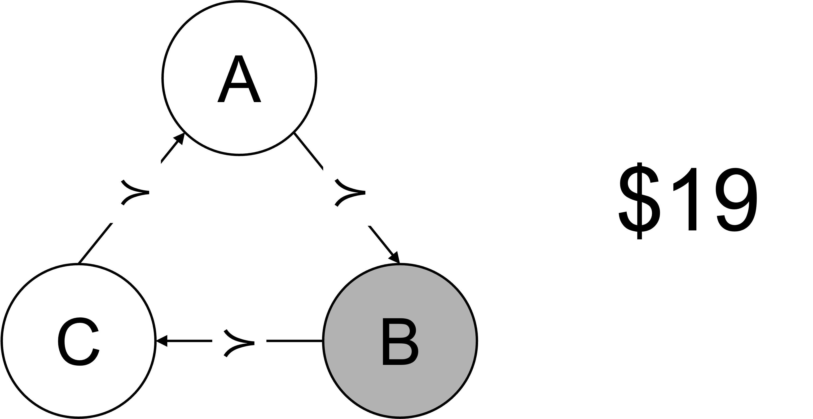
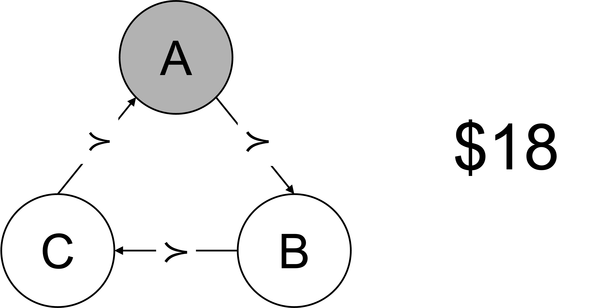

# Rationality

## Summary {.unnumbered}

- In economics, rationality means that preferences respect certain principles, not that decisions are necessarily reasonable or self-interested.
- The completeness axiom states that an agent can always compare any two options: for all $x$ and $y$, either $x \succcurlyeq y$ or $y \succcurlyeq x$ (or both).
- The transitivity axiom states that if an agent prefers A to B and B to C, they will prefer A to C: if $x \succcurlyeq y$ and $y \succcurlyeq z$, then $x \succcurlyeq z$.
- These axioms allow for the construction of a preference ordering, but they provide minimal constraints on the nature of preferences themselves.

---

::: {.content-visible when-format="html"}



---

:::

## Introduction

A standard economic assumption is that decision makers are rational.

However, rationality in economics has a different definition to the 'lay' definition of rationality.

Rationality simply means that preferences respect some desirable principles. These principles are assumptions, not rules of behaviour.

Economists tend to keep the number of assumptions as small as possible. They choose the assumptions that they need for the particular analytical problem they have at hand.

In its most stripped-back form, analysis of consumer choice rests on just two assumptions. These are completeness and transitivity.

## Completeness

Completeness means that an agent can always compare any two options. The agent cannot fail to have a preference between two options (although that preference may be indifference).

For example, if an agent was presented with a choice between an apple and a banana, or a choice between a Mercedes and a BMW, they will always strictly prefer one of them or be indifferent between the two. They will never not know what to choose or be unable to make a choice. They cannot be indecisive.

Formally, we can state the completeness axiom as follows:

> For all $x$ and $y$, either $x \succcurlyeq y$ or $y \succcurlyeq x$ (or both).

Completeness means people always prefer $x$ or $y$, or are indifferent between the two.

While the completeness axiom appears sensible, it is possible to develop examples where it may not hold. Consider a choice between two possible holiday destinations. Or two potential dates or spouses. If you are torn between the options and unable to make up your mind, this would represent a breach of the completeness axiom.

Incomplete preferences are different from indifference. If you are indifferent, you would be able to decide by, say, flipping a coin. You will be equally satisfied whatever the outcome. Incompleteness makes choice impossible.

## Transitivity

Under transitivity, if a person prefers A to B and B to C, they will prefer A to C.

Formally, we can state the transitivity axiom as follows:

> For all $x$, $y$ and $z$, if $x \succcurlyeq y$ and $y \succcurlyeq z$, then $x \succcurlyeq z$.

One classic argument for transitivity is the concept of a "money pump" (@davidson1955).

Suppose you have a person who prefers A to B, B to C and C to A. That is, they have intransitive preferences. They have \$20 and an endowment of C.

{width=50%}

They are offered B in exchange for their endowment of C for some small nominal cost (say \$1). If they make the trade they now have B and \$19.

{width=50%}

They are then offered A in exchange for their endowment of B, again for a nominal cost.

{width=50%}

Finally, they are offered C in exchange for their endowment of A for a further nominal cost. They now have an endowment of C and \$17. This process can be repeated until the agent has no money.

{width=50%}

## Preference Orderings

If we assume preferences are transitive and complete, it is possible to construct a preference ordering.

Completeness guarantees that there will be only one ordering.

Transitivity guarantees that there will be no cycles in strict preference. Weak preferences can cycle, so that one can prefer a to b and b to c and c to a, but this entails indifference.

That preference ordering, a simple rank of which options an agent prefers, is all that is required for some analysis of consumer choice.

## Defining rationality

This definition of rationality, accordance to the axioms of completeness and transitivity, provides little constraint on preferences.

You could prefer less money to more. You could prefer sums of money divisible by seven with no remainder. You could prefer more for yourself or more for someone else.

These axioms do not lead to an assumption that people are selfish, unless you define selfishness to be simply acting in accordance with their preferences.

These axioms place some constraints on behaviour, and empirical evidence suggests those constraints are sometimes breached by decision makers. But they are constraints that allow much behaviour to be described as rational.
