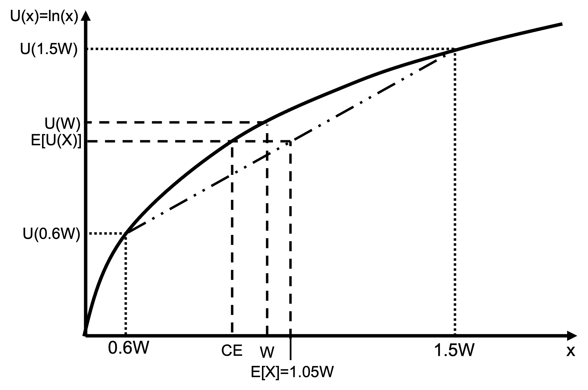

# Expected utility examples

## Example 1

Suppose your utility function is $U(x)=ln(x)$.

You have a 50% chance of winning \$10 and a 50% chance of losing \$10. Assume your starting wealth is \$20.

What is the expected value of this game?

\begin{align*}
E[x]&=\sum_{i=1}^n p_ix_i \\[6pt]
&=0.5*10+0.5*(-10) \\[6pt]
&=0
\end{align*}

The expected value of the game is \$0.

What is the expected utility of this game?

\begin{align*}
E[U(W+x)]&=\sum_{i=1}^n p_iU(x_i+W) \\[6pt]
&=0.5U(20-10)+0.5U(20+10) \\[6pt]
&=0.5ln(10)+0.5ln(30) \\[6pt]
&=2.85
\end{align*}

What does an expected utility of 2.85 mean? To make it tangible, we can ask what wealth would give that utility.

$$U(W)=ln(W)=2.85$$
$$W=e^{2.85}=\$17.30$$

This gamble with expected value of zero reduces utility by an amount equivalent to \$2.70. 


We could also say that the certainty equivalent of this gamble is final wealth of \$17.30, a loss of $2.70.

## Example 2

Suppose your utility function is $\small U(x)=ln(x)$.

You have an 80% chance of winning \$10 and a 50% chance of losing \$10. Assume your starting wealth is \$20.

What is the expected value and the expected utility of this game?

\begin{align*}
E[x]&=\sum_{i=1}^n p_ix_i \\[6pt]
&=0.8*10+0.2*(-10) \\[6pt]
&=\$6
\end{align*}

The expected value of the game is \$6.

\begin{align*}
E[U(W+x)]&=\sum_{i=1}^n p_iU(x_i+W) \\[6pt]
&=0.8U(20+10)+0.2U(20-10) \\[6pt]
&=0.8ln(30)+0.2ln(10) \\[6pt]
&=3.18
\end{align*}

What does an expected utility of 3.18 mean? To make it tangible, we can ask what wealth would give that utility.

$$U(W)=ln(W)=3.18$$
$$W=e^{3.18}=\$24.08$$

This gamble with expected value of \$6 increases utility by an amount equivalent to \$4.08. 


## Example 3

Suppose your utility function is $U(x)=ln(x)$.

You have a 50% chance of increasing your wealth by 50% and a 50% chance of decreasing your wealth by 40%.

What is the expected value and the expected utility of this games?

\begin{align*}
E[U(X)]&=\sum_{i=1}^n p_iU(X_i) \\[6pt]
&=0.5U(0.6W)+0.5U(1.5W) \\[6pt]
&=0.5ln(0.6)+0.5*ln(W)+0.5ln(1.5)+0.5*ln(W) \\[6pt]
&=-0.255+0.203+ln(W) \\[6pt]
&=−0.053+ln(W)
\end{align*}

Here we have a gamble with a positive expected value, 5% of your wealth, but lower expected utility. Someone with log utility would reject this bet.



## Example 4: The St. Petersburg game

The St. Petersburg game was invented by Swiss mathematician Nicolas Bernoulli.

The game starts with a pot containing \$2. A dealer then flips a coin. The pot doubles every time a head appears. The game ends and the player win the pot as soon as tails appears.

- Tail on the first flip: \$2
- Tail on the second flip: \$4
- Tail on the third flip: \$8
- Tail on the fourth flip: \$16

And so on.

The expected value of this game is equal to:

\begin{align*}
E[X]&=\underbrace{\frac{1}{2}*2}_\textrm{Tail first}+\underbrace{(\frac{1}{2}*\frac{1}{2})*4}_\textrm{Tail second}+\underbrace{(\frac{1}{2}*\frac{1}{2}*\frac{1}{2})*8}_\textrm{Tail third} \\[24pt]
&\qquad +\underbrace{(\frac{1}{2}*\frac{1}{2}*\frac{1}{2}*\frac{1}{2})*16}_\textrm{Tail fourth}+... \\[24pt]
&=1+1+1+1+... \\
&=\sum_{k=1}^\infty 1 \\
&=\infty
\end{align*}

The $\sum$ operator means “sum for $k=1$ to $k=\infty$”.

The expected utility of this game is equal to:

\begin{align*}
E[U(X)]&=\underbrace{\frac{1}{2}*U(W+2)}_\textrm{Tail first}+\underbrace{(\frac{1}{2}*\frac{1}{2})*U(W+4)}_\textrm{Tail second} \\[24pt] 
&\qquad +\underbrace{(\frac{1}{2}*\frac{1}{2}*\frac{1}{2})*U(W+8)}_\textrm{Tail third}
+\underbrace{(\frac{1}{2}*\frac{1}{2}*\frac{1}{2}*\frac{1}{2})*U(W+16)}_\textrm{Tail fourth}+... \\[24pt]
&=\frac{1}{2}U(W+2)+\frac{1}{4}U(W+4)+\frac{1}{8}U(W+8)+\frac{1}{16}U(W+16)+...  \\[12pt]
&=\sum_{k=1}^{k=\infty}\frac{1}{2^k}U(W+2^k)
\end{align*}

What is the maximum \$$c$ a risk neutral player with $U(x)=x$ would be willing to pay to play the game? One strategy to determine \$$c$ is to ask at what \$$c$ the player would be indifferent between accepting and rejecting a chance to play. That is the maximum \$$c$ that they would be willing to pay. They will be indifferent when $U(W)=E[U(X-c)]$.

\begin{align*}
U(W)&=E[U(X-c)] \\[6pt]
U(W)&=\sum_{k=1}^{k=\infty}\frac{1}{2^k}(U(W+\$2^k-c) \\[6pt]
W&=\sum_{k=1}^{k=\infty}\frac{1}{2^k}(W+2^k-c) \\[6pt]
W&=W-c+\sum_{k=1}^{k=\infty}1 \qquad \bigg(\text{as }\sum_{k=1}^{k=\infty}\frac{1}{2^k}=1\bigg) \\[12pt]
c&=\infty
\end{align*}

A risk-neutral player would pay any amount \$$c$ to play.

What is the maximum $\$c$ a risk averse player with $U(x)=ln(x)$ player would be willing to pay to play the game? How does their wealth affect their willingness to pay?

Again we will determine at what \$$c$ the player is indifferent between accepting and rejecting a chance to play, which occurs when $U(W)=E[U(X-c)]$.

\begin{align*}
U(W)&=E[U(X-c)] \\[6pt]
U(W)&=\sum_{k=1}^{k=\infty}\frac{1}{2^k}U(W+\$2^k-c) \\[6pt]
ln(W)&=\sum_{k=1}^{k=\infty}\frac{1}{2^k}ln(W+\$2^k-c)
\end{align*}

```{r}
#| output: false
# Calculation of value of gamble for following paragraph
# Code based on: https://math.stackexchange.com/questions/2882484/log-utility-function-and-the-st-petersburg-paradox
EU = function(W, c, epsilon){
    ans = 0
    k = 1
    while(abs(val <- (log(max(epsilon, W + 2^k - c)) - log(W)) / 2^k) > epsilon){
        k <- k + 1;
        ans <- ans + val;
    }
    ans
}

find_c = function(W, epsilon=10^(-10)){
    low = 0
    c = 0
    high = 10^10
    while(abs(low - high) > epsilon){
        c = (high + low) / 2
        exp_value = EU(W, c, epsilon)
        ifelse(exp_value > 0, low <- c, high <- c)
    }
    c
}

# Value of bet to someone with wealth of $1,000,000
c1000000 <- round(find_c(10^6), 2)
# Value of bet to someone with wealth of $1,000
c1000 <- round(find_c(10^3), 2)
# Value of bet to someone with wealth of $0.01
c001 <- round(find_c(0.01), 2)
```

There is no closed form solution to this equation to enable us to determine $c$. It needs to be solved via numerical methods (such as testing and iterating to a solution). Someone who has wealth of \$0.01 would be willing to pay up to \$`r c001` (they would need to borrow). Someone with wealth \$1000 would be willing to pay \$`r c1000`, while a person with wealth of \$1 million would be willing to pay \$`r c1000000`.

Note: we cannot solve for a person with no wealth as ln⁡(0) is undefined. 

Another way to gain an intuition of what is happening to ask what is the utility of a risk averse player whose only asset is the opportunity to play this game.

\begin{align*}
E[U(X)]&=\sum_{k=1}^{k=\infty}\frac{1}{2^k}U(\$2^k) \\[12pt]
&=\sum_{k=1}^{k=\infty}\frac{1}{2^k}ln(2^k) \\[12pt]
&=\sum_{k=1}^{k=\infty}\frac{k}{2^k}ln(2) \\[12pt]
&=\frac{1}{2}ln(2)+\frac{2}{4}ln(2)+\frac{3}{8}ln(2)+\frac{4}{16}ln(2)+\frac{5}{32}ln(2)+... \\[12pt]
&=(\frac{1}{2}+\frac{1}{2}+\frac{3}{8}+\frac{1}{4}+\frac{5}{32}+...)ln(2) \\[12pt]
&=2ln(2)
\end{align*}

The change in utility from each flip rapidly converges as the series of fractions sums to two. The expected utility from the game is equal to the utility of \$4 $(U(W)=ln(W)=2ln(2);\space W=e^{2ln2}=4)$.

Why does willingness to pay increase with wealth?

With log utility, as wealth increases the slope of the log function increasingly approximates a linear function (the second derivative approaches zero). Hence, the gambler displays less risk averse (closer to risk neutral) behaviour.
