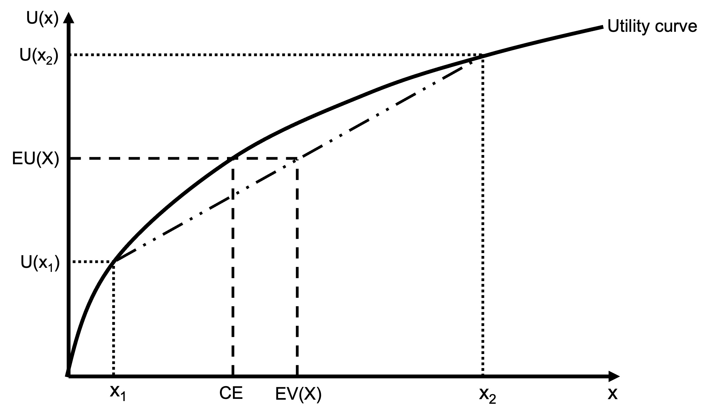
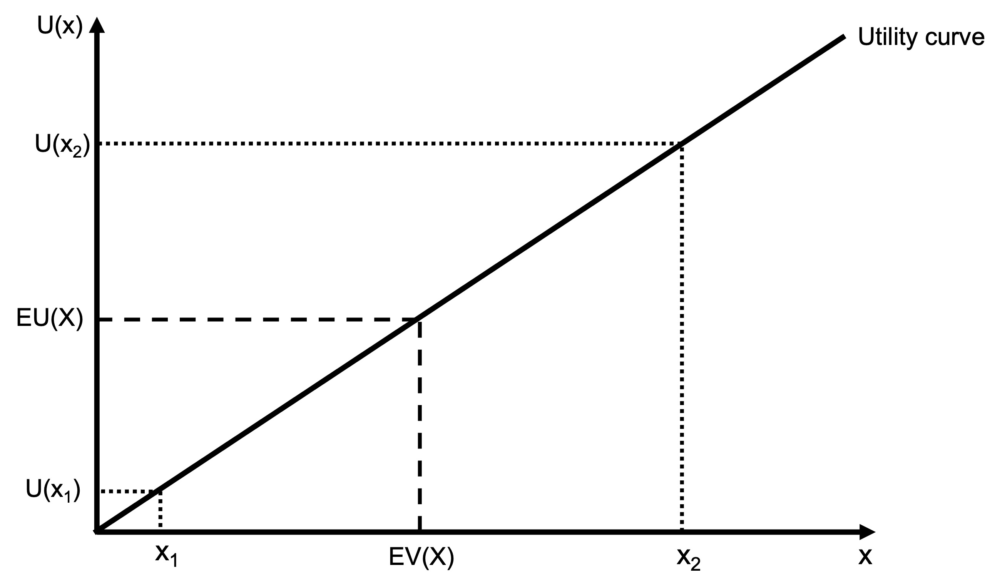
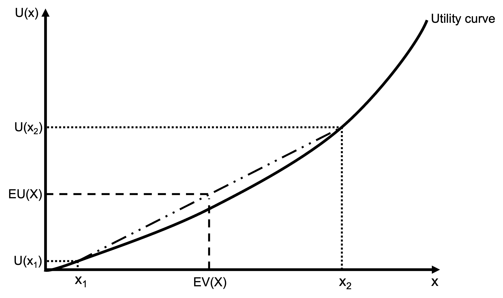

# Expected Utility Theory

## Maximising expected utility

People do not seek to maximize expected value, but instead maximize expected utility.

Under expected utility theory, people choose between risky prospects (another word for lottery or gamble common in the literature) by comparing expected utility values. The agent maximises expected utility, $E[U(x)]$:

\begin{align*}
E[U(x)]&=p_1U(x_1)+p_2U(x_2)+ ... +p_nU(x_n) \\[6pt]
&=\sum_{i=1}^n p_iU(x_i)
\end{align*}

$p_i$ is the probability of outcome $x_i$.

$U(x_i)$ is the utility of outcome $x_i$

Under Expected Utility Theory, risky options are evaluated in 3 steps:

1. Define utility over final outcomes $x_1, ..., x_n$

2. Weight utility of each outcome $U(x_i)$ by the probability of outcome $p_i$

3. Add the weighted utilities

There is an important note to make here regarding outcomes $x_1, ..., x_n$. Typically, these outcomes are not just the payoffs from the gamble, but rather the agent's final position. If the agent has wealth of \$100 and is offered a coin flip to win or lose \$10, the outcomes are typically taken to be \$90 and \$110. Their decision depends on their current wealth. As a result, expected utility is often represented as:

\begin{align*}
E[U(W+x)]&=p_1U(W+x_1)+p_2U(W+x_2)+ ... +p_nU(W+x_n) \\[6pt]
&=\sum_{i=1}^n p_iU(W+x_i)
\end{align*}

## Attitudes toward risk

Expected utility theory captures an individual's risk preference by means of their utility function.

If a person prefers a sure amount over a gamble with comparable expected value, they are risk averse.

If a person prefers the gamble over the sure amount, they are risk seeking.

If a person is indifferent, they are risk neutral.

The certainty equivalent (CE) of a gamble X is the the amount of money such that you are indifferent between taking the gamble and taking the money:

$$u(CE)=EU(X)$$

### Risk aversion

For a risk averse person, the certainty equivalent is less than the expected value of the gamble.

### Risk neutrality

For a risk averse person, the certainty equivalent is equal to the expected value of the gamble. A risk neutral person is an expected value maximiser.

### Risk seeking

For a risk seeking person, the certainty equivalent is more than the expected value of the gamble. The gamble has value in and of itself.

