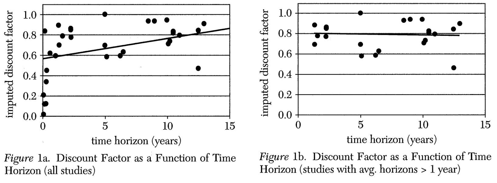

# Exponential discounting anomalies

## Estimation of $\delta$

@frederick2002 plotted estimates of 𝛿 from a set of published papers. Figure 1a shows that the estimated discount factor increases with time horizon. If studies with horizons of one year or less are excluded, there is no relationship between the discount factor and time horizon (Figure 1b).

@thaler1981 estimated the discount rate of experimental subjects by presenting them with a choice between a prize today or a larger later. In each case, they were asked, given the size of the prize that could be received today, how large would the future prize would need to be such that waiting would be as attractive as receiving the money now.

For example, some subjects were asked how large a future prize would need to be such that they would be happy to wait three months, one year or three years rather than receiving \$15 today. The median answers were \$30, \$60 and \$100 respectively. If you use these estimates to calculate an implied discount rate, the result is 277%, 139% and 63%. It can be seen that this discount rate is decreasing with the length of delay (which matches the pattern of increasing discount factor with length of delay).

## Preference reversal

@green1994 offered experimental subjects choices between a smaller reward and delayed larger reward while varying the delay. For example, they offered:

- \$20 now or \$50 in three months

- \$20 in one week or \$50 in three months and one week.

Across the choices offered to the experimental subjects, there was a consistent effect whereby incrementing the delay for both rewards equally would result in a switch from the small sooner reward to the latter larger reward.

In a study by @kirby1995, 34 of 36 experimental subjects reversed preference from a. Larger later reward to a smaller earlier reward as the delays to both decreased.

### Healthy choices

@read1998 asked 200 study participants to make a choice between healthy or unhealthy snacks (e.g., banana or apple versus Mars bar or Snickers bar) that they would receive in one week. 48% of men and 51% of women chose the healthy choice.

At the scheduled time one week later they asked the participants to choose again. Although no reference was made to their previous choice, this effectively gave them the opportunity to change their mind. This time, only 25% of men and 11% of women chose the healthy snack. While many changed from the healthy to unhealthy snack, almost no changed from the unhealthy to healthy snack.

This result is evidence of time inconsistency. The participants made different decisions depending upon when they made the decision.
