# Game theory exercises

## Question 1

The year is 1964 and the Soviet Union and the United States are in the midst of the cold war.

Suppose each player is considering whether they should act aggressively (hawk) or peacefully (dove). If one plays hawk while the other plays dove, they win the cold war. If both play hawk, there is a nuclear armageddon.

The payoffs ($x,y$) of each option for the Soviet Union and United States is as follows:

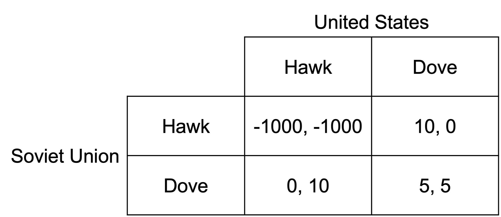

a\) What is the Nash equilibrium of this game? What other game does this resemble? 

::: {.callout-tip collapse="true"}
## Question 1a) answer

The preferred action in response to the action of the other player are indicated in the below diagram.

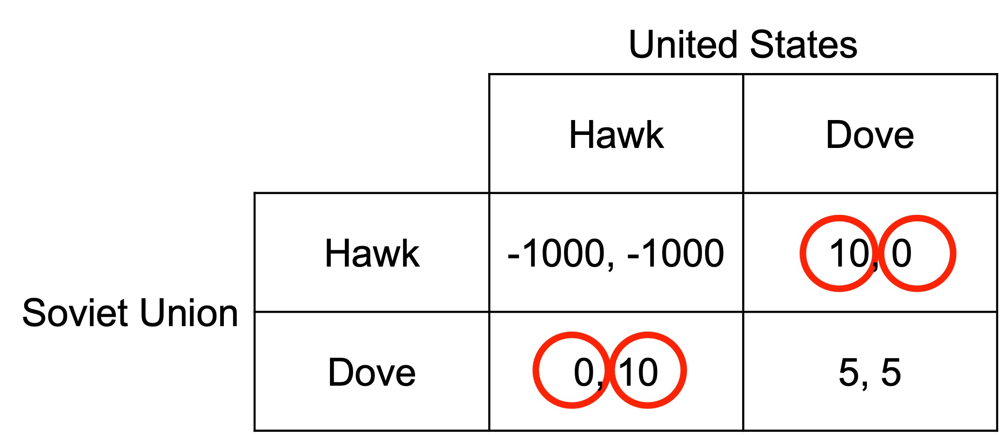

The two Nash equilibria are (Hawk, Dove) and (Dove, Hawk).

This game resembles chicken. Each player wants to win, but if neither swerve, there is a catastrophic outcome for both.
:::

b\) In the movie Dr Strangelove, the Soviet Union created a doomsday machine that would detonate automatically if there was a nuclear strike. The fallout would render the earth uninhabitable. The doomsday machine could not be deactivated and would explode if any attempt was made.

Explain how the doomsday device could act as a commitment device?

::: {.callout-tip collapse="true"}
## Question 1b) answer

By removing dove as a response to hawk, the game effectively changes to the following:

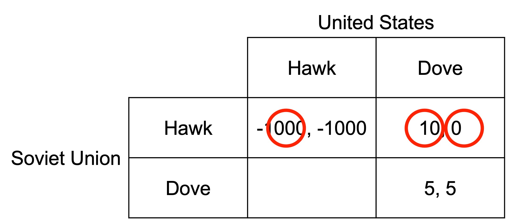

The Soviet Union can now credibly signal that it will respond to hawk with hawk. This leads to a single Nash equilibrium: (Hawk, Dove).
:::

c\) In the movie, the Soviet Union failed to inform the United States of the existence of the device. How could this failure to inform undermine its effectiveness as a commitment device?

::: {.callout-tip collapse="true"}
## Question 1c) answer

A commitment will only be effective if it is both observable and irreversible. While the doomsday machine is irreversible, by not being observable it will not change the response of the United States. The United States will think they are playing the game analysed in part a), not that in part b).
:::

## Question 2

Robyn is hunting for a new employee. Robyn's company uses highly-technical equipment and needs to invest heavily in training the new employee. If the new employee leaves straight after training, Robyn's company will suffer a net loss from the employee. If the employee stays long-term, they will have a large gain.

Robyn approaches Sean and asks if he is interested in a long-term role with the company.

Sean is interested in the training as he could use it to boost his career, but sees less benefit in staying long-term. He considers whether he should say he is interested or not.

The extensive form of the game is laid out below, with the payoffs ($x,y$) being for Robyn and Sean respectively.

a\) Will Robyn offer the position to Sean?

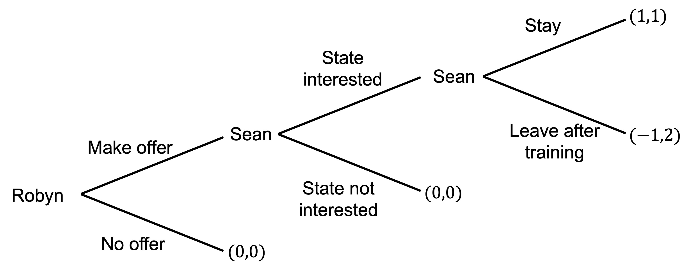

::: {.callout-tip collapse="true"}
## Question 2a) answer

We work through the problem by backward induction.

Sean can get 2 by leaving after training or 1 by staying. He leaves after training.

When considering whether he will state that he is interested, he could get 2 for stating he is interested (as he will later leave) versus nothing for saying he is not interested. He states he is interested.

Robyn compares the -1 she gets for hiring Sean (as he will leave) with the zero for no offer. She does not make an offer.

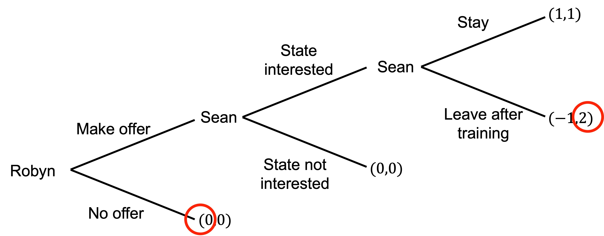

The subgame-perfect equilibrium is (No offer; State interested, Leave after training).
:::

b\) What sort of strategic move could help John? What could make the move credible?

::: {.callout-tip collapse="true"}
## Question 2b) answer

One option is to sign a binding contract with penalties if he leaves early. Any penalty greater than -1 would make staying more attractive.

A contract is both observable and irreversible (at least without mutual agreement).
:::

## Question 3

Linda is looking for investment opportunities. She identifies a promising crypto-based start-up created by an Marco. Marco is looking for seed funding.

Linda can invest \$10.

If Linda invests, her investment will triple in value. Marco can then decide to either shut down the start-up and keep the \$30 or maintain the start-up in the market and pay a $15 dividend to each of Linda and himself.

If Linda does not invest, Linda keeps the \$10. The start-up gets \$0.

a\) Draw the extensive form representation of the above sequential game.

::: {.callout-tip collapse="true"}
## Question 3a) answer

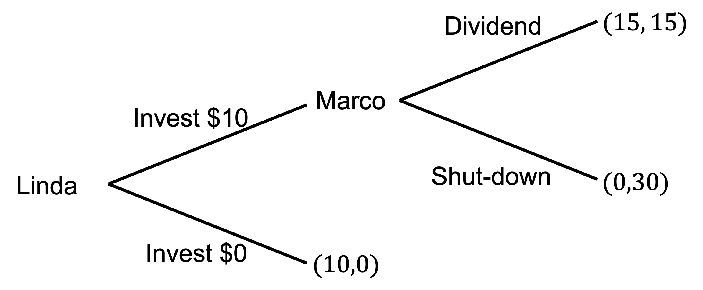
:::

b\) What is the equilibrium of this game if Linda and Marco are purely self-interested?

::: {.callout-tip collapse="true"}
## Question 3b) answer

Marco will shutdown (payoff 30 versus payoff of 15), so Linda will not invest (payoff of 10 versus payoff of zero).

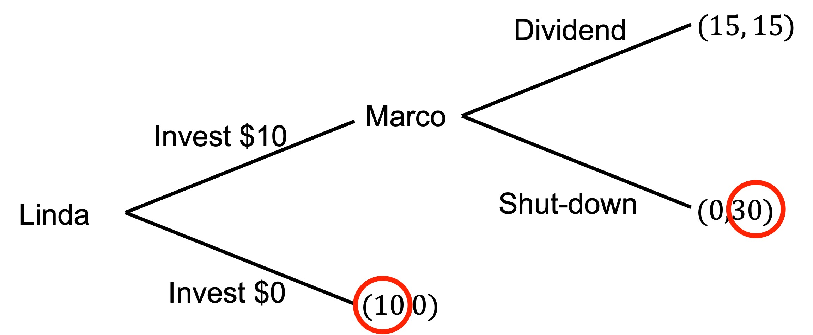

:::

## Question 4

Two city states, Atlantis and El Dorado, are divided by a body of water. In the middle is an island that both states claim sovereignty over.

To establish their claims, both states have built a bridge to the island. Atlantis then sent troops to the island.

El Dorado is deciding whether to attack Atlantis's troops to reclaim the island or to concede.

If El Dorado attacks, Atlantis need to decide whether to defend against the attack or to retreat back across the bridge.

If El Dorado attacks and Atlantis defends, both countries will suffer large losses.

These decisions and the payoffs ($x,y$) from each decision for El Dorado and Atlantis respectively are as follows.

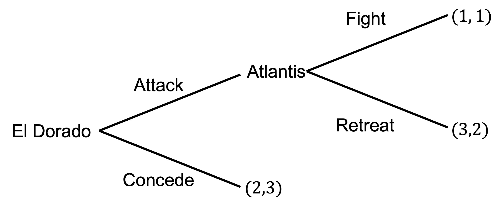

a\) What is the subgame-perfect equilibrium of this game?

::: {.callout-tip collapse="true"}
## Question 4a) answer

By backward induction, Atlantis would prefer to retreat (payoff of 2) compared to fighting (payoff of 1). El Dorado then has a choice between attacking (payoff of 3) and conceding (payoff of 2). El Dorado attacks.

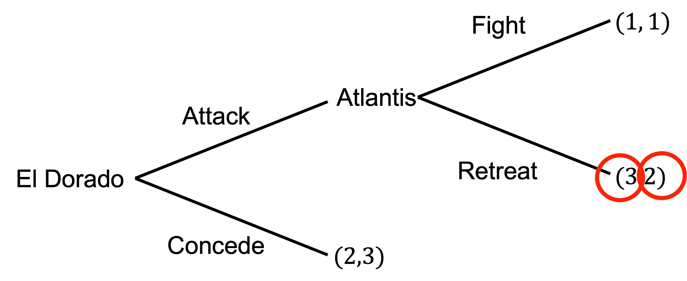

The subgame-perfect equilbrium is (Attack, Retreat).
:::

b\) An adviser to the Atlantis army suggests that they burn the bridge behind them to remove the option of retreat.

Draw the new extensive form game that would emerge if Atlantis had the option of the burning the bridge. What is the subgame-perfect equilibrium?

::: {.callout-tip collapse="true"}
## Question 4b) answer

The new game is as follows (maintaining the payoffs as $x,y$ for El Dorado and Atlantis respectively):

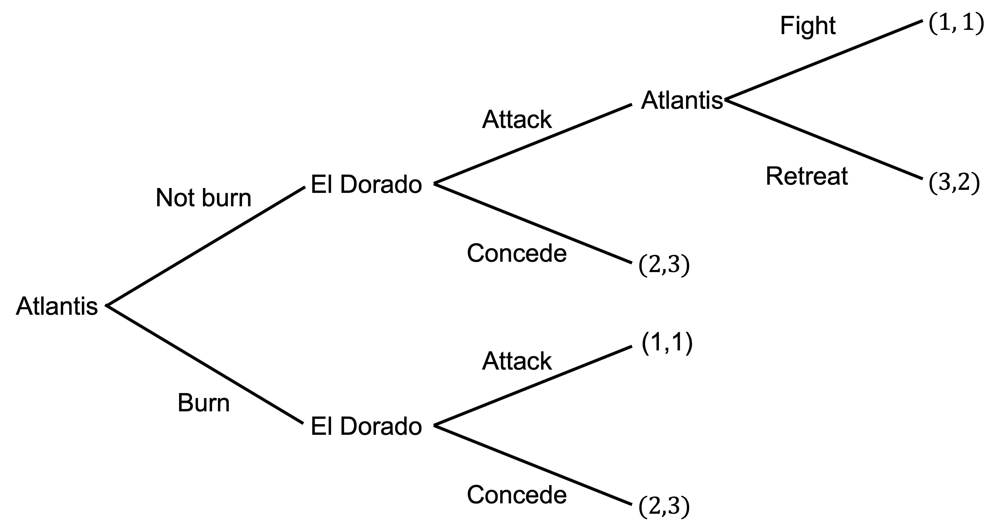

If we work through this game by backward induction, starting with the upper branch:

- Atlantis would prefer to retreat (payoff of 2) compared to fighting (payoff of 1).

- El Dorado would prefer to attack (payoff of 3) compared to conceding (payoff of 2).

For the lower branch:

- El Dorado would prefer to concede (payoff of 2) compated to attack (payoff of 1).

For Atlantis's final decision, they would prefer to burn (payoff of 3) compared to not burning (payoff of 2).

Atlantis burns the bridge.

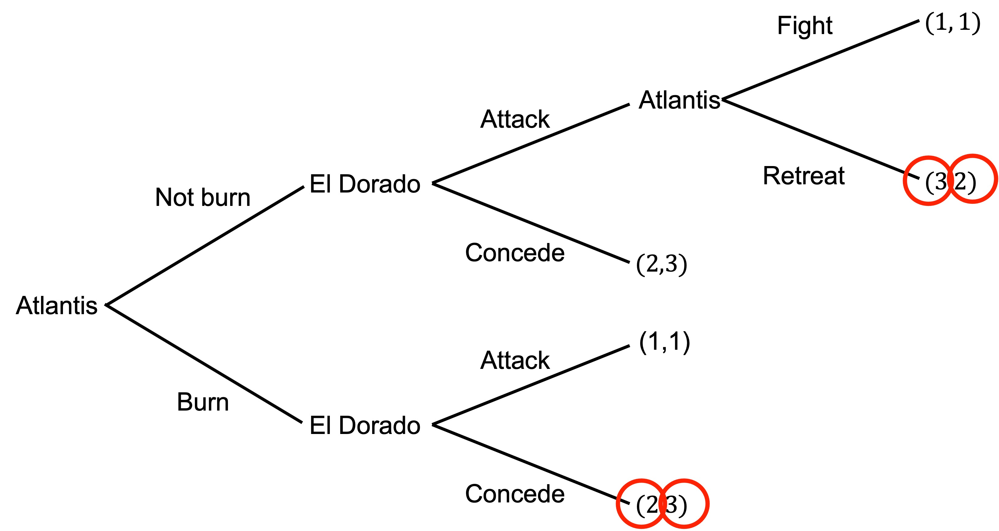

The subgame-perfect equilibrium is (Burn, Retreat; Attack, Concede).
:::
