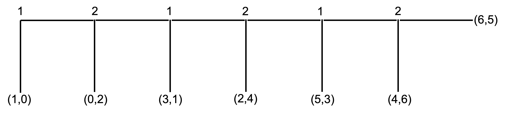
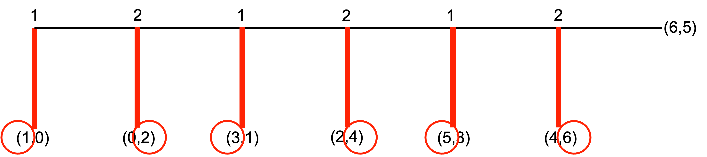
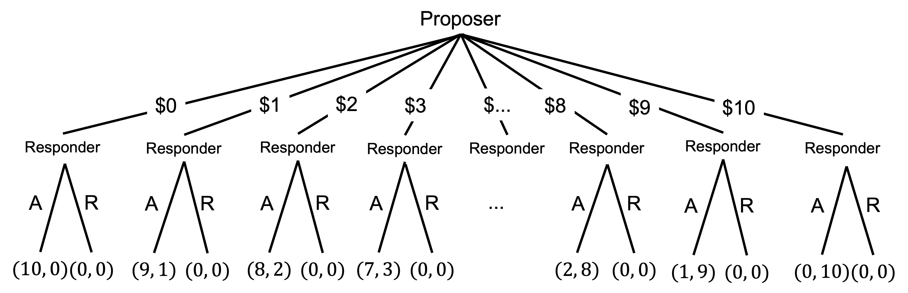
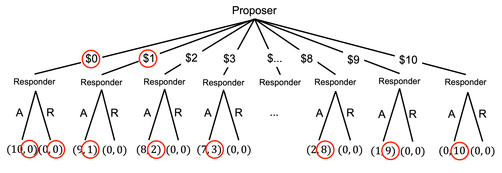

# Sequential games

In sequential games, players make sequential decisions knowing the action of the other player.

## The extensive form

Sequential games can be shown in what is called the "extensive form" representation. The extensive form representation explicitly shows the timing of play.

Payoffs are represented in a game tree.

I will now illustrate the extensive form with a game called the centipede game.

### The centipede game {#sec-centipede-game}

This centipede game has six decision nodes. At each node, a player can “take”, and end the game, or they can “pass”, increasing the total payoff. The other player then has a move.

The numbers 1 and 2 along the top of the centipede represent the decision nodes for two players. At the first node, player 1 has the choice to take or pass. If player 1 passes, player 2 has the choice to take or pass, and so on. At the final node, the game ends regardless of what player 2 chooses.



The payoff when a player takes and ends the game is represented by the numbers in the brackets. The first number is the payoff for player 1 and the second number is the payoff for player 2. For example, if player 1 takes at the first node, they receive a payoff of 1 and player 2 receives a payoff of 0. At the final node, if player 2 passes they receive a payoff of 5 and Player 1 receives a payoff of 6. If player 2 takes at that final node, they receive a payoff of 6 and Player 1 receives a payoff of 4.

## Subgame perfect Nash equilibrium

Before examining this game, I will introduce the concept of a subgame perfect Nash equilibrium.

A subgame is a part of a game that can be played as a game itself. It begins at a single node and contains every successor node.

### Solving the centipede game {#sec-solving-the-centipede-game}

For example, this final stage of the centipede game is a subgame.

{width=30%}

As is this subset of the game.

{width=80%}

A Nash Equilibrium is subgame perfect if every player plays the Nash Equilibrium in every subgame

We can solve for the subgame perfect Nash equilibrium of sequential games by backward induction. To do that we solve for the decision nodes at the end of the game first and then work our way back to the beginning of the game.

In our centipede game, using backward induction, player 2 at the final node will "take" for a payoff of 6 instead of passing for a payoff of 5. When marking choices in a sequential game, it is often useful to mark the option taken by the player, or that not taken, in addition to indicating the payoff they would receive.


At the node immediately before, player 1 will "take" for a payoff of 5 instead of passing, given player 2 will then take, giving player 1 a payoff of 4.


Therefore, at the node before, player 2 will take for a payoff of 4 instead of passing for a payoff of 3.

Therefore, at the node before, player 1 will take for a payoff of 3 instead of passing for a payoff of 2.

Therefore, player 2 at the node before will take for a payoff of 2 instead of passing for a payoff of 1.

And therefore, player 1 at the first node will take for a payoff of 1 instead of passing for a payoff of 0.



There is a unique subgame perfect equilibrium for the centipede game: $S_1=(\text{take, take, take})$ and $S_2=(\text{take, take, take})$, where $S_1$ and $S_2$ are the set of strategies for player 1 and player 2 respectively.

In the subgame perfect Nash equilibrium of the centipede game, player 1 takes at the first node.

## Sequential game examples

In this part, I will discuss some sequential games and their subgame perfect Nash equilibria.

### The ultimatum game

The first example is the ultimatum game.

The ultimatum game involves two players: the proposer and the responder.

The proposer is given a fixed amount of money $m$. They then offer a portion $x$ of the sum $m$ to the responder.

The responder can either accept or reject the offer. They make this decision knowing the fixed amount $m$ held by the proposer and the offer $x$.

If the responder accepts, the responder receives the offer $x$ and the proposer gets the remainder $m-x$. If the responder rejects, both players receive nothing.

```{mermaid}
%%| fig-width: 5
%%| label: fig-ultimatum-game
%%| fig-cap: The ultimatum game
%%| mermaid-format: png

graph LR
    A(Proposer) ---B[Offer x] --> C(Responder)
    A(Proposer) ---D[Offer 0] --> E(Responder)
    C ---F[Accept] --> H["(m-x, <b>x</b>)"]
    C ---G[Reject] --> I["(0, 0)"]
    E ---J[Accept] --> L["(10, <b>0</b>)"]
    E ---K[Reject] --> M["(0, <b>0</b>)"]

    classDef node fill:#FFF, stroke:#000;
    class A,C,E node;

    classDef edge fill:#FFF, stroke:#FFF;
    class B,D,F,G,J,K edge;

    classDef payoff fill:#FFF, stroke:#FFF;
    class H,I,L,M payoff;
```

Below is the extensive form of the ultimatum game with $m=\$10$ and an assumption that the offer must be a whole dollar amount. At the first node is the proposer. They can choose to offer any dollar sum between $0 and $10. Whatever the choice, the responder is at the next node. They can choose to accept or reject the offer. The payoffs of each set of actions is indicated in the brackets at the bottom of the game tree, with the first number being the proposer's payoff and the second number being the responder's payoff.



If we work through this game by backward induction, we can see that for any non-zero amount, the responder will accept the offer. The only time they might not accept is where the offer is 0, but they still might.

Given this, the proposer will offer \$0 or \$1 only.



We can say that there are two subgame perfect Nash equilibria. The first is for the proposer to offer \$1 and the responder to accept if offered \$1 and reject if offered \$0. The other (weak) subgame perfect Nash equilibrium is an offer of \$0 and acceptance.

More generally, game theory makes a clear prediction on the outcome of the ultimatum game. If the players have monotonic preferences - that is, more is better - the responder accepts any $x>0$ (and possibly even if $x=0$) and the the proposer offers the smallest amount the proposer can offer.

Where the strategy space is continuous (that is the offer could always be made smaller) the only subgame perfect Nash equilibrium is for the proposer to offer \$0 and the receiver to accept.

### The dictator game

The next example is the dictator game.

In the dictator game, the dictator is given a fixed amount of money $m$. They then offer a portion $x$ of the sum $m$ to the receiver. The game then ends.

Exchange is unilateral. Receivers have an empty strategy set.

```{mermaid}
%%| fig-width: 4
%%| label: fig-dictator-game
%%| fig-cap: The dictator game
%%| mermaid-format: png

graph LR
    classDef default fill:#FFF
    A(Dictator) ---B[Send x] --> D["(m-x, x)"]
    A ---C[Send 0] --> E["(m,0)"]
    style A stroke:#000
    style B stroke:#FFF
    style C stroke:#FFF
    style D stroke:#FFF
    style E stroke:#FFF
```

The standard game theory prediction is no interaction whatsoever. The dictator maximises their payoff by keeping all of the endowment themselves, receiving payoff $m$ (which is bolded).

```{mermaid}
%%| fig-width: 4
%%| label: fig-dictator-game-solved
%%| fig-cap: The dictator game solved
%%| mermaid-format: png

graph LR
    classDef default fill:#FFF
    A(Dictator) ---B[Send x] --> D["(m-x, x)"]
    A ---C((Send 0)) --> E["(<b>m</b>,0)"]
    style A stroke:#000
    style B stroke:#FFF
    style C stroke:#F00, stroke-width:4px
    style D stroke:#FFF
    style E stroke:#FFF

```

### The trust game{#sec-trust_game}

The final example is the trust game.

The trust game involves two players: a sender and a receiver

Both the sender and receiver are given an initial sum $m$.

The sender sends a share $x$ of their $m$ to the receiver. This amount $x$ is often called the investment.

Before the investment is received by the receiver, it is multiplied by some factor $k$.

Therefore, the receiver receives $kx$.

The receiver then returns to the sender some share $y$ of their total allocation $m+kx$.

The final outcome is the sender has $m-x+y$ and the receiver has $m+kx-y$. We can represent these payoffs as:

$$
(m-x+y, m+kx-y)
$$

The extensive form of the game is as follows.

```{mermaid}
%%| fig-width: 5
%%| label: fig-trust-game
%%| fig-cap: The trust game
%%| mermaid-format: png

graph LR
    classDef default fill:#FFF
    A(Sender) ---B[Send x] --> C{Multplied by k} --> D(Receiver)
    A ---E((Send 0)) --> F["(10,10)"]
    D ---G[Return y] --> H["(10-x+y, 10+3x-y)"]
    D ---I[Return 0] --> J["(10-x, 10+3x)"]

    classDef node fill:#FFF, stroke:#000;
    class A,D node;

    classDef edge fill:#FFF, stroke:#FFF;
    class B,E,G,I edge;

    classDef payoff fill:#FFF, stroke:#FFF;
    class F,H,J payoff;

```

Here is a numerical example.

Suppose the sender and receiver are given an initial sum of $10.

The sender decides to send \$5 of their \$10 to the receiver.

This is multiplied by a factor of 3. Therefore, the receiver receives \$15 and now has \$25.

The receiver then returns to the sender \$7.50 of their \$25.

The final outcome is $(10−5+7.50,  10+15−7.50)=(12.50, 17.50)$.

```{mermaid}
%%| fig-width: 5
%%| label: fig-trust-game-1
%%| fig-cap: The trust game
%%| mermaid-format: png

graph LR
    classDef default fill:#FFF
    A(Sender) ---B[Send 5] --> C{5 x 3 = 15} --> D(Receiver)
    D ---G[Return 7.50] --> H["(12.50, 17.50)"]

    classDef node fill:#FFF, stroke:#000;
    class A,D node;

    classDef edge fill:#FFF, stroke:#FFF;
    class B,G edge;

    classDef payoff fill:#FFF, stroke:#FFF;
    class H payoff;

```

If both receivers have utility function $u(x)=x$ the only subgame-perfect equilibrium is that the receiver will keep all their money, so the sender sends nothing.

We can see this by backward induction. The receiver can either return $y$ for a payoff of $10+3x-y$ or return 0 for a payoff of $10+3x$. The receiver will return 0.

One way to think about this problem is that the receiver is effectively playing a dictator game.

Working backwards, the sender therefore has a choice between sending $x$ for a payoff of $10-x$ or sending $0$ for a payoff of $10$. The sender will send $0$.

```{mermaid}
%%| fig-width: 5
%%| label: fig-trust-game-2
%%| fig-cap: The trust game
%%| mermaid-format: png

graph LR
    classDef default fill:#FFF
    A(Sender) ---B[Send x] --> C{Multplied by k} --> D(Receiver)
    A ---E((Send 0)) --> F["(10,10)"]
    D ---G[Return y] --> H["(10-x+y, 10+3x-y)"]
    D ---I((Return 0)) --> J["(10-x, 10+3x)"]

    classDef node fill:#FFF, stroke:#000;
    class A,D node;

    classDef edge fill:#FFF, stroke:#FFF;
    class B,G edge;

    classDef payoff fill:#FFF, stroke:#FFF;
    class F,H,J payoff;

    classDef action stroke:#F00, stroke-width:4px;
    class E,I action;

```

Relative to the Pareto optimal outcome whereby the sender's full endowment is tripled and they receive a positive return on their investment, both players are worse off under the equilibrium outcome.
