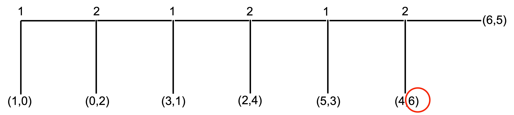
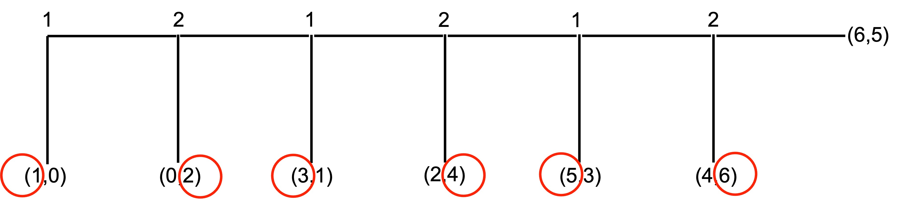
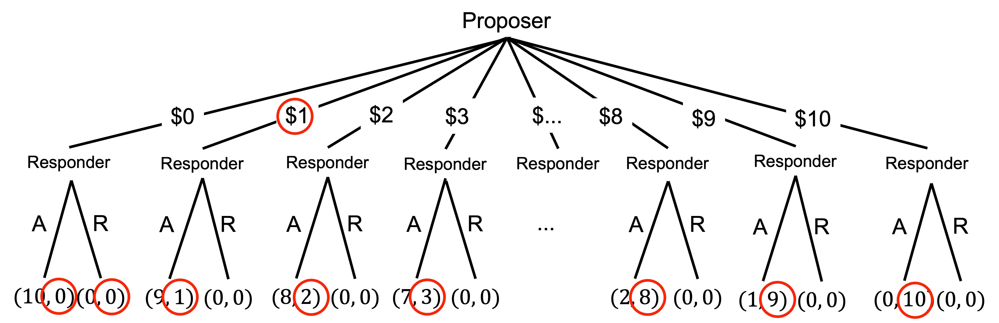
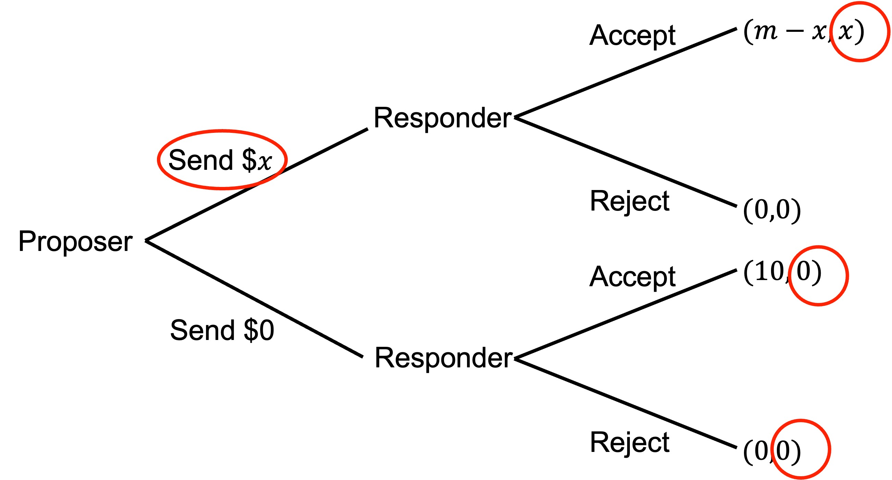
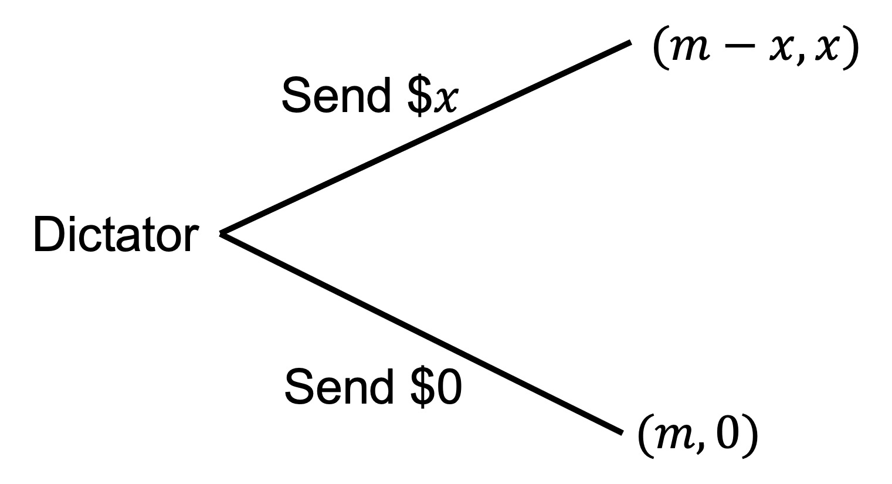
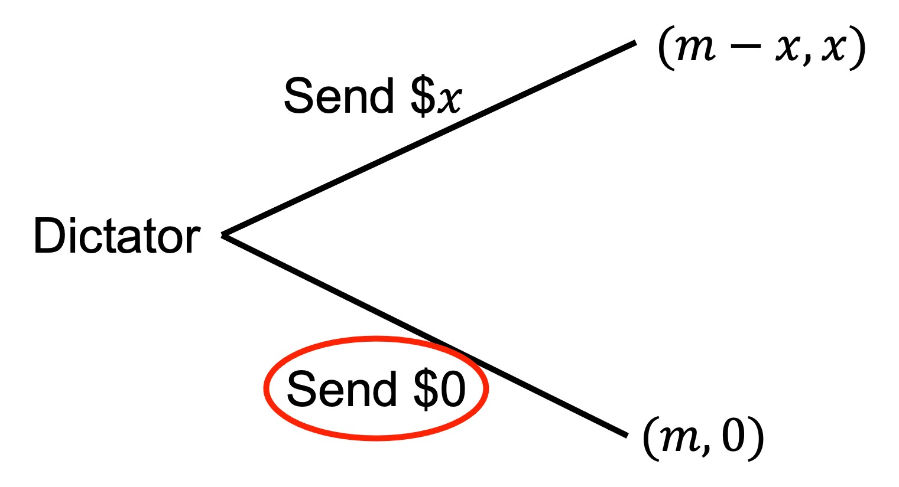
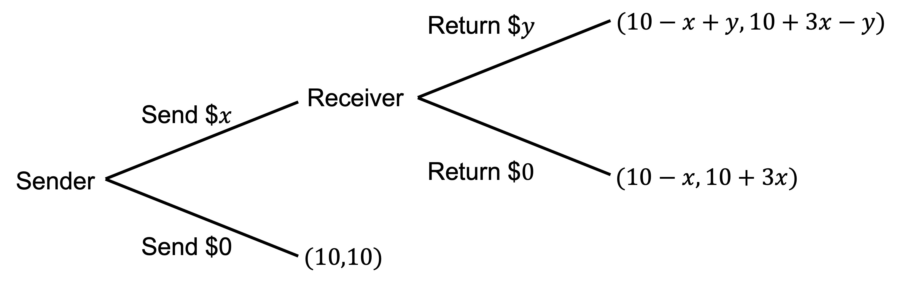
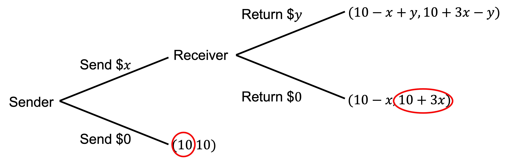

# Sequential games

In sequential games, players make sequential decisions knowing the action of the other player.

## The extensive form

The extensive form representation explicitly shows the timing of play.

Payoffs are represented in a game tree.

I will now illustrate the extensive form of the game with a game called the centipede game.

### The centipede game

This centipede game has six stages. At each stage, a player can “take” and end the game or they can “pass”, increasing the total payoff. The other player then has a move.

## Subgame perfect Nash equilibrium

A subgame is a part of a game that can be played as a game itself. It begins at a single node and contains every successor node.

A Nash Equilibrium is subgame perfect if every player plays the Nash Equilibrium in every subgame

We can solve for the subgame perfect Nash equilibrium of sequential games by backward induction: 

- solve for the decision nodes at the end of the game first

- work your way to the beginning of the game.

In our centipede game, using backward induction, player 2 at the final stage will take for a payoff of 6 (relative to 5 for passing).

Therefore, player 1 at the stage before will take for a payoff of 5 (relative to the payoff of 4 they would receive for passing, given player 2 will then take).

Therefore, player 2 at the stage before will take for a payoff of 4.

And so on.

There is a unique subgame perfect equilibrium: $S_1=(\text{take, take, take})$ and $S_2=(\text{take, take, take})$, where $S_1$ and $S_2$ are the set of strategies for player 1 and player 2 respectively.

In the subgame perfect Nash equilibrium, player 1 takes at the first stage.

## Sequential game examples

### The ultimatum game

The ultimatum game involves two players: the proposer and the responder.

The proposer is given a fixed amount of money $m$. They then offer a portion $x$ of the sum $m$ to the responder.

The responder can either accept of reject the offer. They make this decision knowing $m$ and $x$.

If the responder accepts, the responder receives $x$ and the proposer gets $m-x$. If the responder rejects, both players receive nothing.

Below is the extensive form of the ultimatum game with $m=\$10$ and an assumption that the offer must be a whole dollar amount.

If we work through this game by backward induction, we can see that for any non-zero amount, the responder will accept the offer. The only time they might not accept is there the offer is $0$.

Given this, the proposer will offer $\$1$ only.

More generally, game theory makes a clear prediction on the outcome of the ultimatum game. If $u(x)=x$:

- The responder accepts any $x>0$.

- The proposer offers $x=\epsilon$, where $\epsilon$ is the smallest non-zero amount the proposer can offer.

The other (weak) subgame perfect Nash equilibrium is an offer of \$0 and acceptance.

Where the strategy space is continuous (i.e $\epsilon$ could always be made smaller) the only subgame perfect Nash equilibrium is for the proposer to offer \$0 and the receiver to accept.

### The dictator game

In the dictator game, the dictator is given a fixed amount of money 𝑚. They then offer a portion 𝑥 of the sum 𝑚 to the receiver. The game then ends.

Exchange is unilateral. Receivers have an empty strategy set.

The standard game theory prediction is no interaction whatsoever. The dictator maximises their payoff by keeping all of the endowment themselves.

### The trust game

The trust game involves two players: a sender and a receiver

Both the sender and receiver are given an initial sum $m$.

The sender sends a share $x$ of their $m$ to the receiver (the investment).

Before the investment is received by the receiver, it is multiplied by some factor $k$.

The receiver receives $kx$.

The receiver then returns to the sender some share $y$ of their total allocation $m+kx$.

The final outcome is ($m-x+y$, $m+kx-y$).

Here is a numerical example.

Suppose the sender and receiver are given an initial sum of $10.

The sender decides to send \$5 of their \$10 to the receiver (the investment).

This is multiplied by a factor of 3. Therefore, the receiver receives \$15 and now has \$25.

The receiver then returns to the sender \$7.50 of their \$25.

The final outcome is (\$10−5+7.50,  \$10+15−7.50)=(\$12.50, \$17.50).

The extensive form of the game is as follows.

If both receivers have utility function $u(x)=x$ the only subgame-perfect equilibrium is that the receiver will keep all their money, so the sender sends nothing.

One way to think about this problem is that the receiver is effectively playing a dictator game.

Relative to the Pareto optimal outcome whereby the sender's full endowment is tripled and they receive a positive return on their investment, both players are worse off under the equilibrium outcome.
