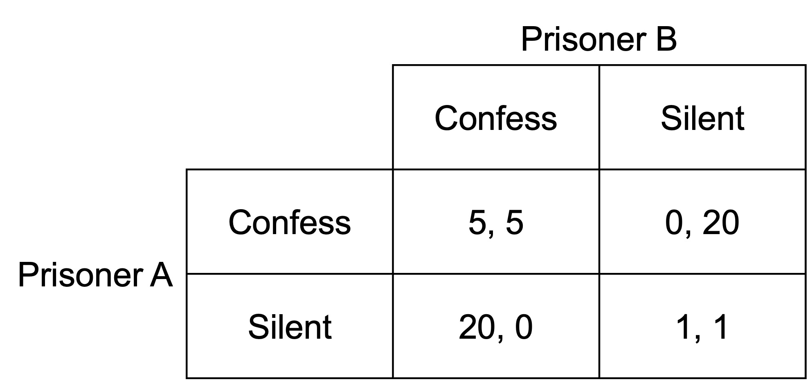
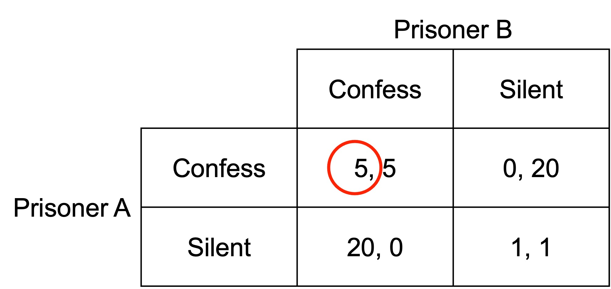
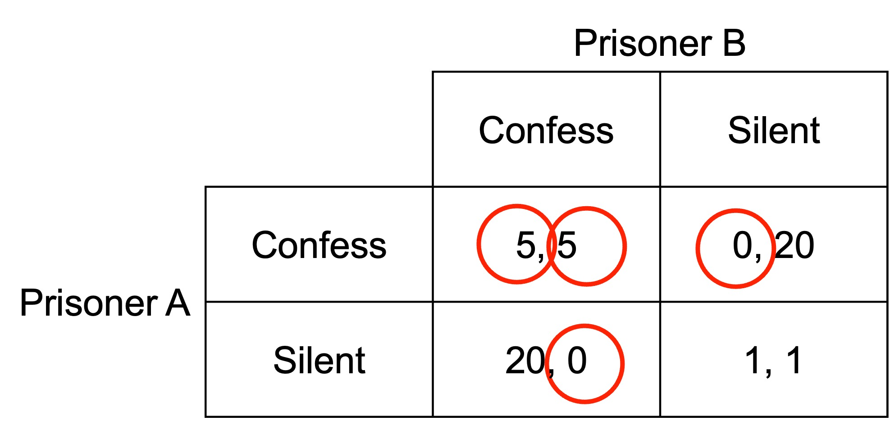
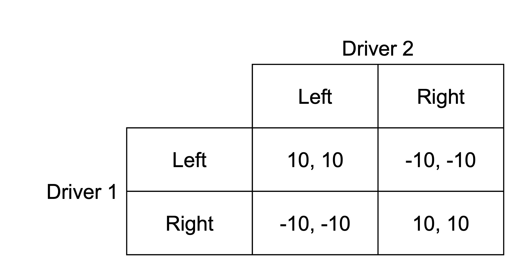
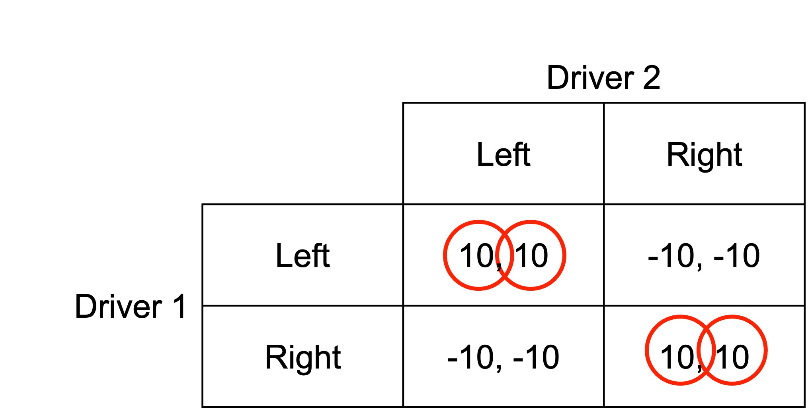
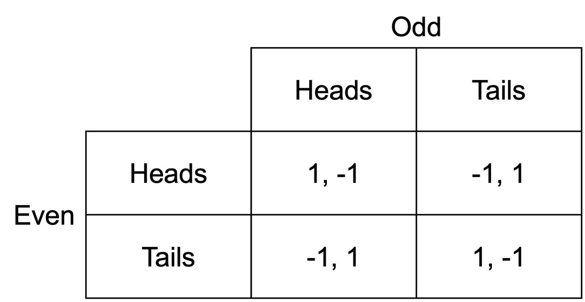
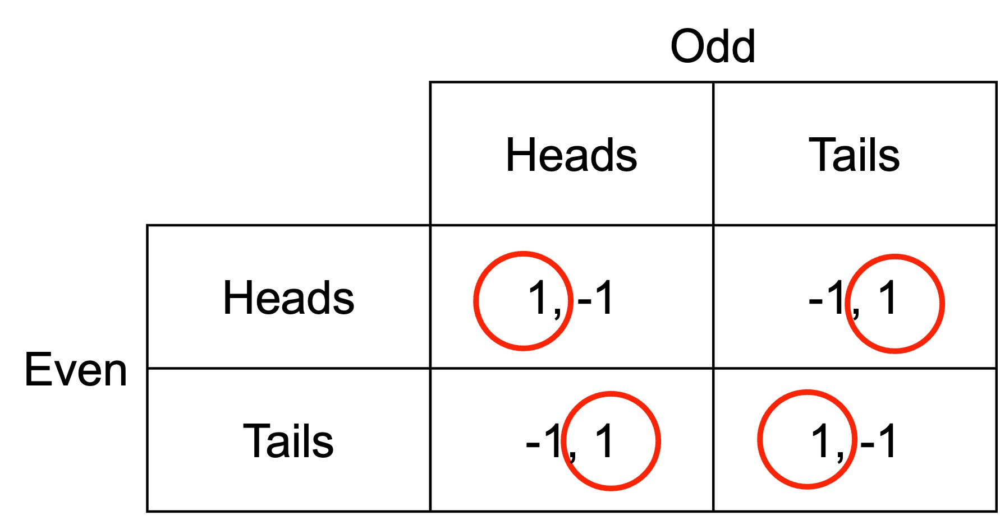
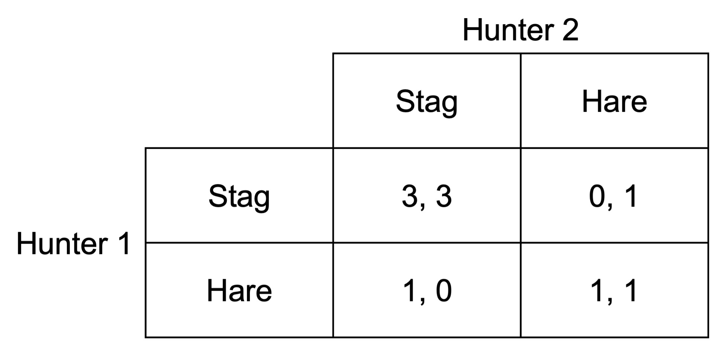
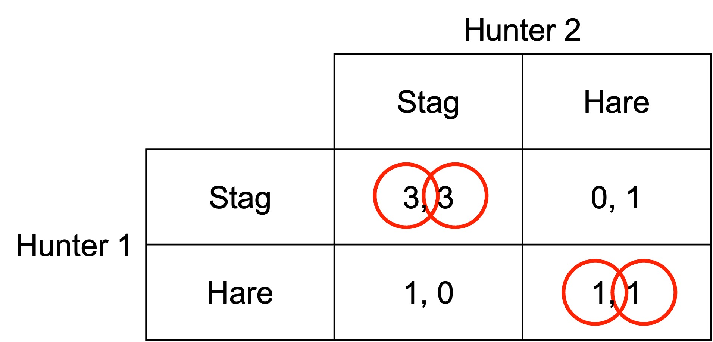

# Simultaneous move one-shot games

In a simultaneous move one-shot game, you make decisions without knowing the action of your rival. This can be interpreted as:

- Players making decisions at the same time

- Players making decisions before knowing the decisions of their rivals.

## The normal form

We usually write simultaneous move one-shot games in what is called the “strategic” or “normal” form:

- Payoffs are represented in a matrix

- Payoffs include all the outcomes for a player (monetary or non-monetary)

I will now illustrate the normal form of the game with a game called the prisoner's dilemma.

### The prisoner's dilemma

The prisoner’s dilemma is a classic simultaneous move one-shot game. A pair of criminals have been captured following a crime. The police have sufficient evidence to convict them of a minor crime (e.g. trespass), but insufficient evidence to convict them of the major crime that has occurred (e.g. theft of the crown jewels).

The police place each prisoner in a separate cell where they cannot communicate with each other. The police then offer both prisoners a deal: confess and they will let them go free despite the minor crime, but they will then have the evidence required to give their criminal partner a massive sentence for the serious crime.

If neither confesses, the police will have insufficient evidence to get a conviction for the major crime, so they will both receive a short sentence for the minor crime. If both confess, they will both get a longer sentence, but with some reduction in sentence relative to if they didn't confess.

The normal form of the game is as follows:

Prisoners A and B have two actions available: confess and silent. The numbers in the matrix represent the payoffs from each combination of actions, in this case the number of years they will serve in prison (a higher number is a worse outcome). The number in the left of each payoff cell represents the payoff to the row player, Prisoner A. The number on the right of each payoff cell is the payoff to the column player, Prisoner B.

For example, if both Prisoner A and Prisoner B choose to confess, they each receive a prison sentence of five years. If Prisoner A confesses and Prisoner B remains silent, Prisoner A gets off without a prison sentence, whereas Prisoner B gets twenty years.

Equipped with the normal form of the game, we can determine what each player wants to do in response to each action of the other player.

For example, we can see that if Prisoner B confesses, Prisoner A can either confess and receive five years in prison, or remain silent and receive 20 years in prison. They would choose to confess.

We indicate the preferred action in response to another player's action by circling the relevant payoff. For example:

If Prisoner B remains silent, Prisoner A could either confess and escape without a sentence, or remain silent and receive a sentence of one year in prison. They would prefer to confess.

We can then work through the same process for Prisoner B's actions. 

If Prisoner A confesses, Prisoner B can either confess and receive five years in prison, or remain silent and receive 20 years in prison. They would choose to confess.

If Prisoner A remains silent, Prisoner B could either confess and escape without a sentence, or remain silent and receive a sentence of one year in prison. They would prefer to confess.

Indicating this set of preferred actions in response to that of the other player gives us the following:

## Dominant strategies

A strategy is (strictly) dominant if it gives a (strictly) higher payoff than every other strategy, for every strategy that your rivals play.

If you have a strictly dominant strategy, you should play it for sure.

In a dominant strategy equilibrium, all players choose a dominant strategy.

In the prisoner's dilemma both players have a dominant strategy to confess.

## Nash equilibrium

A set of strategies is a Nash equilibrium if every player is playing a best response to their rivals’ strategies. No one has an incentive to change strategy.

A Nash equilibrium is self-enforcing and stable.

An agreement that is a Nash equilibrium is self-fulfilling. If the players agree to play a certain way, they’ll both go through with it. Unilateral deviations are not worthwhile.

The prisoner's dilemma has a single Nash equilibrium: (Confess, Confess). Visually, where the preferred response of both players to the other player's action falls within the same cell, this indicates a Nash equilibrium.

## Simultaneous move one-shot game examples

### The driving game

Consider the following game between two players deciding what side of the road to drive on. If they don’t drive on the same side of the road they crash.

What are the Nash equilibria? The Nash equilibria are (Left, Left) and (Right, Right).

### Matching pennies

Consider the following game between two players, Even and Odd. If both pennies match, Even wins. If they don’t match, Odd wins.

What are the Nash equilibria?

There are no pure-strategy Nash equilibria for this game. (There are mixed-strategy equilibria, but mixed-strategy equilibria are beyond the scope of this subject.)

### The stag hunt

Consider the following game between two players deciding what animal they will hunt. Both hunters need to cooperate to catch the stag. They can catch a hare by themselves, but it provides less meat.

What are the Nash equilibria?

The Nash equilibria are (Stag, Stag) and (Hare, Hare). 

### The public goods game

Participants are given an initial endowment.

Each secretly and simultaneously chooses how much of their endowment they wish to contribute to a public pot.

The money in the public pot is multiplied by some amount $m$ and split evenly between the players.

For example, players might each be given $10, with the pot doubled.

In Nash equilibrium in the public goods game, nobody transfers anything to the pot. Any contributions are split between all players, so if there are more players than $m$ (which is normally the case by design), contributions result in a loss.

The Pareto optimal result, however, is for all players to contribute their full endowment and each receive back their contribution multiplied by $m$.
