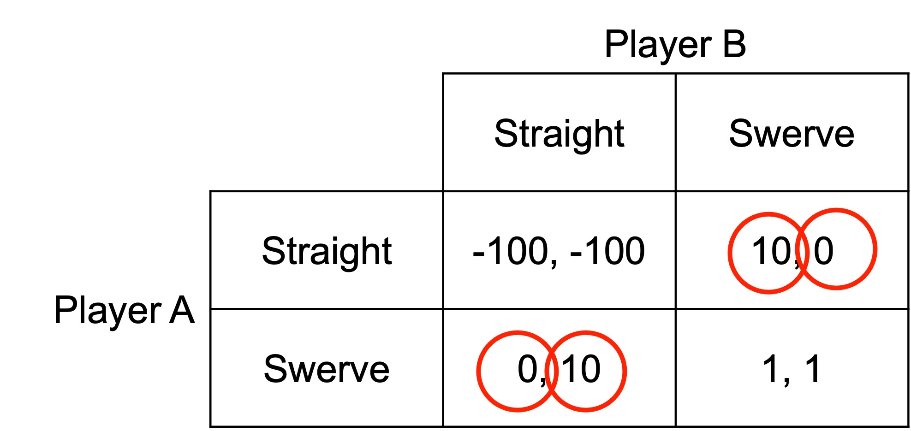
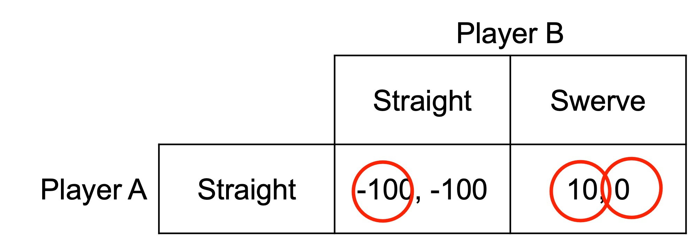
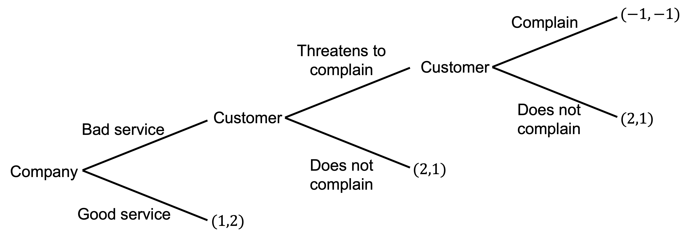

# Strategic moves and commitment

## Chicken

Consider the following game of chicken. Two players are driving toward each other. Whoever swerves first loses. If neither swerves, they crash and die.

There are two pure-strategy Nash equilibria: (Straight, Swerve) and (Swerve, Straight). If the other player swerves, they want to go straight. If the other player goes straight, they want to swerve. 

As they are driving toward each other, Player A rips the steering wheel out of their car and throws it out the window. They will now drive straight no matter what Player B does. 

This is effectively a new game. What is the Nash equilibrium?

The Nash equilibrium is (Straight, Swerve). Player A wins the game of chicken.

## Strategic moves

The option to commit to a course of action as in this game of chicken is an example of a strategic move.

A strategic move changes the game you are playing from a single-stage game to a two-stage game. In the first stage you make your strategic move. In the second you play the original game.

Strategic moves come in two forms:

- Unconditional: commitments

- Conditional: threats and promises

## Unconditional strategic moves

An unconditional strategic move is a commitment.  For example, removing your steering wheel in chicken is a commitment.

The commitment needs to be:

- Observable: your opponent should be able to observe your commitment. Otherwise you can claim to have made the commitment when you have not.

- Irreversible: you cannot undo your commitment. Otherwise, the game remains as if you had never made it.

## Conditional strategic moves

A conditional strategic move involves specifying to your opponent how you will respond to each move.

- Threats: ”If you don’t clean your room, you won’t get dessert.”

- Promises: “If you clean you room, you can have dessert.”

## Credibility of strategic moves

Commitments, threats and promises only achieve their objective if they are credible. That is, they only work if the other player believes they will be carried out as stated.

Sticking to a commitment and carrying out a threat or a promise typically reduces the possible actions of the player.

If the proposer loses too much from carrying out a threat or promise, they will not carry it out.

### Example

You threaten to complain about a poor service by a company. Complaining is costly.

There are two sub-game perfect Nash equilibria: (Threatens to complain, Bad service, Does not complain) and (No threat, Bad service). The threat to complain is not credible.

