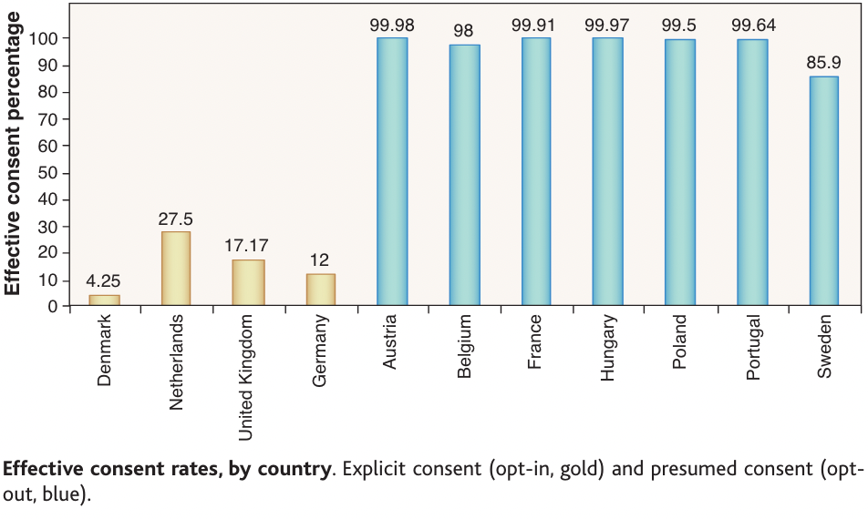

# Intertemporal choice applications

## Savings

In the 1960s, the domestic savings rate in the Philippines was over 20% of GDP (one of the highest in Asia). By 2006, the savings rate ranges between 12 and 15 percent, far below the level of savings for most East Asian countries.

@ashraf2006 offered a commitment savings product called SEED (Save, Earn, Enjoy Deposits) to randomly chosen clients of a Philippine bank. SEED restricted access to savings for one year.

Other than providing a possible commitment savings device, no further benefit accrued to individuals with this account.

-   28.4% take-up rate of the two commitment protocols studies (either goal or time-based goal).
-   Average savings balance increased by 42% after six months and by 82% after one year.

## Smoking

@giné2010 tested a voluntary commitment product for smoking cessation.

Smokers were offered a product (CARES) that comprised a savings account in which they deposit funds. After six months they take urine tests for nicotine and cotinine.

If they pass, the money is returned. Otherwise, it is forfeited.

The result was that 11% of smokers offered CARES took it up. Smokers offered CARES were 3 percentage points more likely to pass the 6-month test than the control group

The effect persisted in a surprise tests at 12 months.

## Gym attendance

@kirgios2020 found that:

-   Teaching gym-goers how to temptation bundle with a free audiobook boosts gym visits.

-   People who are given audiobooks by gyms can infer they should temptation bundle.

-   Simply receiving a free audiobook with no explicit instruction boosts exercise.

-   Teaching temptation bundling modestly outperforms simply giving gym-goers free audiobooks.

## Organ donation

In European countries there are registers of people who will donate their organs in case of death. There is a considerable gap in the percentage of registered organ donors. Why?

 Figure from @johnson2003.

Yellow countries have an opt-in policy. People are required to register as an organ donor.

Green countries have an opt-out policy known as presumed consent. They are presumed to consent unless they opt-out (often through submission of a form).

This is a classic example of a default effect. Defaults are sticky. The stickiness of defaults is typically assumed to come from loss aversion or present-bias.

-   There is an immediate cost of changing from the default (time, effort, money). That cost is not discounted.

-   The future benefit of their action is discounted.

-   Agents put off a switch even though cost is low since they believe they will switch later.

-   Consequently, people do not exert their right to choose once they are allocated some options.

It is also possible to make an argument that the stickiness of the defaults is due to a rational cost-benefit calculation, rather than due to loss aversion of present bias.

-   The cost of opting out is real.

-   People may not have a strong preference about whether they are an organ donor

-   Registration does not mean that your organs will be donated. Other factors such as family preference affect donation. As a result, registration might be seen as having little effect on the outcome you care about (actual organ donation). @johnson2003 argue that there is a positive relationship between an opt-out policy and organ donations, but it is much weaker than the registration numbers would suggest and based on a simple regression that likely does not capture all relevant variables.

-   Further, the absence of any active consent in situations of presumed consent means that the family cannot take their presence on the organ donation register as an indication of the deceased's wishes.

Put together, the failure to opt-out may reflect a simple cost-benefit analysis.

There are alternatives to presumed

One alternative is the use of defaults in a more transparent way where opting out is easy. For example, when obtaining your driver's licence there could be a section stating "Please tick this box if you do not wish to be registered as an organ donor". This measure would likely increase registration over the alternative of asking people to tick the box if they wish to be an organ donor.

Another alternative is "active choice", where citizens are required to indicate whether or not they wish to be registered. This could also be built into a form such as a driver's licence application.

## Save More Tomorrow

The Save More Tomorrow program (@thaler2004) combines principles relating to both prospect theory and time preference to increase retirement savings.

Under Save More Tomorrow, customers are asked to commit in advance to allocating a fraction of their future salary increases toward their retirement savings accounts.

Save More Tomorrow is designed to reduce loss aversion as a factor in deciding contribution amounts. A commitment of a proportion of pay rises means that the contribution can increase over time, but pay never decreases.

The program capitalises on participants' propensity to stick with the status quo, as people are unlikely to unwind their future commitments despite being able to opt out at any time.

That ability opt-out also reduces regret/disappointment aversion.

The first tests of the Save More Tomorrow program by @thaler2004 resulted in 78 per cent of those offered the plan joining, 80% of those remaining in the plan through the fourth pay rise, and average savings rates increasing from 3.5% to 13.6% over 40 months. This compares to much lower savings rates by those who declined advice, accepted a recommended savings rate or took advice but declined to enrol in Save More Tomorrow.

```{r}
#| label: fig-smart
#| fig-cap: Savings rates for SMarT
#| warning: false

library(ggplot2)
library(tidyverse)

df <- data.frame( "Raise" = c("Pre-advice", "First", "Second", "Third", "Fourth"),
                  "Declined-advice"=c(6.6, 6.5, 6.8, 6.6, 6.2),
                  "Recommended"=c(4.4, 9.1, 8.9, 8.7, 8.8),
                  "SMarT"= c(3.5, 6.5, 9.4, 11.6, 13.6),
                  "Declined"= c(6.1, 6.3, 6.2, 6.1, 5.9)
                  )

df2 <- df |>
  pivot_longer(!Raise, names_to = "group", values_to ="percentage") |>
  arrange(group) |>
  mutate(Raise=factor(Raise, levels=c("Pre-advice", "First", "Second", "Third", "Fourth")))

df2 <- df2[,c(2,1,3)]

df2 <- df2 |>
  mutate(group = replace(group, group == "No.advice", "Declined advice")) |>
  mutate(group = replace(group, group == "Declined", "Declined SMarT"))

ggplot(df2, aes(group, percentage)) +
  geom_col(aes(group = Raise, fill=Raise), colour = "grey50", position = "dodge")+ 
  labs(x = "", y = "Percentage of income saved") +
  scale_fill_brewer(palette="RdBu")
```

Note the savings rate is higher than the default rate in Australia. Could the default in Australia create a low anchor for some people?
