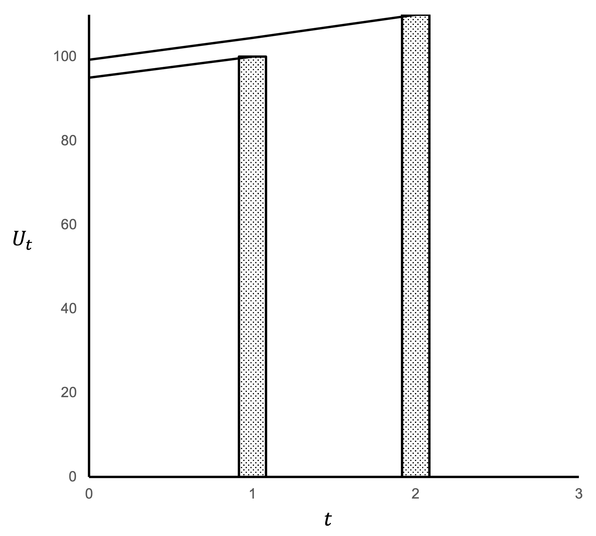
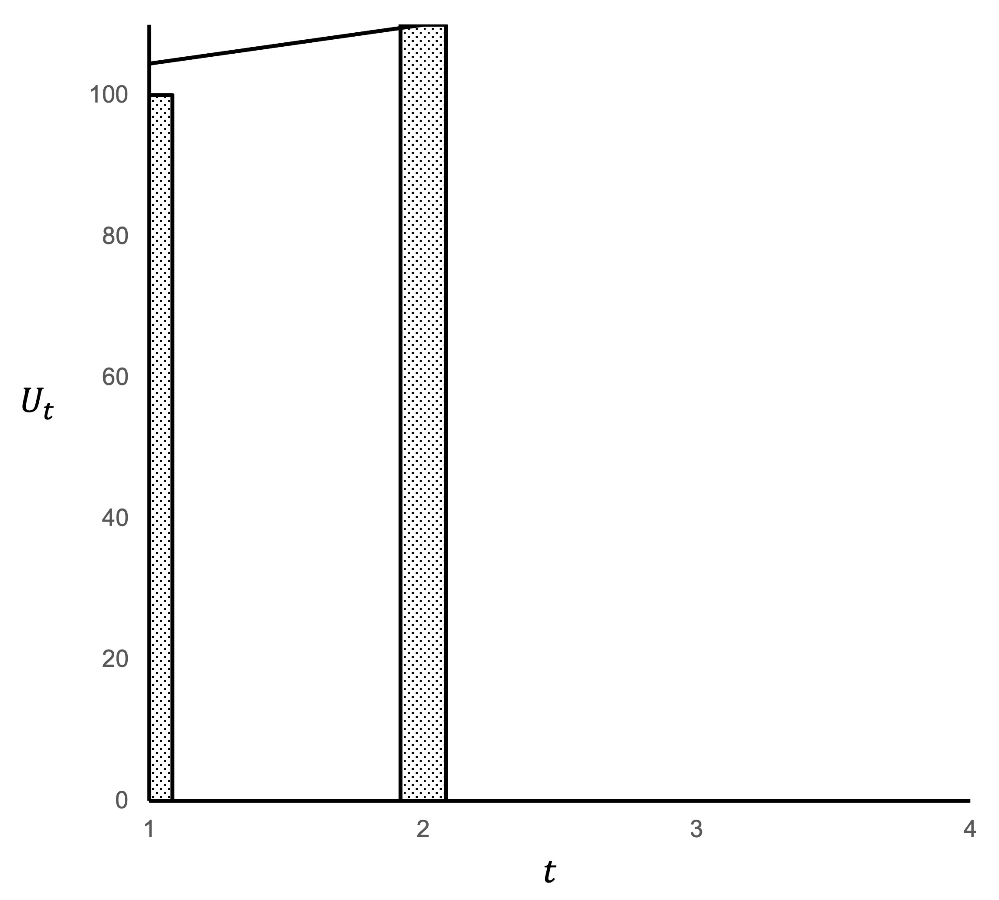
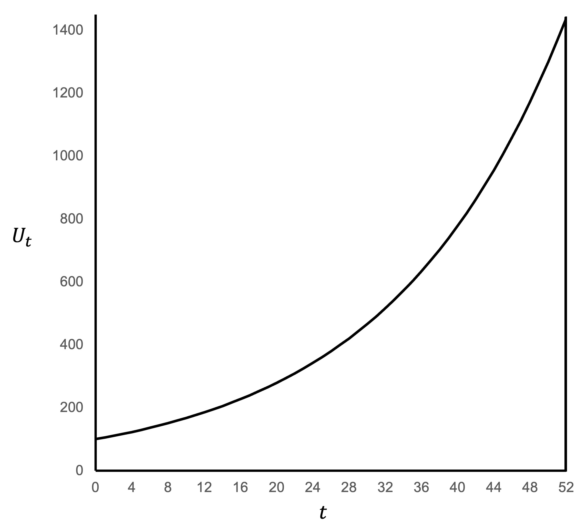
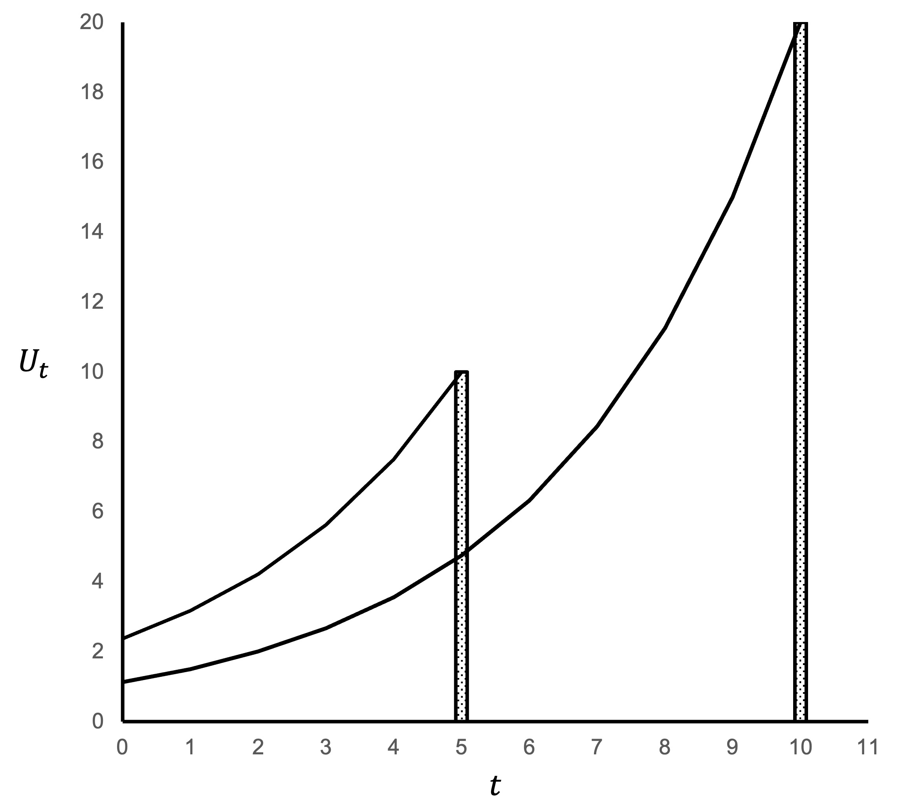
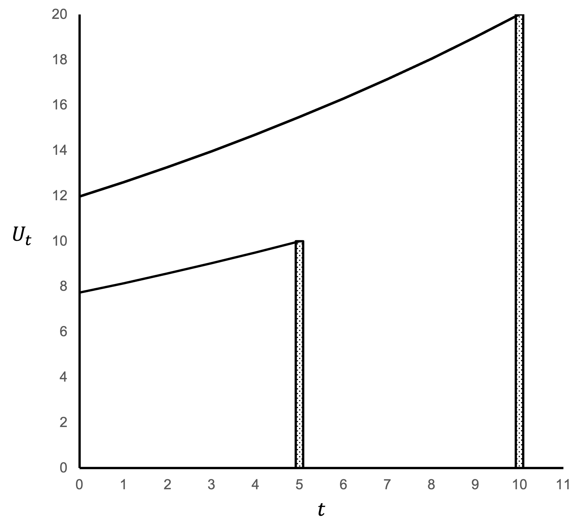

# Exponential discounting examples

## Example 1

Suppose we have an exponential discounter with $\delta=0.95$ and utility each period of $u(x_n)=x_n$.

Choice 1: Would this agent prefer \$100 today ($t=0$) or \$110 next week ($t=1$)? 

\begin{align*}
U_0(0,\$100)&=u(\$100) \\
&=100 \\
\\
U_0(1,\$110)&=\delta u(\$110) \\
&=0.95*110 \\
&=104.50
\end{align*}

The exponential discounter will prefer to receive \$110 next week.

Choice 2: Would this agent prefer \$100 next week ($t=1$) or \$110 in two weeks ($t=2$)? 

\begin{align*}
U_1(1,\$100)&=\delta u(\$110) \\
&=0.95*100 \\
&=95 \\
\\
U_1(2,\$110)&=\delta^2 u(\$110) \\
&=0.95^2*110 \\
&=`r 0.95^2*110`
\end{align*}

The exponential discounter will prefer to receive \$110 in two weeks. The set of decisions across Choice 1 and Choice 2 are time consistent. If the agent selected \$110 in two weeks for Choice 2 and was given a chance to change their choice after one week (which is effectively Choice 1), they would not change.

@fig-example_1 visualises the effect of discounting in Choice 2.

The two bars represent the options: \$100 at $t=1$ and \$110 at $t=2$. The line from each represents the discounted value of that option at each time. For example, at $t=1$ the discounted utility of the \$100 received at $t=1$ is \$100 and of the \$110 received at $t=2$ is \$104.50. We can read those values from the line. For any time $t$ we can determine which option would be preferred by seeing which line is higher.

{width=60% #fig-example_1}

You will note that the two lines do not cross. For an exponential discounter, if one line is higher at any particular time $t$, it is higher at all times.

@fig-example_1a visualises Choice 1.

{width=60% #fig-example_1a}

## Example 2

Suppose we have an exponential discounter with $\delta=0.95$ per week and utility each period of $u(x_n)=x_n$

They are offered \$100 today. What sum would they need to be offered in one year (52 weeks) to prefer that later payment to the \$100 today?

\begin{align*}
U_0(0,\$100)&=u(\$100) \\
&=100 \\
\\
U_0(52,\$x)&=\delta^{52} u(\$x) \\
&=0.95^{52}*x
\end{align*}

They will prefer \$$x$ in 52 weeks if $U(\$x \text{ at } t=52)$ is greater than 100.

\begin{align*}
0.95^{52}*x&>100 \\[6pt]
x&>\frac{100}{0.95^{52}} \\[6pt]
x&>\$`r round(100/(0.95^52), 2)`
\end{align*}

The agent would be willing to wait a year for payment if they were paid more than $1440.03.

@fig-example_2 visualises this problem.

{width=60% #fig-example_2}

## Example 3

Suppose we have an exponential discounter with $\delta=0.75$ and utility each period of $u(x_n)=x_n$.

Would this agent prefer \$10 in five days ($t=5$) or \$20 in 10 days ($t=10$)? 

\begin{align*}
U_0(5,\$10)&=\delta^5u(\$10) \\
&=0.75^5\times 10 \\
&=`r round(0.75^5*10, 3)` \\
\\
U_0(10,\$20)&=\delta^{10} u(\$20) \\
&=0.75^{10}\times 20 \\
&=`r round(0.75^10*20, 3)`
\end{align*}

This exponential discounter will prefer to receive \$10 in five days.

What if their discount rate was $\delta=0.95$?

\begin{align*}
U_0(5,\$10)&=\delta^5u(\$10) \\
&=0.95^5\times 10 \\
&=`r round(0.95^5*10, 3)` \\
\\
U_0(10,\$20)&=\delta^{10} u(\$20) \\
&=0.95^{10}\times 20 \\
&=`r round(0.95^10*20, 3)`
\end{align*}

This exponential discounter will prefer to receive \$20 in 10 days.

::: {#fig-example3 layout-ncol=2}

{#fig-example_3}

{#fig-example_3a}

Exponential discounting
:::
