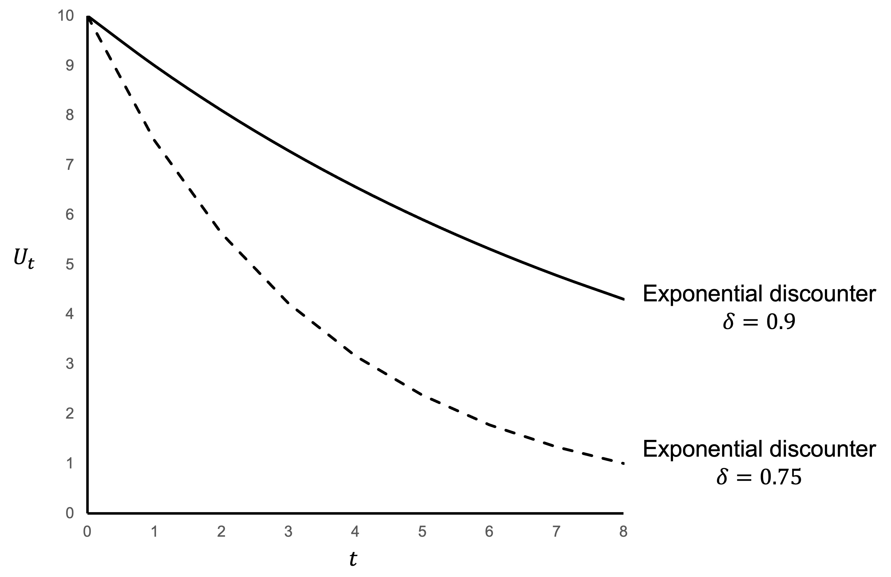

# Exponential discounting

Exponential discounting occurs where future costs and benefits are discounted at a consistent rate through time. The following equation is an example of exponential discounting.

\begin{align*}
U_0&=u(x_0)+\delta u(x_1)+\delta^2u(x_2)+\delta^3u(x_3)+...+\delta^Tu(x_T) \\[6pt]
&=\sum_{t=0}^{t=T}\delta^tu(x_t)
\end{align*}

$$0\leq \delta\leq1$$

where $U_0$ is utility at time $t=0$, and $x_t$ is the payoff in period $t$. $\delta$ is a discount factor reflecting how much the decision maker weights the future relative to today.

The degree of discounting in this equation evolves over time as 1, $\delta$, $\delta^2$, $\delta^3$, $\delta^4$ and so on. This results in a smooth decline in present value over time.

$\delta$ is the discount factor. The higher the discount factor, the less the agent discounts future costs and benefits.
You will often see discussion of the ”discount rate”, $r$. In discrete time, the relationship between $\delta$ and $r$ is as follows:

$$\delta=\frac{1}{1+r}$$

A larger discount factor implies less discounting. A larger discount rate implies more discounting.

## Exponential discounted utility model assumptions

Under the standard model of exponential discounting, at 𝑡=0 the agent seeks to maximize the utility of the future path of consumption. It is underpinned by the following assumptions:

### Time-consistency

Once the agent starts moving along the consumption path, they are time-consistent with their own initial plan. For example, consider an agent facing the following two choices:

Would you like \$100 today or \$110 next week?

Would you like \$100 next week or \$110 in two weeks?

An exponential discounter will choose \$100 in both choices or \$110 in both choices. The reason is that after one week the second choice effectively becomes the same as the first choice. Time consistency implies that they will continue to want to make the same choice regardless of when they are making it.

### Consumption independence

Consumption independence means that utility in period $t+k$ is independent of consumption in any other period. An outcome’s utility is unaffected by outcomes in prior or future periods.

Imagine a world with the consumption good $x$ = a behavioural economics subject.

An exponential discounted utility maximiser wants to consume Lecture 1 at $t+3$ and Lecture 2 at $t+4$. Under consumption independence, if the agent does not attend Lecture 1, they still expect to benefit from Lecture 2 at $t+4$ consistent with the plan they decided at t.

This assumption allows us to write $x=x_1+x_2+x_3+...+x_n$. That is, good $x$ can be split and allocated across periods.

### Stationary preferences

$U_t=U_{t=K}$. The utility function is stationary across periods. The functional form of $U_t$ is the same as the functional form of $U_{t+k}$.

### Utility independence

Under utility independence, all that matters is maximizing the sum of discounted utilities. Decision makers have no preference for the distribution of utilities.

## Visualising exponential discounting

The following figures illustrate the effect of exponential discounting.

@fig-exponential plots the size of the discount as a function of $t$ for an exponential discounter with $\delta=0.9$ and $\delta=0.75$.

{#fig-exponential}
