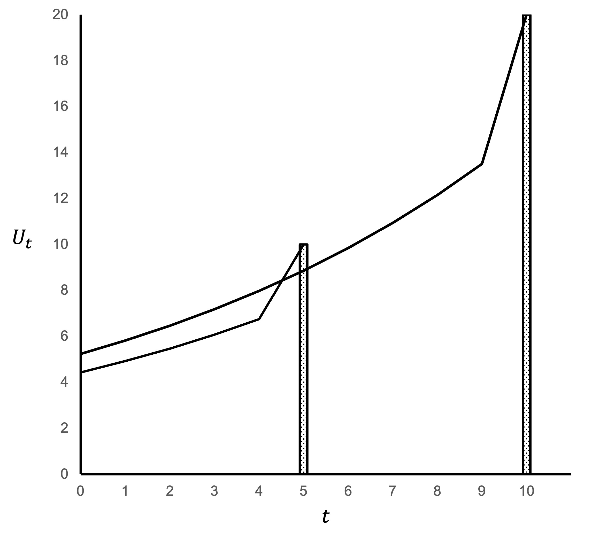

# Present bias examples

In the section, I provide some simple examples of the $\beta\delta$ model.

## Example 1

For the first example, we will consider the following pair of choices presented to an exponential discounting agent and a present-biased agent and contrast their decisions.

Choice 1: Would you like \$100 today or \$110 next week? 

Choice 2: Would you like \$100 next week or \$110 in two weeks? 

### The exponential discounter

The exponential discounter has $\delta=0.95$ and utility each period of $U(x_n)=x_n$.

Would the exponential discounter prefer \$100 today ($t=0$) or \$110 next week ($t=1$)?

To determine this, we calculate the discounted utility of each option. The agent will prefer the option with the highest discounted utility.

The discounted utility of the \$100 today is:

\begin{align*}
U_0(0,\$100)&=u(\$100) \\[6pt]
&=100
\end{align*}

The discounted utility of the \$110 next week is:

\begin{align*}
U_0(1,\$110)&=\delta u(\$110) \\[6pt]
&=0.95\times 110 \\[6pt]
&=`r 0.95*110`
\end{align*}

The exponential discounter will prefer to receive \$110 next week as it leads to higher discounted utility.

Choice 2: Would the exponential discounter prefer \$100 next week ($t=1$) or \$110 in two weeks ($t=2$)? 

The discounted utility of the \$100 next week is:

\begin{align*}
U_0(1,\$100)&=\delta u(\$110) \\[6pt]
&=0.95\times 100 \\[6pt]
&=`r 0.95*100`
\end{align*}

The discounted utility of the \$110 in two weeks is:

\begin{align*}
U_0(2,\$110)&=\delta^2 u(\$110) \\[6pt]
&=0.95^2\times 110 \\[6pt]
&=`r 0.95^2*110`
\end{align*}

The exponential discounter will prefer to receive \$110 in two weeks.

The set of decisions across Choice 1 and Choice 2 are time consistent. If the exponential-discounting agent selected \$110 in two weeks for Choice 2 and was given a chance to change their choice after one week (which is effectively an offer of Choice 1), they would not change their decision.

### The present-biased agent

The present biased agent has $\delta=0.95$, $\beta=0.95$ and utility each period of $U(x_n)=x_n$.

Choice 1: Would this agent prefer \$100 today ($t=0$) or \$110 next week ($t=1$)? 

The discounted utility of the \$100 today is:

\begin{align*}
U_0(0,\$100)&=u(\$100)\\[6pt]
&-100
\end{align*}

The discounted utility of the \$110 next week is:

\begin{align*}
U_0(1,\$110)&=u(x_0)+\beta \sum_{t=1}^{t=T}\delta^t u(x_t) \\[6pt]
&=\beta\delta u(\$110) \\[6pt]
&=0.95\times 0.95\times 110 \\[6pt]
&=`r 0.95*0.95*110`
\end{align*}
        
As $U_0(0,\$100) > U_0(1,\$110)$, the present-biased agent will prefer to receive \$100 this week.

Choice 2: Would this present-biased agent prefer \$100 next week ($t=1$) or \$110 in two weeks ($t=2$)? 

The discounted utility of the \$100 next week is:

\begin{align*}
U_0(1,\$100)&=u(x_0)+\beta \sum_{t=1}^{t=T}\delta^t u(x_t) \\[6pt] 
&=\beta\delta u(\$100) \\[6pt]
&=0.95\times 0.95\times 100 \\[6pt]
&=`r e1pb3<-0.95*0.95*100; e1pb3`
\end{align*}

The discounted utility of the \$110 in two weeks is:

\begin{align*}
U_0(2,\$110)&=u(x_0)+\beta \sum_{t=1}^{t=T}\delta^t u(x_t) \\[6pt]
&=\beta\delta^2 u(\$110) \\[6pt]
&=0.95\times 0.95^2\times 110 \\[6pt]
&=`r e1pb4<-round(0.95*0.95^2*110, 2); e1pb4`
\end{align*}

As $U_0(1,\$100)=`r e1pb3`<`r e1pb4`=U_0(2,\$110)$, the present-biased agent will prefer to receive \$110 in two weeks.

If we consider those two choices by the present-biased agent together, we see the following pattern.

For choice 1, the present-biased agent will prefer \$100 now to \$110 in one week. Their preference for benefits now due to the short-term discount factor $\beta$ leads them to prefer the immediate payoff.

For choice 2, the present-biased agent will prefer \$110 in two weeks to \$100 in one week. They are willing to wait longer for a larger reward, with both outcomes in the future and subject to the short-term discount factor $\beta$.

Consider what would happen if this present-biased agent selected the \$110 in two weeks in Choice 2, but after one week we asked if they would like to reconsider their choice. They are effectively being offered Choice 1. This would then lead them to change their mind and take the immediate \$100.

This combination of decisions is time inconsistent. The present-biased agent’s actions are not consistent with their initial plan.

## Example 2

Assume there is a present-biased agent with $\beta=0.75$, $\delta=0.9$ and utility each period of $u(x_n)=x_n$.

Would this agent prefer \$10 in five days ($t=5$) or \$20 in 10 days ($t=10$)? 

The discounted utility of the \$10 in five days is:

\begin{align*}
U_0(5,\$10)&=\beta\delta^5u(\$10) \\[6pt]
&=0.75\times 0.9^5\times 10 \\[6pt]
&=`r round(0.75*0.9^5*10, 2)` \\[6pt]
\end{align*}

The discounted utility of the \$20 in 10 days is:

\begin{align*}
U_0(10,\$20)&=\beta\delta^10 u(\$20) \\[6pt]
&=0.75\times 0.9^{10}\times 20 \\[6pt]
&=`r round(0.75*0.9^10*20, 2)`
\end{align*}

As $U_0(10,\$20)=5.23>4.43=U_0(5,\$10)$, this present-biased agent will prefer to receive \$20 in 10 days.

Five days pass so that we are now at $t=5$. We ask the agent if they would like to change their mind.

The discounted utility of the \$10 today is:

\begin{align*}
U_5(5,\$10)&=u(\$10) \\[6pt]
&=10
\end{align*}

The discounted utility of the \$20 in five days is:

\begin{align*}
U_5(10,\$20)&=\beta\delta^5 u(\$20) \\[6pt]
&=0.75\times 0.9^5\times 20 \\[6pt]
&=`r round(0.75*0.9^5*20, 2)`
\end{align*}

As $U_5(5,\$10)=10>8.86=U_5(10,\$20)$, this present-biased agent will prefer to receive \$10 today. They have changed their preference between the two payments relative to their decision at $t=0$.

We can see this change in preference in the following diagram.

The vertical bars represent the payments of \$10 and \$20. The lines projecting back from the bars to the y-axis represent the discounted utility of each payment at each time. There is a kink in the line in the period immediately before each payment, representing the effect of the short-term discount factor $\beta$.

At $t=0$ (and through to $t=4$) the discounted utility of the \$20 at $t=10$ is higher and that payment is therefore preferred. At $t=5$ when the \$10 is no longer discounted by the short-term discount factor $\beta$, it suddenly becomes more attractive. If offered on that day, would be chosen in substitute of the \$20 due in another five days.

{width=75%}
