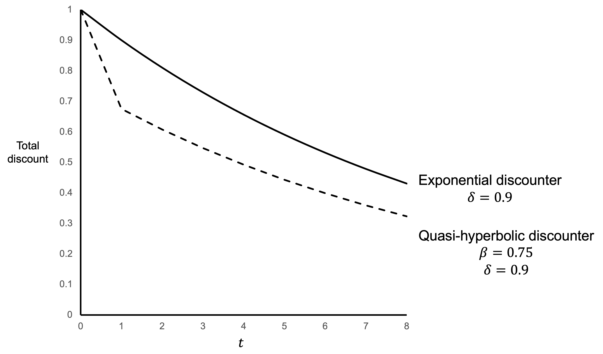
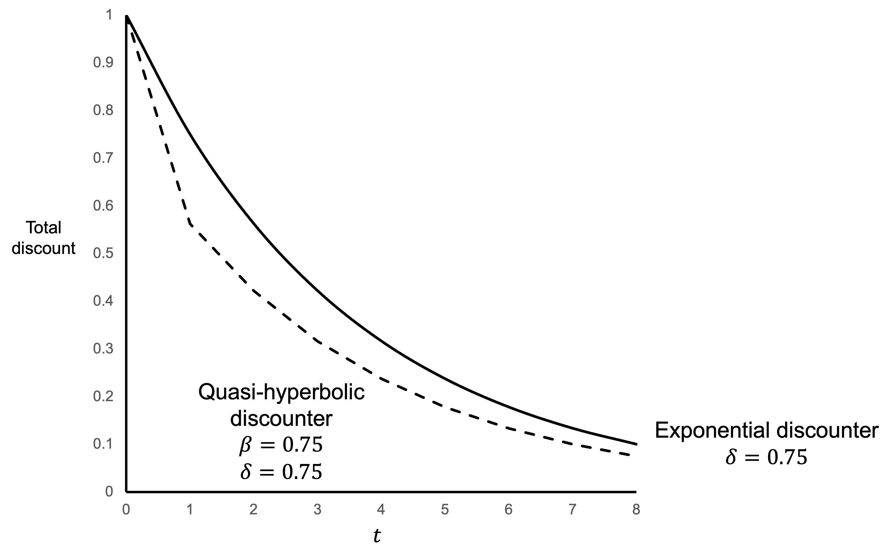
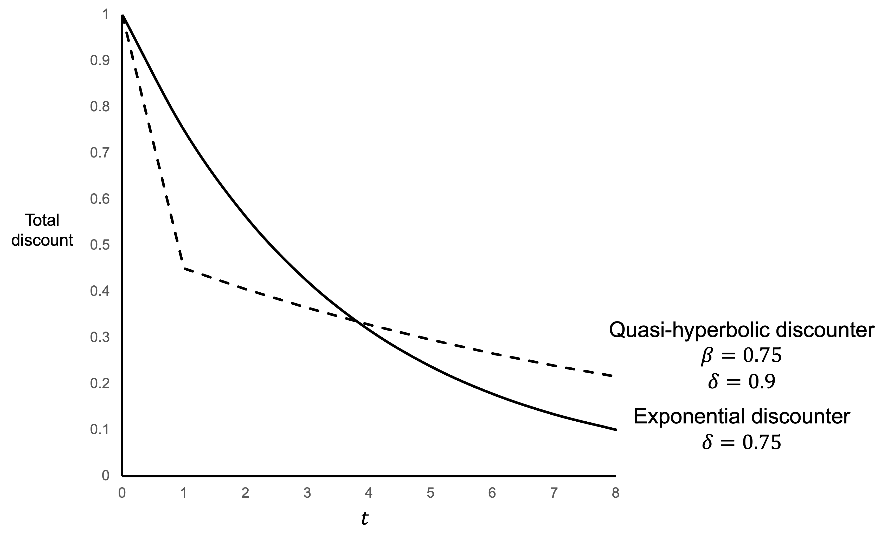

# Present bias

One concept developed to account for anomalies in the exponential discounting model is present bias.

Present bias occurs when we place additional weight on costs and benefits at the present time.

## The $\beta\delta$ model

One simple model of present bias is the quasi-hyperbolic discounting model, otherwise known as the $\beta\delta$ model. ^[This model is a discrete-time version of hyperbolic discounting.]

Under the quasi-hyperbolic discounting model, there are two discount factors applied to future costs and benefits.

The first is $\beta$, the short-term discount factor. All future payoffs are discounted by a single application of $\beta$, a number between 0 and 1. The discount $\beta$ is applied simply because the payoff is not immediate. The higher the short-term discount factor, the less the agent discounts payoffs that are not received now.

The second is the discount factor $\delta$ that is also present in the exponential discounting model. Each additional period of delay results in a discount of a future cost or benefit by a factor of $\delta$. The discount factor $\delta$ is also a number between 0 and 1. The higher the discount factor, the less the agent discounts future costs and benefits.

As for exponential discounting, an agent with a choice between alternative streams of payoffs under the $\beta\delta$ model will seek to maximize the discounted utility of the future path of consumption.

The following equation provides a mathematical representation of the $\beta\delta$ model, with a stream of costs or benefits $x_0$ through to $x_T$ incurred at periods 0 through to $T$. $U_0$ is the discounted utility of the stream of payoffs at time $t=0$. $x_t$ is the payoff in period $t$.

\begin{align*}
U_0&=u(x_0)+\beta \delta u(x_1)+\beta \delta^2 u(x_2)+ ... + \beta \delta^T u(x_T) \\[6pt]
&=u(x_0)+\beta \sum_{t=1}^{t=T}\delta^t u(x_t) \\
\\
0&\leq \delta \leq 1 \\
\\
0&\leq \beta \leq 1
\end{align*}

The first period of delay results in a discount of the cost or benefit by a factor of $\beta\delta$. Each further period of delay results in a discount of $\delta$.

As a result, the degree of discounting evolves over time as 1, $\beta\delta$, $\beta\delta^2$, $\beta\delta^3$, $\beta\delta^4$ and so on. This progression results in a larger discount for the first period of delay ($\beta\delta$) than the degree of discount for each subsequent period of delay ($\delta$). There is a relative weighting toward the present.

Present bias of this nature can result in time inconsistency, with decisions at one point reversed at another if the agent is given the opportunity to change their mind.

## Visualising present bias

The following figures illustrate the effect of present bias.

@fig-present_bias_1 plots the size of the discount as a function of $t$ for a present-biased agent with $\beta=0.75$ and $\delta=0.9$. The discount curve for an exponential discounter with $\delta=0.9$ is also plotted. The curve for the present-biased agent has a large drop for the first period of delay. From then on, the discount is proportionally the same as for the exponential discounter.

We can read off the total discount factor at any time $t$ from this chart. For example, the total discount factor for the exponential discounter is $0.9$ at $t=1$, $0.81$ at $t=2$ and $0.43$ at $t=8$. The total discount factor for the present-biased agent is $0.675$ at $t=1$, $0.61$ at $t=2$ and $0.32$ at $t=8$.

{#fig-present_bias_1}

@fig-present_bias_2 shows the discount curve for present-biased and exponential discounting agents with different parameters. The present-biased agent and exponential discounter have the same discount factor $\delta=0.75$. The present-biased agent also has the short-term discount factor $\beta=0.75$. Again, the present-biased agent discounts the first period of delay more than the exponential discounter.

{#fig-present_bias_2}

@fig-present_bias_3 shows a scenario where the present-biased agent has a higher discount factor $\delta=0.9$ than the exponential discounter with $\delta=0.75$. The present-biased agent also has the short-term discount factor $\beta=0.75$. The present-biased agent discounts the first period of delay more than the exponential discounter. However, due to their higher $\delta$, the present-biased agent discounts additional periods of delay less than the exponential discounter and ultimately has a lower total discount for periods further in the future.

{#fig-present_bias_3}

## Assumptions

The exponential discounting model is underpinned by many assumptions. These include:

- Time consistency, whereby once the agent starts moving along the consumption path, they are time-consistent with their initial plan.

- Consumption independence, whereby utility in period $t+k$ is independent of consumption in any other period. An outcome’s utility is unaffected by outcomes in prior or future periods.

- Stationary preferences, whereby $U_t=U_{t+k}$. The utility function is stationary across periods.

- Utility independence, whereby all that matters is maximizing the sum of discounted utilities. Decision makers are assumed to have no preference for the distribution of utilities.

Under the $\beta\delta$ model we are loosening the assumption of time consistency. An agent may change their initial plan over time.

However, we maintain the assumptions of consumption independence, stationary preferences and utility independence.

