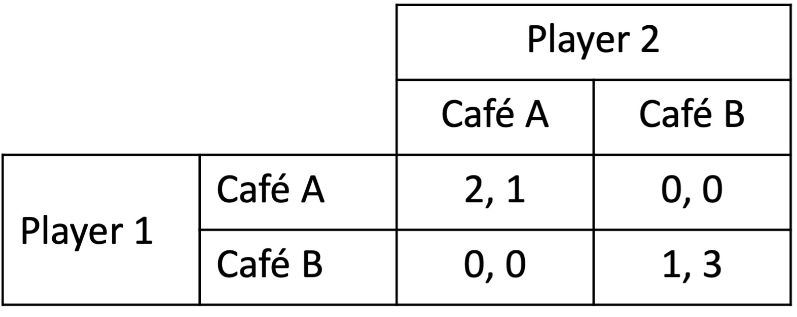
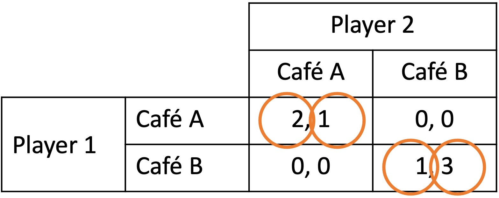

# Behavioural game theory problems

## Airline competition

Quokka Airlines and Viper Air are competitor airlines. Each is considering how it should price its tickets. They have two options: a high price or a low price. Each must choose the price simultaneously.

If one airline offers a lower price than the other, they gain more market share but a lower profit margin. If both airlines offer the same price, Quokka takes more of the market as the incumbent airline.

The expected payoffs for each combination of actions are as follows, with the payoff ($x,y$) being the payoffs for Quokka and Viper respectively.

{width=80%}

a\) Are there any pure-strategy Nash equilibria? If so, what are they?

::: {.callout-tip collapse="true"}
## Answer

We determine the pure-strategy Nash equilibria by considering the best response of each player to each of the other player's strategies.

If Viper sets prices high, Quokka can choose high for a payoff of 100 or low for a payoff of 60. High is the best response.

If Viper sets prices low, Quokka can choose high for a payoff of 40 or low for a payoff of 50. Low is the best response.

If Quokka sets prices high, Viper can choose high for a payoff of 20 or low for a payoff of 30. Low is the best response.

If Quokka sets prices low, Viper can choose high for a payoff of 0 or low for a payoff of 10. Low is the best response.

The pure Nash equilibrium is therefore (low, low). Neither has an incentive to deviate.

{width=80%}

:::

b\) Suppose the managers of Quokka and Viper are level-k thinkers.

If they were level-0, both would choose high or low with equal probability.

What would each player do if they were a level-1 thinker?

::: {.callout-tip collapse="true"}
## Answer

A level-1 thinker assumes that the other player is a level-0 thinker. Each level-1 thinker plays the optimal strategy on this assumption.

A level-1 Quokka plays the optimal strategy against a level-0 Viper. A level-0 Viper plays high or low with equal probability. The payoffs to Quokka from each option are:

\begin{align*}
U_Q(\text{high})&=0.5\times 100+0.5\times 40 \\
&=`r 0.5*100+0.5*40`
\end{align*}

\begin{align*}
U_Q(\text{low})&=0.5\times 60+0.5\times 50 \\
&=`r 0.5*60+0.5*50`
\end{align*}

Quokka chooses high.

The payoffs to Viper from each option are:

\begin{align*}
U_V(\text{high})&=0.5\times 20+0.5\times 0 \\
&=`r 0.5*20+0.5*0`
\end{align*}

\begin{align*}
U_V(\text{low})&=0.5\times 30+0.5\times 10 \\
&=`r 0.5*30+0.5*10`
\end{align*}

Viper chooses low.

:::

c\) What would each player do if they were a level-2 thinker?

::: {.callout-tip collapse="true"}
## Answer

A level-2 thinker assumes that the other player is a level-1 thinker. Each level-2 thinker plays the optimal strategy on this assumption.

A level-2 Quokka knows that the level-1 Viper will choose low. Therefore, the payoff from high is 40 and from low is 50. Quokka chooses low.

A level-2 Viper knows that the level-1 Quokka will choose high. Therefore, the payoff from high is 20 and from low is 30. Viper chooses low.

:::

d\) What would each player do if they were a level-3 or above thinker?

::: {.callout-tip collapse="true"}
## Answer

At whatever level of thinking the players discover the Nash equilibrium, for any higher level of thinking they will remain at the Nash equilibrium. 

Therefore, at level-3 and above, both players will choose low.

:::

e\) Suppose now that the managers of Quokka and Viper are perfectly rational. Each is considering how they could make more profit.

A staff member in Viper suggests launching an advertising campaign with high prices before they and Quokka choose. Once Viper has advertised their prices, they will be constrained to setting them high.

Is this a good idea? What concept does this illustrate?

::: {.callout-tip collapse="true"}
## Answer

Suppose Viper advertises high prices and is committed to that choice. The game therefore becomes:

{width=60%}

With this game, Viper plays high no matter what choice is made by Quokka. They effectively have no choice.

Quokka can choose high for a payoff of 100 or low for a payoff of 60. High is the best response.

{width=60%}

The new Nash equilibrium is (high, high). Viper has increased its payoff from 10 to 20 by making the strategic move. The move is therefore a good idea.

This example illustrates the concept of *commitment* via a strategic move.

:::

## Valuing a business

You are considering buying a small business. You research the business, attempting to estimate the revenue and profit it will generate. Based on your research, you determine a fair valuation is $850,000.

The business ultimately sells for $1.1 million to another person. You discover that many other parties were interested in buying the business.

You later hear that the purchaser is disappointed with the business and that it is worth less than they paid. What phenomenon could this be an example of? Explain.

::: {.callout-tip collapse="true"}
## Answer

This is an example of the *winner's curse*.

The winner's curse occurs when the winner of an auction is the bidder who most overestimates the value of the item. The winner therefore pays more than the item is worth.

:::

## Cafe

Two friends, Player 1 and Player 2, have arranged to meet at a cafe. Neither can remember which of the two cafes in town they had arranged to meet at.

Each player has a favourite cafe. However, they would prefer to go to their less-favourite cafe with a friend than go to their favourite cafe alone.

Each chooses a cafe and goes there. The payoffs for each combination of choices are in the table below, with the payoffs $(x, y)$ being the payoffs for Player 1 and Player 2 respectively.

{width=60%}

a\) What are the pure-strategy Nash equilbria of this game?

::: {.callout-tip collapse="true"}
## Answer

If player 2 chooses cafe A, player 1 wants to choose cafe A.

If player 2 chooses cafe B, player 1 wants to choose cafe B.

If player 1 chooses cafe A, player 1 wants to choose cafe A.

If player 1 chooses cafe B, player 1 wants to choose cafe B.

{width=60%}

The two pure-strategy Nash equilibria are (cafe A, cafe A) and (cafe B, cafe B).
:::

b\) What would Player 1 and Player 2 do if each was a level-1 thinker? Explain.

::: {.callout-tip collapse="true"}
## Answer

If Player 2 chooses randomly, Player 1's payoff's from each option are:

\begin{align*}
U_1(\text{cafe A})&=0.5\times 2+0.5\times 0=1 \\[6pt]
U_1(\text{cafe B})&=0.5\times 0+0.5\times 1=0.5
\end{align*}

Player 1 chooses cafe A.

If Player 1 chooses randomly, Player 2's payoff's from each option are:

\begin{align*}
U_2(\text{cafe A})&=0.5\times 1+0.5\times 0=0.5 \\[6pt]
U_2(\text{cafe B})&=0.5\times 0+0.5\times 3=1.5
\end{align*}

Player 2 chooses cafe B.
:::

c\) What would Player 1 and Player 2 do if each was a level-2 thinker? Explain.

::: {.callout-tip collapse="true"}
## Answer

The level-2 Player 1 assumes that Player 2 is level-1. Therefore, they assume that Player 2 will choose cafe B. Accordingly, they choose cafe B.

The level-2 Player 2 assumes that Player 1 is level-1. Therefore, they assume that Player 1 will choose cafe A. Accordingly, they choose cafe A.
:::
