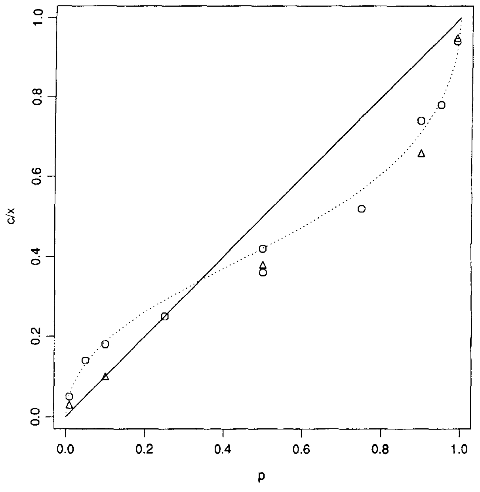

# Probability weighting

In expected utility theory, probabilities enter the expected utility function linearly. That is, if an event is twice as likely as another outcome, it has double the weight.

Experimental observation confirms that we approximate linear probabilities for intermediate probabilities. But, there is strong evidence that we overweight certain events, when the probability of the event $p$ = 1, relative to near certain events, such as when the probability $p$ = 0.99. This is effectively the same as overweighting very low-probability events.

The consequence of this is that the value in prospect theory is calculated using weighted probabilities, with those weights reflecting the empirical observations.

The following diagram from @tversky1992 illustrates the relationship between objective utility and the weight applied to the value function. On the x-axis is the probability of the event. On the y-axis is the weight applied to the value function for that probability. The straight line at 45 degrees represents linear weighting of probabilities. The curve represents the weighting function.

{width="60%"}

Where the probability is very low, such as around $p=0.05$, the weight is around 0.15. Similarly, at high $p=0.95$, the weight is around 0.8. For intermediate probabilities, the observed weight is close to the probability.

@kahneman2011 calls the large psychological value of the change from 0 to 5% (or some other small probability) the possibility effect. Very unlikely but possible outcomes are given more weight than similar increases in probability for events that are already possible. He calls the large psychological value of the change to 100% the certainty effect. We will pay a lot more for certainty than near certainty.

## The Allais Paradox

Probability weighting is often offered as an explanation for the Allais Paradox, which I discuss in @sec-allais.

The Allais paradox can be illustrated as follows.

You are given the following pair of choices.

**Choice 1**: Choose one of the following bets:

Bet A:

-   \$2500 with probability: 33%
-   \$2400 with probability: 66%
-   \$0 with probability: 1%

Bet B:

-   \$2400 with probability: 100%

Which would you prefer? People tend to prefer Bet B.

**Choice 2**: Choose one of the following bets:

Bet C:

-   \$2500 with probability: 33%\
-   \$0 with probability: 67%

Bet D:

-   \$2400 with probability: 34%
-   \$0 with probability: 66%

People tend to prefer Bet C. It can be shown that this pair of preferences, Bet B and Bet C, does not conform with expected utility theory.

One explanation for this comes from probability weighting. If you look at Bet B, the outcome is certain. Certain events tend to be overweighted relative to near-certain events, such as the 99% chance of \$2400 or \$2500 in Bet A. An alternative way of thinking about this is that the 1% probability of nothing in Bet A is overweighted.

Conversely, for the intermediate probabilities in Bet C and Bet D, they are weighted closer to linearly, which can result in the slightly higher expected value Bet C being preferred.

## The decision weight

This exercise of probability weighting leads to the decision weights that are applied to outcomes in prospect theory.

Under expected utility theory, the utility of a prospect is a linear expectation. Each possible outcome is weighted by its probability.

In prospect theory, the decision maker does not weigh probabilities linearly but instead attaches a decision weight $\pi(p_i)$ to each probability.

This decision-weighting function reflects the empirical regularity that people overweight certain events) relative to near-certain events and overweight very low probability events.

An example probability weighting function, of a type proposed by @prelec1998, is as follows:

$$
\pi(p)=e^{-(-ln(p))^\alpha}
$$

```{r}
#Plot of probabiltiy weighting function using ggplot2
library(ggplot2)
library(dplyr)
library(tidyr)

#Define probability weighting function
prob_weight <- function(p, alpha){
  exp(-(-log(p))^alpha)
}

#Create data frame of probabilities and weights
prob <- seq(0, 1, 0.01)
prob_df <- data.frame(prob = prob, weight = prob_weight(prob, 1.5))

#Plot
ggplot(prob_df, aes(x = prob, y = weight)) +
  geom_line() +
  labs(x = "Probability", y = "Weight") +
  theme_bw()
```
