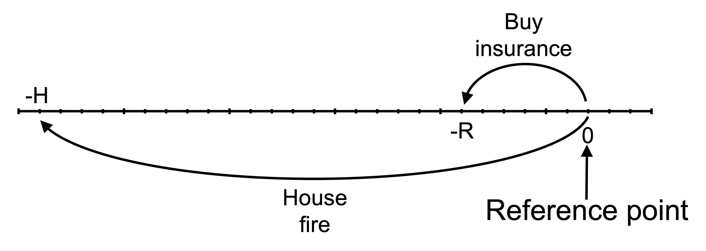

# Prospect theory and insurance

In this section, I analyse the purchase of insurance through the lens of prospect theory.

## Insurance

Insurance has a negative expected value due to the insurer's profit and administrative costs. Why would a consumer purchase insurance?

The classical economic explanation for the purchase of insurance is based on diminishing marginal utility, which leads to risk aversion. Consumers are willing to buy insurance as the consumer prefers the certainty of the premium payment to the risk of suffering an uninsured loss.

Prospect theory provides an alternative explanation. The purchase of insurance involves a certain loss (the premium) or a gamble involving the possibility of either a large loss or the status quo. As prospect theory has people as risk seeking in the loss domain, we would not expect them to purchase insurance.

However, under prospect theory, people also overweight small probabilities. This overweighting of small probabilities can make the purchase of insurance attractive even though it is in the loss domain.

This combination of the loss domain with a small probability is the bottom-right quadrant of the fourfold pattern to risk attitudes generated by prospect theory. People tend to be risk averse in this circumstance.

|                            | Gains         | Losses        |
|----------------------------|---------------|---------------|
| **High probability**       | Risk aversion | Risk seeking  |
| **Low probability**        | Risk seeking  | Risk aversion |

The following numerical example is an illustration.

An agent is considering insurance against bushfire for their house valued at $H=\$1,000,000$. The house has a 1 in 1000 ($p=0.001$) chance of burning down. An insurer is willing to offer full coverage for a premium ($R$) of \$1100. (Note: \$1000 is the actuarially fair price. The additional \$100 might represent profit or administrative costs.)

### Expected value

The first question is whether a risk-neutral person would purchase the insurance. A risk-neutral utility function is:

$$
u(x)=x
$$

A risk-neutral agent will choose the option with the highest expected value.

If the agent purchases insurance, they pay the premium and do not suffer any loss regardless of whether there is a bushfire or not. Therefore, the expected value of purchasing insurance is:

$$
\mathbb{E}[\text{I}]=-R=-\$1,100
$$

The expected value of purchasing insurance is the guaranteed loss of the premium, \$1100.

If the agent does not purchase insurance, they face the 1 in 1000 possibility of an uninsured loss. Therefore, the expected value of not purchasing insurance is:

\begin{align*}
\mathbb{E}[\neg \text{I}]&=p\times(-H) \\[6pt]
&=-0.001\times 1000000 \\[6pt]
&=-\$1000
\end{align*}

The expected value of purchasing insurance is lower than the expected value of not purchasing insurance. Therefore, a risk-neutral agent would not purchase the insurance.

### Expected utility

Would a risk-averse agent purchase the insurance? Suppose they have a logarithmic utility function ($u(x)=\ln(x)$) and they have \$10,000 in cash in addition to their house, giving them wealth ($W$) of \$1,010,000.

The logarithmic utility function has diminishing marginal utility. Diminishing marginal utility is the principle the marginal utility from each additional unit decreases. In the context of wealth, this means that each additional dollar provides less satisfaction than the previous one.

Diminishing marginal utility means that the agent will be risk averse. They will prefer a certain outcome to a gamble with the same expected value.

To understand whether this risk-averse agent will purchase insurance in this instance, we need to compare the expected utility of purchasing insurance with the expected utility of not purchasing insurance.

The expected utility of purchasing insurance is:

\begin{align*}
\mathbb{E}[U(\text{I})]&=\ln(W-R) \\[6pt]
&=\ln(1,010,000-1,100) \\[6pt]
&=\ln(`r prettyNum(1000000+10000-1100, big.mark=",", preserve.width="none")`) \\[6pt]
&=`r round(log(1000000+10000-1100), 4)`
\end{align*}

The expected utility of not purchasing insurance is:

\begin{align*}
\mathbb{E}[U(\neg \text{I})]&=(1-p)\times u(W)+p\times u(W-H)) \\[6pt]
&=0.999\times \ln(W)+0.001\times \ln(W-H)) \\[6pt]
&=0.999\times \ln(1,010,000)+0.001\times \ln(10,000) \\[6pt]
&=`r round(0.999*log(1010000)+0.001*log(10000), 4)`
\end{align*}

The expected utility of purchasing insurance is greater than the expected utility of not purchasing insurance. This agent will purchase insurance.

The following diagram illustrates. The agent's utility function is plotted, with the outcome on the horizontal axis and the utility of each outcome on the vertical axis. Each outcome and the utility of that outcome is marked: wealth after losing the house when uninsured ($W-H$), wealth after paying the insurance premium ($W-R$), and wealth if uninsured but the house does not burn down ($W$).

The expected utility of not purchasing insurance is on the dash-dot line between $U(W-H)$ and $U(W)$. The location of this point is determined by the probability $p$ of incurring a loss. This point lies at a distance of $p$ from $U(W)$ along the line (or equivalently, at a distance of $1-p$ from $U(W-H)$). This point aligns with the expected value of leaving the house uninsured $\mathbb{E}[\neg I]$.

The utility of purchasing insurance, $U(W-R)$, is greater than the expected utility of not purchasing insurance, $\mathbb{E}[U(\neg I)]$. The agent will purchase insurance.

```{r}
#| label: fig-insurance-reflection
#| fig-cap: Insurance choice by an agent with the reflection effect

library(ggplot2)
library(latex2exp)

u <- function(x){
  log(x)
}

df <- data.frame(
  x=seq(1,100,0.1),
  y=NA
)

df$y <- u(df$x)

#Variables for plot (may not match labels as not done to scale)
#Payoffs from gamble
x1<-3 #loss
x2<-90 #win
ev<-77 #expected value of gamble
xc<-70 #certain outcome
px2<-(ev-x1)/(x2-x1)

ggplot(mapping = aes(x, y)) +
    geom_line(data = df) +
    geom_vline(xintercept = 0, linewidth=0.25)+ 
    geom_hline(yintercept = 0, linewidth=0.25)+
    labs(x = "x", y = "U(x)")+

    # Set the theme
    theme_minimal()+

    #remove numbers on each axis
    theme(axis.text.x = element_blank(),
            axis.text.y = element_blank(),
            axis.title=element_text(size=14,face="bold"),
            axis.title.y = element_text(angle=0, vjust=0.5))+

    #limit to y greater than zero and x greater than -8 (need -8 so space for y-axis labels)
    coord_cartesian(xlim = c(-8, 100), ylim = c(0, 5))+

    #Add labels W, U(W) and line to curve indicating each
    annotate("text", x = x2, y = 0, label = "W", size = 4, hjust = 0.4, vjust = 1.5)+
    annotate("segment", x = x2, y = 0, xend = x2, yend = u(x2), linewidth = 0.5, colour = "black", linetype="dotted")+
    annotate("segment", x = 0, y = u(x2), xend = x2, yend = u(x2), linewidth = 0.5, colour = "black", linetype="dotted")+
    annotate("text", x = 0, y = u(x2), label = "U(W)", size = 4, hjust = 1.1, vjust = 0.4)+

    #Add labels W-R, U(W_R) and line to curve indicating each
    annotate("text", x = xc, y = 0, label = "W-R", size = 4, hjust = 0.5, vjust = 1.5)+
    annotate("segment", x = xc, y = 0, xend = xc, yend = u(xc), linewidth = 0.5, colour = "black", linetype="dotted")+
    annotate("segment", x = 0, y = u(xc), xend = xc, yend = u(xc), linewidth = 0.5, colour = "black", linetype="dotted")+
    annotate("text", x = 0, y = u(xc), label = "U(W-R)", size = 4, hjust = 1.05, vjust = 0.45)+

    #Add expected utility line
    annotate("segment", x = x2, xend = x1, y = u(x2), yend = u(x1), linewidth = 0.5, colour = "black", linetype="dotdash")+

    #Add labels W-H, U(W-H) and line to curve indicating each
    annotate("text", x = x1, y = 0, label = "W-H", size = 4, hjust = 0.4, vjust = 1.5)+
    annotate("segment", x = x1, y = 0, xend = x1, yend = u(x1), linewidth = 0.5, colour = "black", linetype="dotted")+
    annotate("segment", x = 0, y = u(x1), xend = x1, yend = u(x1), linewidth = 0.5, colour = "black", linetype="dotted")+
    annotate("text", x = 0, y = u(x1), label = "U(W-H)", size = 4, hjust = 1.05, vjust = 0.45)+

    #Add labels E[not I], E[U(not I)] and curve indicating each
    annotate("text", x = ev, y = 0, label = TeX("E[$\\neg$ I]", output='character'), parse=TRUE, size = 4, hjust = 0.4, vjust = 1.4)+
    annotate("segment", x = ev, y = 0, xend = ev, yend = u(x1)+(u(x2)-u(x1))*px2, linewidth = 0.5, colour = "black", linetype="dashed")+
    annotate("segment", x = 0, y = u(x1)+(u(x2)-u(x1))*px2, xend = ev, yend = u(x1)+(u(x2)-u(x1))*px2, linewidth = 0.5, colour = "black", linetype="dashed")+
    annotate("text", x = 0, y = u(x1)+(u(x2)-u(x1))*px2, label = TeX("E[U($\\neg$ I)]", output='character'), parse=TRUE, size = 4, hjust = 1.05, vjust = 0.45)

```

### The reflection effect

I will now move on to the elements of prospect theory, introducing them one at a time. The first element is the reflection effect.

Consider an agent who is risk seeking in the domain of losses but weights probability linearly. Their value function is:

$$
v(x)=\left\{\begin{matrix}
x^{0.8} \qquad &\textrm{where} \space x \geq 0\\
-2(-x)^{0.8} \quad &\textrm{where} \space x < 0 
\end{matrix}\right.
$$

$x$ is the realised outcome relative to the reference point.

In this analysis, we will take the reference point as current wealth before the purchase of the insurance. Determination of the reference point can be arbitrary. What if you pay insurance every year? Would the reference point then be wealth minus the insurance payment, meaning the insurance payment is in the gain domain? In that case, the analysis changes.

We can see the outcomes for an agent with a reference point of wealth before purchasing insurance on the following line (not drawn to scale). The outcomes are the premium payment $-R$ and the value of the house after a bushfire $-H$. If uninsured and no fire, the agent will remain at their reference point of the status quo.



Would this agent with a reference point of wealth before purchasing the insurance make the purchase?

We need to compare the weighted value of purchasing insurance with the weighted value of not purchasing insurance. The agent will purchase insurance if the weighted value of purchasing insurance is greater.

The weighted value of purchasing insurance is:

\begin{align*}
V(\text{I})&=v(-R) \\[6pt]
&=v(-1,100) \\[6pt]
&=-(1,100)^{0.8} \\[6pt]
&=`r round(-(1100)^(0.8), 1)`
\end{align*}

The weighted value of not purchasing insurance is:

\begin{align*}
V(\neg\text{I})&=\sum_{i=1}^n p_iv(x_i) \\[6pt]
&=0.999\times v(0)+0.001\times v(-H) \\[6pt]
&=0.999\times 0+0.001\times v(-1,000,000) \\[6pt]
&=-0.001\times (1,000,000)^{0.8} \\[6pt]
&=`r round(0.999*0-0.001*(1000000)^(0.8), 1)`
\end{align*}

As $V(\text{I})<V(\neg\text{I})$, this agent does not purchase insurance. The diminishing feeling of loss leads to them weigh the certain loss of the premium relatively more heavily than the chance of losing the value of their house.

Including loss aversion in the value function does not change the decision as all possible outcomes are in the loss domain.

The following diagram illustrates. The agent's value function is plotted, with the outcome on the horizontal axis and the value of the outcome on the vertical axis. The function is concave in the gain domain and convex in the loss domain, leading to risk averse and risk-seeking behaviour, respectively.

Each outcome and the value of that outcome is marked: the premium payment $-R$ and the value of the house after a bushfire $-H$. If uninsured and no fire, the agent will remain at their reference point of the status quo.

The weighted value of not purchasing insurance is on the dash-dot line between $v(-H)$ and $v(0)$. The location of this point is determined by the probability $p$ of incurring a loss. This point lies at a distance of $p$ from $v(0)$ along the line (or equivalently, at a distance of $1-p$ from $v(-H)$). This point aligns with the expected value of leaving the house uninsured $\mathbb{E}[\neg I]$.

The value of purchasing insurance, $v(-R)$, is less than the weighted value of not purchasing insurance, $V(\neg I)$. The agent will not purchase insurance.

```{r}
#| label: fig-reflection-effect-insurance
#| fig-cap: The reflection effect and insurance

library(ggplot2)

u <- function(x){
  ifelse (x >= 0, x^0.5, -2*(-x)^0.5)
}

df <- data.frame(
  x = seq(-220, 220, 0.1),
  y = u(seq(-220, 220, 0.1))
)

#Variables for plot (may not match labels as not done to scale)
#Payoffs from gamble
x1<- -200 #loss
x2<- 0 #win
ev<- -30 #expected value of gamble
xc<- -60 #certain outcome
px2<-(ev-x1)/(x2-x1)

ggplot(mapping = aes(x, y)) +

  #Plot the utility curve
  geom_line(data = df) +
  geom_vline(xintercept = 0, linewidth=0.25)+ 
  geom_hline(yintercept = 0, linewidth=0.25)+
  labs(x = "x", y = "v(x)")+

  # Set the theme
  theme_minimal()+

  #remove numbers on each axis
  theme(axis.text.x = element_blank(),
            axis.text.y = element_blank(),
            axis.title=element_text(size=14,face="bold"),
            axis.title.y = element_text(angle=0, vjust=0.5))+

  #limit to y greater than zero and x greater than -8 (need -8 so space for y-axis labels)
  coord_cartesian(xlim = c(-220, 220), ylim = c(-30, 15))+

  #Add labels -H, v(L) and line to curve indicating each
  annotate("text", x = x1, y = 0, label = "-H", size = 4, hjust = 0.5, vjust = -0.3)+
  annotate("segment", x = x1, y = 0, xend = x1, yend = u(x1), linewidth = 0.5, colour = "black", linetype="dotted")+
  annotate("segment", x = 0, y = u(x1), xend = x1, yend = u(x1), linewidth = 0.5, colour = "black", linetype="dotted")+
  annotate("text", x = 0, y = u(x1), label = "v(-H)=v(-$1m)", size = 4, hjust = -0.1, vjust = 0.6)+

  #Add labels -R, v(-R) and line to curve indicating each
  annotate("text", x = xc, y = 0, label = "-R", size = 4, hjust = 0.8, vjust = -0.3)+
  annotate("segment", x = xc, y = 0, xend = xc, yend = u(xc), linewidth = 0.5, colour = "black", linetype="dotted")+
  annotate("segment", x = 0, y = u(xc), xend = xc, yend = u(xc), linewidth = 0.5, colour = "black", linetype="dotted")+
  annotate("text", x = 0, y = u(xc), label = "v(-R)", size = 4, hjust = -0.1, vjust = 0.3)+

  #Add expected utility line
  annotate("segment", x = x1, xend = x2, y = u(x1), yend = u(x2), linewidth = 0.5, colour = "black", linetype="dotdash")+

  #Add labels E[\neg I], V(\neg I) and curve indicating each
  annotate("text", x = ev, y = 0, label = as.character(TeX("E[$\\neg$ I]")), size = 4, hjust = 0.5, vjust = -0.3, parse=TRUE)+
  annotate("segment", x = ev, y = 0, xend = ev, yend = u(x1)+(u(x2)-u(x1))*px2, linewidth = 0.5, colour = "black", linetype="dashed")+
  annotate("segment", x = 0, y = u(x1)+(u(x2)-u(x1))*px2, xend = ev, yend = u(x1)+(u(x2)-u(x1))*px2, linewidth = 0.5, colour = "black", linetype="dashed")+
  annotate("text", x = 0, y = u(x1)+(u(x2)-u(x1))*px2, label = as.character(TeX("V($\\neg$ I)")), size = 4, hjust = -0.1, vjust = 0.45, parse=TRUE)

```

### Probability weighting

Would a person who is risk seeking in the domain of losses (that is, a person with a value function with reflection effect above) who weights probability in accordance with prospect theory purchase the insurance?

Prospect theory proposes that people overweight small probabilities. They might weight probabilities as per the following table:

|                |     |     |     |     |     |     |     |     |     |
|-----|-----|-----|-----|-----|-----|-----|-----|-----|-----|
|  **Probability**   |   0.001  |   0.01  | 0.1 |0.25   |  0.5   |  0.75   |  0.9   | 0.99    |  0.999   |
|   **Weight**       |  0.01   |  0.05   |   0.15  |  0.3   |  0.5   |  0.7   | 0.85    |  0.95   |  0.99   |

We need to compare the weighted value of purchasing insurance with the weighted value of not purchasing insurance. The person will purchase insurance if the weighted value of purchasing insurance is greater.

The weighted value of purchasing insurance is:

\begin{align*}
V(\text{I})&=v(-R) \\[6pt]
&=v(-1,100) \\[6pt]
&=-(1,100)^{0.8} \\[6pt]
&=`r round(-(1100)^(0.8), 1)` \\
\end{align*}

The weighted value of not purchasing insurance is:

\begin{align*}
V(\neg\text{I})&=\sum_{i=1}^n \pi(p_i)v(x_i) \\[6pt]
&=\pi(p)\times v(0)+\pi(1-p)\times v(-H) \\[6pt]
&=\pi(0.999)\times v(0)+\pi(0.001)\times v(-1,000,000) \\[6pt]
&=0.99\times 0-0.01\times (1,000,000)^{0.8} \\[6pt]
&=`r round(0.99*0-0.01*(1000000)^(0.8), 0)`
\end{align*}

As $V(\text{I})>V(\neg\text{I})$, this person does not purchase insurance.  

Although the diminishing feeling of loss leads to them weigh the certain loss of the premium relatively more heavily than the chance of losing the value of their house, the overweighting of the probability of fire leads them to purchase insurance. Again, if we had included loss aversion, it would not have changed the decision, as all possible outcomes are in the loss domain.
