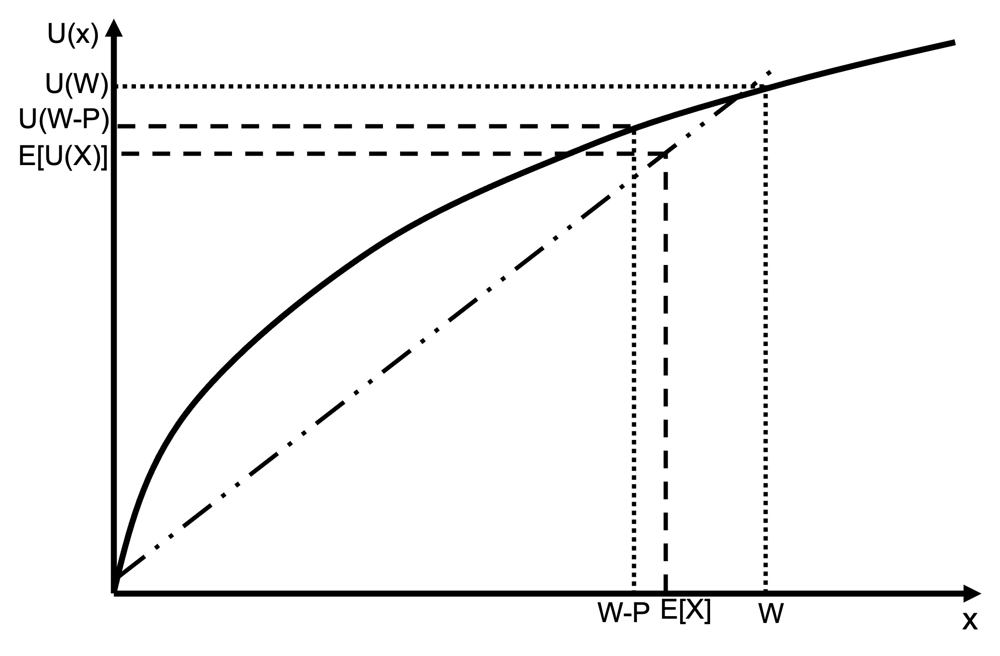
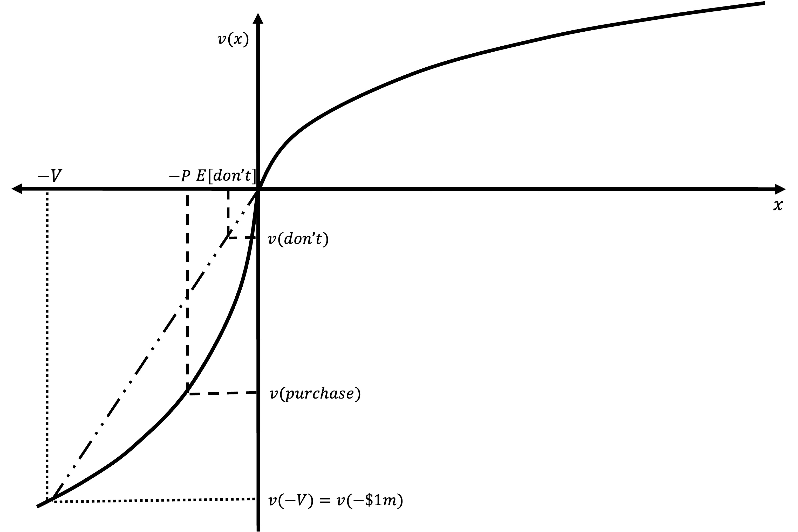
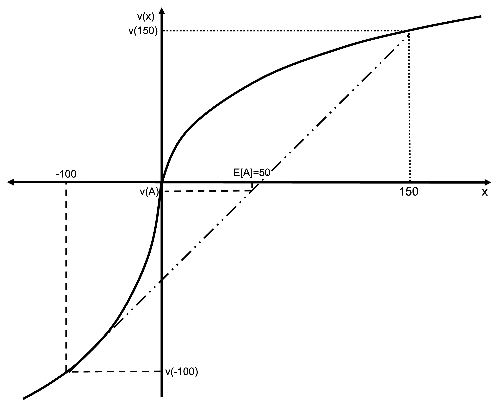
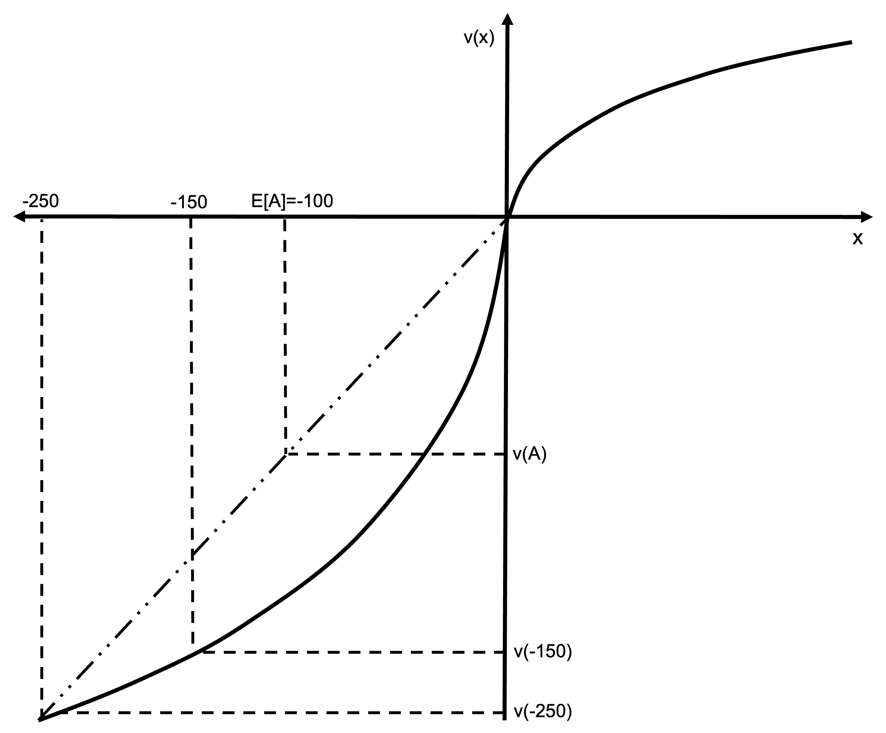

# Prospect Theory examples

## Insurance

The classical economic explanation for the purchase of insurance is based on the risk aversion of consumers. Consumers are willing to buy insurance with a negative expected value as the consumer prefers the certainty of the premium payment to the risk of suffering an uninsured loss. (The negative expected value is due to the insurer's profit and administrative costs.)

Prospect theory provides an alternative explanation. The purchase of insurance involves a certain loss (the premium) or a gamble involving the possibility of either a large loss or the status quo. As prospect theory has people as risk seeking in the loss domain, we would not expect them to purchase insurance.

However, under prospect theory people also overweight small probabilities. This overweighting of small probabilities can make the purchase of insurance attractive even though it is in the loss domain. This combination of the loss domain but small probabilities is the bottom-right quadrant of the fourfold pattern to risk attitudes generated by prospect theory.

The following numerical example is an illustration.

An agent is considering insurance against bushfire for its \$1,000,000 house. The house has a 1 in 1000 chance of burning down. An insurer is willing to offer full coverage for \$1100. (Note: \$1000 is the actuarially fair price, the additional \$100 might represent profit or administrative costs.)

### Expected value

Would an expected value maximiser or risk neutral person purchase the insurance?

\begin{align*}
E[\text{purchase}]&=-\text{premium} \\
&=-\$1,100
\end{align*}

The expected value of purchasing insurance is the guaranteed loss of the premium.

\begin{align*}
E[\text{don't}]&=P_{\text{burn}}\times -value_{\text{house}} \\
&=-0.001\times 1000000 \\
&=-\$1000
\end{align*}

The expected value of purchasing insurance is \$100 less than the expected value of risking the house burning down. A risk neutral agent (who maximises expected value) would not purchase this insurance.

### Expected utility

Would a risk averse agent purchase the insurance? Suppose they have a logarithmic utility function ($U(x)=ln(x)$) and they have \$10,000 in cash in addition to their house, giving them wealth ($W$) of \$1,010,000.

\begin{align*}
E[U(\text{purchase})]&=ln(W-premium) \\
&=ln(`r formatC(1000000+10000-1100, format="d", big.mark=",")`) \\
&=`r round(log(1000000+10000-1100), 4)` \\
\\
E[U(\text{don't})]&=0.999\times ln(W)+0.001\times ln(W-value_{\text{house}}) \\
&=0.999\times ln(1,010,000)+0.001\times ln(10,000) \\
&=`r round(0.999*log(1010000)+0.001*log(10000), 4)`
\end{align*}

The expected utility of purchasing insurance is greater than the expected utility from not purchasing insurance. This agent will insure against the fire despite it being actuarially unfair.

### The reflection effect

Consider an agent who is risk seeking in the domain of losses but weights probability linearly. Their value function is:

$$
v(x)=\left\{\begin{matrix}
x^{0.8} \qquad &\textrm{where} \space x \geq 0\\
-2(-x)^{0.8} \quad &\textrm{where} \space x < 0 
\end{matrix}\right.
$$

Where $x$ is the realised outcome relative to the reference point.

Determination of the reference point can be arbitrary. What if you pay insurance every year? Could the reference point then be wealth minus the insurance payment (meaning the insurance payment is in the gain domain)?

Taking the reference point as current wealth, would this agent purchase the insurance?

\begin{align*}
V(purchase)&=v(-1,100) \\
&=-(1,100)^{0.8} \\
&=`r round(-(1100)^(0.8), 1)` \\
\\
V(don't)&=0.999\times (0)+0.001\times v(-1,000,000) \\
&=0.999\times 0-0.001\times (1,000,000)^{0.8} \\
&=`r round(0.999*0-0.001*(1000000)^(0.8), 1)`
\end{align*}

As $V(purchase)<V(don't)$, the agent does not purchase insurance. The diminishing feeling of loss leads to them weigh the certain loss of the premium relatively more heavily than the chance of losing the value of their house.

Including loss aversion in the value function does not change the decision as all possible outcomes are in the loss domain.

### Probability weighting

Would a person who is risk seeking in the domain of losses (i.e. the value function with reflection effect above) and applies the decision weights described below purchase the insurance?

They apply decision weights as per the following table:

|                |     |     |     |     |     |     |     |     |     |
|-----|-----|-----|-----|-----|-----|-----|-----|-----|-----|
|  **Probability**   |   0.001  |   0.01  | 0.1 |0.25   |  0.5   |  0.75   |  0.9   | 0.99    |  0.999   |
|   **Weight**       |  0.01   |  0.05   |   0.15  |  0.3   |  0.5   |  0.7   | 0.85    |  0.95   |  0.99   |

\begin{align*}
V(purchase)&=v(-1,100) \\
&=-(1,100)^{0.8} \\
&=`r round(-(1100)^(0.8), 0)` \\
\\
V(don't)&=\sum_{i=1}^n \pi(p_i)v(x_i) \\
&=\pi(0.999)\times v(0)+\pi(0.001)\times v(-1,000,000) \\
&=0.99\times 0-0.01\times (1,000,000)^{0.8} \\
&=`r round(0.99*0-0.01*(1000000)^(0.8), 0)`
\end{align*}

Although the diminishing feeling of loss leads to them weigh the certain loss of the premium relatively more heavily than the chance of losing the value of their house, the overweighting of the probability of fire leads them to purchase insurance. Again, if we had included loss aversion it would not have changed the decision as all possible outcomes are in the loss domain.

## A 50:50 gamble

Suppose an agent has the following reference-dependent utility function:

$$
v(x)=\left\{\begin{matrix}
x^{1/2} \qquad &\textrm{where} \space x \geq 0\\
-2(-x)^{1/2} \quad &\textrm{where} \space x < 0 
\end{matrix}\right.
$$

Where $x$ is the realised outcome relative to the reference point.

Assume that the agent’s reference point is the status quo and the agent is offered the gamble A:

$$(\$110, 0.5; −\$100, 0.5)$$

### Accept or reject

Will they want to play this gamble?

The utility from the gamble is:

\begin{align*}
V(A)&=0.5v(110)+0.5v(-100) \\
&=0.5\times (110)^{0.5}-0.5\times 2\times (100)^{0.5} \\
&=-4.76
\end{align*}

They will not want to play this gamble as it has a negative value for the agent. They could receive value of 0 by simply not playing.

The reason for this negative value is that the agent is loss averse. The loss of \$100 is given twice the weight of an equivalent gain.

### Accept or reject after loss

Suppose the agent loses their wallet containing \$100. They feel bad about it and perceive it as a loss. Their reference point is unchanged at the original status quo, but the amount of money they have any after any outcome is \$100 less than otherwise. Would they be willing to take gamble A now?

After losing \$100 but not changing their reference point, they have two possible outcomes relative to their reference point: a gain of \$10 (winning \$110 minus the lost money in the wallet) and a loss of \$200 (losing \$100 and also losing their wallet).

\begin{align*}
V(A)&=0.5v(110-100)-0.5v(-100-100) \\
&=0.5\times (10)^{0.5}-0.5\times 2\times (200)^{0.5} \\
&=-12.56
\end{align*}

The utility of not playing the gamble involves remaining with a loss of \$100:

\begin{align*}
V(\neg A)&=v(-100) \\
&=-2\times (100)^{0.5} \\
&=-20
\end{align*}

They will now want to play the gamble as it has a greater value than staying with their current loss. The reason the gamble becomes attractive is because it gives an opportunity to recover the loss. The agent is risk seeking over the loss domain. (They would even accept a 50:50 gamble to win \$100, lose \$100 with an expected value of zero.)

### Accept or reject after adapt to loss

The agent has now adapted to their loss of \$100. The new reference point is the new wealth level incorporating the loss wallet. Would they take gamble A now?

We are now back to an identical situation as in Question 1. They will not want to partake in the gamble.

## Accept or reject after win

The agent wins \$10,000 at the casino. They feel good about their win, so their reference point remains at their wealth excluding the win. Would they take gamble A now?

With the additional \$10,000, the value from the gamble is now:

\begin{align*}
V(A)&=0.5v(10000+110)+0.5v(10000-100) \\[6pt]
&=0.5\times (10110)^{0.5}+0.5\times (9900)^{0.5} \\[6pt]
&=100.02
\end{align*}

The value of not playing the gamble is:

\begin{align*}
V(\neg A)&=v(10000) \\[6pt]
&=(10000)^{0.5} \\[6pt]
&=100
\end{align*}

The gamble is now attractive. They are less risk averse at a higher wealth, and the gamble is entirely in the gain domain, meaning that loss aversion does not affect the decision.

## A 60:40 gamble

Paddy makes decisions in accordance with prospect theory, has wealth \$300 and value function:

$$
v(x)=\left\{\begin{matrix}
x^{\frac{1}{2}} \quad &\textrm{where} \quad x \geq 0 \\
-2(-x)^{\frac{1}{2}} \quad &\textrm{where} \quad x < 0 
\end{matrix}\right.
$$

Penny and Paddy are offered the following bet A:

- a 60% probability to win \$150
- a 40% probability to lose \$100.

### Accept or reject

Does Paddy accept bet A?

Paddy compares the value of taking versus not taking the bet:

\begin{align*}
V(\text{A})&=p_1v(x_1)+p_2v(x_2) \\
&=0.6\times (150)^{\frac{1}{2}}-0.4\times 2\times (100)^{\frac{1}{2}} \\
&=`r round(0.6*150^0.5-0.4*2*100^0.5, 3)`
\end{align*}

The value of not taking the bet is zero. Paddy would have no change from his reference point.

As $V(A)<V(0)=0$, Paddy rejects the bet.

### Accept or reject after loss

Following some bad economic news, Paddy's wealth declines to \$150. Paddy cannot get over the loss, so his reference point remains his former wealth of \$300.

Paddy is offered bet A again. Does Paddy accept the bet?

As Paddy is now in the loss domain, the two potential outcomes from the bet are a gain of \$0 and a loss of \$250. His alternative is remaining at a point \$150 below his reference point ($L$).

Paddy compares the value of taking versus not taking the bet:

\begin{align*}
V(\text{A})&=p_1v(x_1)+p_2v(x_2) \\
&=0.6\times (-150+150)^{\frac{1}{2}}-0.4\times 2\times (150+100)^{\frac{1}{2}} \\
&=`r round(0.6*0^0.5-0.4*2*250^0.5, 3)` \\
\\
V(\text{L})&=v(L) \\
&=-2\times (150)^{\frac{1}{2}} \\
&=`r round(-2*150^0.5, 3)`
\end{align*}

As $V(A)>V(L)$, Paddy accepts the bet.

### Graphing the decision

For the bet above, draw diagrams showing Paddy's value function, the bets and the value of the bets. Explain how the diagram(s) show whether Paddy accepts or rejects the bet.

First offer: Paddy rejects the bet as $V(A)$ is less than the $V(0)=0$ Paddy could get by simply rejecting the bet. This is caused by both Paddy's loss aversion and his diminishing sensitivity in the gain domain, which has larger effect that the diminishing sensitivity in the loss domain due to the larger magnitude of the potential gain.

{width=80%}

Second offer: Paddy accepts the bet as $V(A)$ is greater than the value of the certain loss of \$150. He is risk seeking in the loss domain, so finds the positive expected value bet attractive.

{width=80%}
