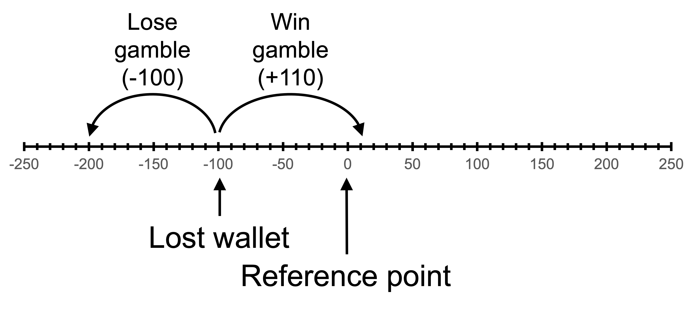
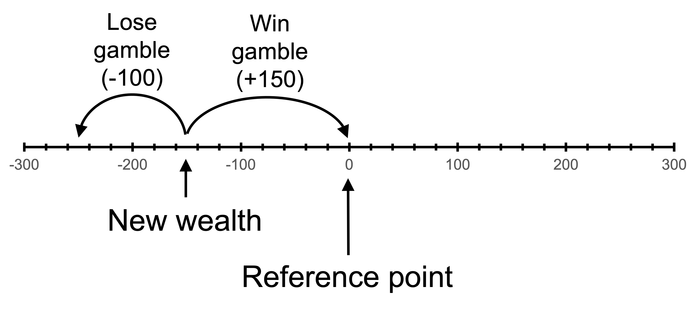
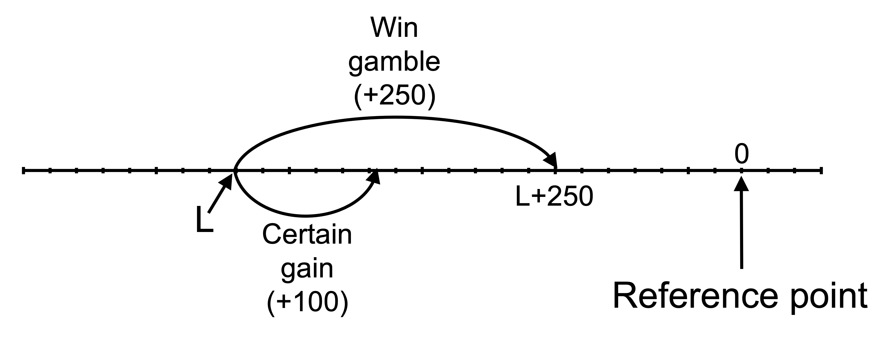

# Prospect theory examples

In this section, I present a series of mathematical examples of prospect theory.

## A 50:50 gamble

Suppose Alby has the following reference-dependent value function:

$$
v(x)=\left\{\begin{matrix}
x^\frac{1}{2} \qquad &\textrm{where} \space x \geq 0\\[6pt]
-2(-x)^\frac{1}{2} \quad &\textrm{where} \space x < 0 
\end{matrix}\right.
$$

$x$ is the realised outcome relative to the reference point.

Assume that Alby’s reference point is the status quo and that he weights outcomes linearly.

Alby is offered the gamble A:

$$
(0.5, \$110; 0.5, −\$100)
$$

### Accept or reject?

Will Alby want to play this gamble?

To determine this, we compare the weighted value of the gamble with the weighted value of rejecting the offer.

The weighted value of the gamble is:

\begin{align*}
V(A)&=p_1v(x_1)+p_2v(x_2) \\[6pt]
&=0.5\times v(110)+0.5\times v(-100) \\[6pt]
&=0.5\times (110)^\frac{1}{2}-0.5\times 2\times (100)^\frac{1}{2} \\[6pt]
&=`r round(0.5*110^0.5-0.5*2*100^0.5, 2)`
\end{align*}

Alby will not want to play this gamble as it has a negative value. He could receive a weighted value of 0 by simply not playing.

The reason for this negative value is that Alby is loss averse. The loss of \$100 is given twice the weight of an equivalent gain.

The following chart illustrates. The horizontal axis is the outcome $x$ relative to the reference point. The vertical axis is the value of each outcome. The S-shaped curve represents Alby's value function, with a concave curve in the game domain and a convex curve in the loss domain. The curve is steeper in the loss domain, due to loss aversion.

The gain of $110 and the loss of $100 and their respective values are marked.

I have drawn a straight line between the two outcomes. The weighted value of the two outcomes will be on this line.

As the probability of each outcome is 50 percent, the expected value of A, \$5, is halfway between the two outcomes. If we project to the straight line from the expected value, we get $V(A)$, a probability-weighted average of the two possible outcomes from the bet. $V(A)$ is negative, indicating that the gamble has a lower weighted value than remaining at the status quo. 

```{r}
#| label: fig-50-50-gamble
#| fig-cap: A 50:50 gamble

library(ggplot2)

u <- function(x){
  ifelse (x >= 0, x^0.5, -2*(-x)^0.5)
}

df <- data.frame(
  x = seq(-220, 220, 0.1),
  y = u(seq(-220, 220, 0.1))
)

#Variables for plot (may not match labels as not done to scale)
#Payoffs from gamble
x1 <- -200 #loss
x2 <- 220 #win
ev <- 10 #expected value of gamble
xc <- 0 #certain outcome
px2<-(ev-x1)/(x2-x1)

ggplot(mapping = aes(x, y)) +

  #Plot the utility curve
  geom_line(data = df) +
  geom_vline(xintercept = 0, linewidth=0.25)+ 
  geom_hline(yintercept = 0, linewidth=0.25)+
  labs(x = "x", y = "v(x)")+

  # Set the theme
  theme_minimal()+

  #remove numbers on each axis
  theme(axis.text.x = element_blank(),
            axis.text.y = element_blank(),
            axis.title=element_text(size=14,face="bold"),
            axis.title.y = element_text(angle=0, vjust=0.5))+

  #limit to y greater than zero and x greater than -8 (need -8 so space for y-axis labels)
  coord_cartesian(xlim = c(-220, 220), ylim = c(-30, 15))+

  #Add labels -100, v(-100) and line to curve indicating each
  annotate("text", x = x1, y = 0, label = "-100", size = 4, hjust = 0.5, vjust = -0.5)+
  annotate("segment", x = x1, y = 0, xend = x1, yend = u(x1), linewidth = 0.5, colour = "black", linetype="dotted")+
  annotate("segment", x = 0, y = u(x1), xend = x1, yend = u(x1), linewidth = 0.5, colour = "black", linetype="dotted")+
  annotate("text", x = 0, y = u(x1), label = "v(-100)", size = 4, hjust = -0.1, vjust = 0.45)+

  #Add expected utility line
  annotate("segment", x = x1, xend = x2, y = u(x1), yend = u(x2), linewidth = 0.5, colour = "black", linetype="dotdash")+

  #Add labels 110, v(110) and line to curve indicating each
  annotate("text", x = x2, y = 0, label = "110", size = 4, hjust = 0.4, vjust = 1.5)+
  annotate("segment", x = x2, y = 0, xend = x2, yend = u(x2), linewidth = 0.5, colour = "black", linetype="dotted")+
  annotate("segment", x = 0, y = u(x2), xend = x2, yend = u(x2), linewidth = 0.5, colour = "black", linetype="dotted")+
  annotate("text", x = 0, y = u(x2), label = "v(110)", size = 4, hjust = 1.05, vjust = 0.45)+

  #Add labels E[A], V(A) and curve indicating each
  annotate("text", x = ev, y = 0, label = "E[A]", size = 4, hjust = 0.3, vjust = -0.5)+
  annotate("segment", x = ev, y = 0, xend = ev, yend = u(x1)+(u(x2)-u(x1))*px2, linewidth = 0.5, colour = "black", linetype="dashed")+
  annotate("segment", x = 0, y = u(x1)+(u(x2)-u(x1))*px2, xend = ev, yend = u(x1)+(u(x2)-u(x1))*px2, linewidth = 0.5, colour = "black", linetype="dashed")+
  annotate("text", x = 0, y = u(x1)+(u(x2)-u(x1))*px2, label = "V(A)", size = 4, hjust = 1.05, vjust = 0.45)

```

### Accept or reject after loss?

Suppose Alby loses his wallet containing \$100. He feels bad about it and perceives it as a loss. His reference point is unchanged at the original status quo, but the amount of money he will have after any outcome is \$100 less than otherwise. Would he be willing to take gamble A now?

After losing \$100 but not changing his reference point, he has two possible outcomes relative to his reference point: a gain of \$10 (winning \$110 minus the lost money in the wallet) and a loss of \$200 (losing \$100 and also losing his wallet).



The weighted value of gamble A is now:

\begin{align*}
V(A)&=p_1v(x_1)+p_2v(x_2) \\[6pt]
&=0.5\times v(110-100)+0.5\times v(-100-100) \\[6pt]
&=0.5\times (10)^\frac{1}{2}-0.5\times 2\times (200)^\frac{1}{2} \\[6pt]
&=`r round(0.5*10^0.5-0.5*2*200^0.5, 2)`
\end{align*}

The value of not playing the gamble involves remaining with a loss of \$100:

\begin{align*}
V(\neg A)&=v(-100) \\[6pt]
&=-2\times (100)^\frac{1}{2} \\[6pt]
&=-20
\end{align*}

He will now want to play the gamble as it has a greater value than staying with his current loss. The gamble becomes attractive as it allows recovery of the loss. Alby is risk seeking in the loss domain. (He would even accept a 50:50 gamble to win \$100, lose \$100 with an expected value of zero.)

The choice is illustrated in the following chart. The two possible outcomes, $200 below the reference point and $10 above the reference point, plus their values, are marked. The weighted value of those two possible outcomes is also marked, with the expected value, E of A, projected onto the line between the two outcomes to give $V(A)$

It is visually apparent that $V(A)$ is above the value of a loss of $100, the outcome if Alby does not accept the gamble. As a result, Alby wants to accept the gamble.

```{r}
#| label: fig-50-50-gamble-after-loss
#| fig-cap: A 50:50 gamble after a loss

library(ggplot2)

u <- function(x){
  ifelse (x >= 0, x^0.5, -2*(-x)^0.5)
}

df <- data.frame(
  x = seq(-220, 220, 0.1),
  y = u(seq(-220, 220, 0.1))
)

#Variables for plot (may not match labels as not done to scale)
#Payoffs from gamble
x1 <- -200 #loss
x2 <- 10 #win
ev <- -95 #expected value of gamble
xc <- -100 #certain outcome
px2<-(ev-x1)/(x2-x1)

ggplot(mapping = aes(x, y)) +

  #Plot the utility curve
  geom_line(data = df) +
  geom_vline(xintercept = 0, linewidth=0.25)+ 
  geom_hline(yintercept = 0, linewidth=0.25)+
  labs(x = "x", y = "v(x)")+

  # Set the theme
  theme_minimal()+

  #remove numbers on each axis
  theme(axis.text.x = element_blank(),
            axis.text.y = element_blank(),
            axis.title=element_text(size=14,face="bold"),
            axis.title.y = element_text(angle=0, vjust=0.5))+

  #limit to y greater than zero and x greater than -8 (need -8 so space for y-axis labels)
  coord_cartesian(xlim = c(-220, 220), ylim = c(-30, 15))+

  #Add labels -200, v(-200) and line to curve indicating each
  annotate("text", x = x1, y = 0, label = "-200", size = 4, hjust = 0.5, vjust = -0.5)+
  annotate("segment", x = x1, y = 0, xend = x1, yend = u(x1), linewidth = 0.5, colour = "black", linetype="dotted")+
  annotate("segment", x = 0, y = u(x1), xend = x1, yend = u(x1), linewidth = 0.5, colour = "black", linetype="dotted")+
  annotate("text", x = 0, y = u(x1), label = "v(-200)", size = 4, hjust = -0.2, vjust = 0.6)+

  #Add labels -100, v(-100) and line to curve indicating each
  annotate("text", x = xc, y = 0, label = "-100", size = 4, hjust = 0.9, vjust = -0.5)+
  annotate("segment", x = xc, y = 0, xend = xc, yend = u(xc), linewidth = 0.5, colour = "black", linetype="dotted")+
  annotate("segment", x = 0, y = u(xc), xend = xc, yend = u(xc), linewidth = 0.5, colour = "black", linetype="dotted")+
  annotate("text", x = 0, y = u(xc), label = "v(-100)", size = 4, hjust = -0.2, vjust = 0.3)+

  #Add expected utility line
  annotate("segment", x = x1, xend = x2, y = u(x1), yend = u(x2), linewidth = 0.5, colour = "black", linetype="dotdash")+

  #Add labels 10, v(10) and line to curve indicating each
  annotate("text", x = x2, y = 0, label = "10", size = 4, hjust = 0.4, vjust = 1.5)+
  annotate("segment", x = x2, y = 0, xend = x2, yend = u(x2), linewidth = 0.5, colour = "black", linetype="dotted")+
  annotate("segment", x = 0, y = u(x2), xend = x2, yend = u(x2), linewidth = 0.5, colour = "black", linetype="dotted")+
  annotate("text", x = 0, y = u(x2), label = "v(10)", size = 4, hjust = 1.05, vjust = 0.45)+

  #Add labels E[A], V(A) and curve indicating each
  annotate("text", x = ev, y = 0, label = "E[A]", size = 4, hjust = 0, vjust = -0.5)+
  annotate("segment", x = ev, y = 0, xend = ev, yend = u(x1)+(u(x2)-u(x1))*px2, linewidth = 0.5, colour = "black", linetype="dashed")+
  annotate("segment", x = 0, y = u(x1)+(u(x2)-u(x1))*px2, xend = ev, yend = u(x1)+(u(x2)-u(x1))*px2, linewidth = 0.5, colour = "black", linetype="dashed")+
  annotate("text", x = 0, y = u(x1)+(u(x2)-u(x1))*px2, label = "V(A)", size = 4, hjust = -0.2, vjust = 0.45)

```

### Accept or reject after adaptation to loss?

Alby has now adapted to his loss of \$100. The new reference point is the new wealth level incorporating the loss wallet. Would he take gamble A now?

We are now back to an identical situation as when he was first offered the gamble with his reference point as the status quo. He will not want to partake in the gamble.

### Accept or reject after a win?

Alby wins \$10,000 at the casino. He feels good about his win, so his reference point remains at his wealth excluding the win. Would he take gamble A now?

With the additional \$10,000, the value of the gamble is:

\begin{align*}
V(A)&=p_1v(x_1)+p_2v(x_2) \\[6pt]
&=0.5\times v(10000+110)+0.5\times v(10000-100) \\[6pt]
&=0.5\times (10110)^\frac{1}{2}+0.5\times (9900)^\frac{1}{2} \\[6pt]
&=`r round(0.5*10110^0.5+0.5*9900^0.5, 2)`
\end{align*}

The value of not playing the gamble is:

\begin{align*}
V(\neg A)&=v(10000) \\[6pt]
&=10000^\frac{1}{2} \\[6pt]
&=100
\end{align*}

The gamble is now attractive. Alby is less risk averse at a higher wealth. Further, the gamble is entirely in the gain domain, meaning that loss aversion does not affect the decision.

The following chart, not drawn to scale, illustrates. Alby becomes increasingly risk neutral as we move further into the gain domain. You can see this through the value function curve becoming approximately straight. As a result, at a high enough wealth, the positive value bet becomes attractive. $V(A)$ is above the value of the certain outcome, $V(10000)$.

```{r}
#| label: fig-50-50-gamble-after-win
#| fig-cap: A 50:50 gamble after a win (not to scale)

library(ggplot2)

u <- function(x){
  ifelse (x >= 0, x^0.5, -2*(-x)^0.5)
}

df <- data.frame(
  x = seq(-220, 1000, 0.1),
  y = u(seq(-220, 1000, 0.1))
)

#Variables for plot (may not match labels as not done to scale)
#Payoffs from gamble
x1 <- 560 #loss
x2 <- 1000 #win
ev <- 800 #expected value of gamble
xc <- 780 #certain outcome
px2<-(ev-x1)/(x2-x1)

ggplot(mapping = aes(x, y)) +

  #Plot the utility curve
  geom_line(data = df) +
  geom_vline(xintercept = 0, linewidth=0.25)+ 
  geom_hline(yintercept = 0, linewidth=0.25)+
  labs(x = "x", y = "v(x)")+

  # Set the theme
  theme_minimal()+

  #remove numbers on each axis
  theme(axis.text.x = element_blank(),
            axis.text.y = element_blank(),
            axis.title=element_text(size=14,face="bold"),
            axis.title.y = element_text(angle=0, vjust=0.5))+

  #limit to y greater than zero and x greater than -8 (need -8 so space for y-axis labels)
  coord_cartesian(xlim = c(-220, 1000), ylim = c(-30, 30))+

  #Add labels 9,900, v(9,900) and line to curve indicating each
  annotate("text", x = x1, y = 0, label = "9,900", size = 4, hjust = 0.5, vjust = 1.5)+
  annotate("segment", x = x1, y = 0, xend = x1, yend = u(x1), linewidth = 0.5, colour = "black", linetype="dotted")+
  annotate("segment", x = 0, y = u(x1), xend = x1, yend = u(x1), linewidth = 0.5, colour = "black", linetype="dotted")+
  annotate("text", x = 0, y = u(x1), label = "v(9,900)", size = 4, hjust = 1.05, vjust = 0.6)+

  #Add labels 10,000, v(10,000) and line to curve indicating each
  annotate("text", x = xc, y = 0, label = "10,000", size = 4, hjust = 0.9, vjust = 1.5)+
  annotate("segment", x = xc, y = 0, xend = xc, yend = u(xc), linewidth = 0.5, colour = "black", linetype="dotted")+
  annotate("segment", x = 0, y = u(xc), xend = xc, yend = u(xc), linewidth = 0.5, colour = "black", linetype="dotted")+
  annotate("text", x = 0, y = u(xc), label = "v(10,000)", size = 4, hjust = 1.05, vjust = 1.2)+

  #Add expected utility line
  annotate("segment", x = x1, xend = x2, y = u(x1), yend = u(x2), linewidth = 0.5, colour = "black", linetype="dotdash")+

  #Add labels 10,110, v(10,110) and line to curve indicating each
  annotate("text", x = x2, y = 0, label = "10,110", size = 4, hjust = 0.4, vjust = 1.5)+
  annotate("segment", x = x2, y = 0, xend = x2, yend = u(x2), linewidth = 0.5, colour = "black", linetype="dotted")+
  annotate("segment", x = 0, y = u(x2), xend = x2, yend = u(x2), linewidth = 0.5, colour = "black", linetype="dotted")+
  annotate("text", x = 0, y = u(x2), label = "v(10,110)", size = 4, hjust = 1.05, vjust = 0.45)+

  #Add labels E[A], V(A) and curve indicating each
  annotate("text", x = ev, y = 0, label = "E[A]", size = 4, hjust = 0, vjust = 1.5)+
  annotate("segment", x = ev, y = 0, xend = ev, yend = u(x1)+(u(x2)-u(x1))*px2, linewidth = 0.5, colour = "black", linetype="dashed")+
  annotate("segment", x = 0, y = u(x1)+(u(x2)-u(x1))*px2, xend = ev, yend = u(x1)+(u(x2)-u(x1))*px2, linewidth = 0.5, colour = "black", linetype="dashed")+
  annotate("text", x = 0, y = u(x1)+(u(x2)-u(x1))*px2, label = "V(A)", size = 4, hjust = 1.05, vjust = 0)

```

## A 60:40 gamble

Paddy makes decisions in accordance with prospect theory, has wealth \$300 and value function:

$$
v(x)=\left\{\begin{matrix}
x^{\frac{1}{2}} \quad &\textrm{where} \quad x \geq 0 \\[6pt]
-2(-x)^{\frac{1}{2}} \quad &\textrm{where} \quad x < 0 
\end{matrix}\right.
$$

Assume Paddy weights probabilities linearly.

Paddy is offered the following bet A:

- a 60% probability to win \$150
- a 40% probability to lose \$100.

### Accept or reject

Does Paddy accept bet A?

Paddy compares the value of taking versus not taking the bet:

\begin{align*}
V(\text{A})&=p_1v(x_1)+p_2v(x_2) \\[6pt]
&=0.6\times v(150)+0.4\times v(-100) \\[6pt]
&=0.6\times (150)^{\frac{1}{2}}-0.4\times 2\times (100)^{\frac{1}{2}} \\[6pt]
&=`r round(0.6*150^0.5-0.4*2*100^0.5, 3)`
\end{align*}

The value of not taking the bet is zero. Paddy would have no change from his reference point.

Paddy rejects the bet as $V(A)$ is less than the $V(0)=0$ that Paddy could get by simply rejecting the bet. He rejects the bet due to his loss aversion and the diminishing sensitivity to gains. The loss is weighted double that of an equivalent gain, outweighing both the larger potential gain and 60% probability.

The following figure shows Paddy's value function, the bets and the value of the bets. The figure illustrates that Paddy's rejection is caused by both Paddy's loss aversion and his diminishing sensitivity in the gain domain, which has a larger effect than the diminishing sensitivity in the loss domain due to the larger magnitude of the potential gain.

```{r}
#| label: fig-60-40-gamble
#| fig-cap: A 60:40 gamble

library(ggplot2)

u <- function(x){
  ifelse (x >= 0, x^0.5, -2*(-x)^0.5)
}

df <- data.frame(
  x = seq(-110, 160, 0.1),
  y = u(seq(-110, 160, 0.1))
)

#Variables for plot (may not match labels as not done to scale)
#Payoffs from gamble
x1 <- -100 #loss
x2 <- 150 #win
ev <- 0.6*150-0.4*100 #expected value of gamble
xc <- 0 #certain outcome
px2<-(ev-x1)/(x2-x1)

ggplot(mapping = aes(x, y)) +

  #Plot the utility curve
  geom_line(data = df) +
  geom_vline(xintercept = 0, linewidth=0.25)+ 
  geom_hline(yintercept = 0, linewidth=0.25)+
  labs(x = "x", y = "v(x)")+

  # Set the theme
  theme_minimal()+

  #remove numbers on each axis
  theme(axis.text.x = element_blank(),
            axis.text.y = element_blank(),
            axis.title=element_text(size=14,face="bold"),
            axis.title.y = element_text(angle=0, vjust=0.5))+

  #limit to y greater than zero and x greater than -8 (need -8 so space for y-axis labels)
  coord_cartesian(xlim = c(-110, 160), ylim = c(-25, 15))+

  #Add labels -100, v(-100) and line to curve indicating each
  annotate("text", x = x1, y = 0, label = "-100", size = 4, hjust = 0.5, vjust = -0.5)+
  annotate("segment", x = x1, y = 0, xend = x1, yend = u(x1), linewidth = 0.5, colour = "black", linetype="dotted")+
  annotate("segment", x = 0, y = u(x1), xend = x1, yend = u(x1), linewidth = 0.5, colour = "black", linetype="dotted")+
  annotate("text", x = 0, y = u(x1), label = "v(-100)", size = 4, hjust = -0.1, vjust = 0.45)+

  #Add expected utility line
  annotate("segment", x = x1, xend = x2, y = u(x1), yend = u(x2), linewidth = 0.5, colour = "black", linetype="dotdash")+

  #Add labels 150, v(150) and line to curve indicating each
  annotate("text", x = x2, y = 0, label = "150", size = 4, hjust = 0.4, vjust = 1.5)+
  annotate("segment", x = x2, y = 0, xend = x2, yend = u(x2), linewidth = 0.5, colour = "black", linetype="dotted")+
  annotate("segment", x = 0, y = u(x2), xend = x2, yend = u(x2), linewidth = 0.5, colour = "black", linetype="dotted")+
  annotate("text", x = 0, y = u(x2), label = "v(150)", size = 4, hjust = 1.05, vjust = 0.45)+

  #Add labels E[A], V(A) and curve indicating each
  annotate("text", x = ev, y = 0, label = "E[A]", size = 4, hjust = 0.4, vjust = -0.5)+
  annotate("segment", x = ev, y = 0, xend = ev, yend = u(x1)+(u(x2)-u(x1))*px2, linewidth = 0.5, colour = "black", linetype="dashed")+
  annotate("segment", x = 0, y = u(x1)+(u(x2)-u(x1))*px2, xend = ev, yend = u(x1)+(u(x2)-u(x1))*px2, linewidth = 0.5, colour = "black", linetype="dashed")+
  annotate("text", x = 0, y = u(x1)+(u(x2)-u(x1))*px2, label = "V(A)", size = 4, hjust = 1.05, vjust = 0.45)

```

### Accept or reject after a loss?

Following some bad economic news, Paddy's wealth declines to \$150. Paddy cannot get over the loss, so his reference point remains his former wealth of \$300.

Paddy is offered bet A again. Does Paddy accept the bet?

As Paddy is now in the loss domain, the two potential outcomes from the bet are a gain of \$0 and a loss of \$250. His alternative is remaining at a point \$150 below his reference point.



Paddy compares the value of taking versus not taking the bet:

\begin{align*}
V(\text{A})&=p_1v(x_1)+p_2v(x_2) \\[6pt]
&=0.6\times v(-150+150)+0.4\times v(-150-100) \\[6pt]
&=0.6\times (0)^{\frac{1}{2}}-0.4\times 2\times (250)^{\frac{1}{2}} \\[6pt]
&=`r round(0.6*0^0.5-0.4*2*250^0.5, 3)` \\
\\
V(\neg\text{A})&=v(-150) \\[6pt]
&=-2\times (150)^{\frac{1}{2}} \\[6pt]
&=`r round(-2*150^0.5, 3)`
\end{align*}

Paddy accepts the bet as $V(A)$ is greater than the value of the certain loss of \$150.

The following figure shows Paddy's value function, the bets and the value of the bets.  The figure shows that Paddy accepts the bet as he is risk seeking in the loss domain. The potential loss of another \$100 results in a smaller incremental loss of value than an equivalent win of $100.

```{r}
#| label: fig-60-40-gamble-after-loss
#| fig-cap: A 60:40 gamble after a loss

library(ggplot2)

u <- function(x){
  ifelse (x >= 0, x^0.5, -2*(-x)^0.5)
}

df <- data.frame(
  x = seq(-260, 100, 0.1),
  y = u(seq(-260, 100, 0.1))
)

#Variables for plot (may not match labels as not done to scale)
#Payoffs from gamble
x1 <- -250 #loss
x2 <- 0 #win
ev <- -100 #expected value of gamble
xc <- -150 #certain outcome
px2<-(ev-x1)/(x2-x1)

ggplot(mapping = aes(x, y)) +

  #Plot the utility curve
  geom_line(data = df) +
  geom_vline(xintercept = 0, linewidth=0.25)+ 
  geom_hline(yintercept = 0, linewidth=0.25)+
  labs(x = "x", y = "v(x)")+

  # Set the theme
  theme_minimal()+

  #remove numbers on each axis
  theme(axis.text.x = element_blank(),
            axis.text.y = element_blank(),
            axis.title=element_text(size=14,face="bold"),
            axis.title.y = element_text(angle=0, vjust=0.5))+

  #limit to y greater than zero and x greater than -8 (need -8 so space for y-axis labels)
  coord_cartesian(xlim = c(-260, 100), ylim = c(-35, 5))+

  #Add labels -250, v(-250) and line to curve indicating each
  annotate("text", x = x1, y = 0, label = "-250", size = 4, hjust = 0.5, vjust = -0.5)+
  annotate("segment", x = x1, y = 0, xend = x1, yend = u(x1), linewidth = 0.5, colour = "black", linetype="dotted")+
  annotate("segment", x = 0, y = u(x1), xend = x1, yend = u(x1), linewidth = 0.5, colour = "black", linetype="dotted")+
  annotate("text", x = 0, y = u(x1), label = "v(-250)", size = 4, hjust = -0.2, vjust = 0.6)+

  #Add labels -150, v(-150) and line to curve indicating each
  annotate("text", x = xc, y = 0, label = "-150", size = 4, hjust = 0.5, vjust = -0.5)+
  annotate("segment", x = xc, y = 0, xend = xc, yend = u(xc), linewidth = 0.5, colour = "black", linetype="dotted")+
  annotate("segment", x = 0, y = u(xc), xend = xc, yend = u(xc), linewidth = 0.5, colour = "black", linetype="dotted")+
  annotate("text", x = 0, y = u(xc), label = "v(-150)", size = 4, hjust = -0.2, vjust = 0.3)+

  #Add expected utility line
  annotate("segment", x = x1, xend = x2, y = u(x1), yend = u(x2), linewidth = 0.5, colour = "black", linetype="dotdash")+

  #Add labels E[A]=-100, V(A) and curve indicating each
  annotate("text", x = ev, y = 0, label = "E[A]=-100", size = 4, hjust = 0.5, vjust = -0.5)+
  annotate("segment", x = ev, y = 0, xend = ev, yend = u(x1)+(u(x2)-u(x1))*px2, linewidth = 0.5, colour = "black", linetype="dashed")+
  annotate("segment", x = 0, y = u(x1)+(u(x2)-u(x1))*px2, xend = ev, yend = u(x1)+(u(x2)-u(x1))*px2, linewidth = 0.5, colour = "black", linetype="dashed")+
  annotate("text", x = 0, y = u(x1)+(u(x2)-u(x1))*px2, label = "V(A)", size = 4, hjust = -0.2, vjust = 0.45)

```

## A gamble in the gain domain

Suppose Bill has the following reference-dependent value function:

$$
v(x)=\left\{\begin{matrix}
x^{1/2} \qquad &\textrm{where} &\space x \geq 0\\
-2(-x)^{1/2} \quad &\textrm{where} &\space x < 0 
\end{matrix}\right.
$$

$x$ is the change in Bill's position relative to his reference point.

What feature of Bill's value function leads to the reflection effect?

The power of $\frac{1}{2}$ applied in both the gain and loss domain leads to diminishing sensitivity to gains and losses. The value function is concave in the gain domain and convex in the loss domain. This curvature leads to risk-averse behaviour in the gain domain and risk-seeking behaviour in the loss domain. This change in risk preference between the gain and loss domains is the reflection effect.

```{r}
#| label: fig-bill-curve
#| fig-cap: Bill's value function

library(ggplot2)

u <- function(x){
  ifelse (x >= 0, x^0.5, -2*(-x)^0.5)
}

df <- data.frame(
  x = seq(-220, 220, 0.1),
  y = u(seq(-220, 220, 0.1))
)

ggplot(mapping = aes(x, y)) +

  #Plot the utility curve
  geom_line(data = df) +
  geom_vline(xintercept = 0, linewidth=0.25)+ 
  geom_hline(yintercept = 0, linewidth=0.25)+
  labs(x = "x", y = "v(x)")+

  # Set the theme
  theme_minimal()+

  #remove numbers on each axis
  theme(axis.text.x = element_blank(),
            axis.text.y = element_blank(),
            axis.title=element_text(size=14,face="bold"),
            axis.title.y = element_text(angle=0, vjust=0.5))+

  #limit to y greater than zero and x greater than -8 (need -8 so space for y-axis labels)
  coord_cartesian(xlim = c(-220, 220), ylim = c(-30, 15))

```

### Accept or reject?

Bill considers a choice between \$100 for certain and gamble A: (0.5, \$250; 0.5, 0).

Will Bill prefer the \$100 or gamble A?

The weighted value of gamble A is:

\begin{align*}
V(A)&=p_1v(x_1)+p_2v(x_2) \\[6pt]
&=0.5\times v(250)+0.5\times v(0) \\[6pt]
&=0.5 \times 250^{0.5} + 0.5 \times 0^{0.5} \\[6pt]
&=`r round(0.5*250^0.5 + 0.5*0^0.5, 2)`
\end{align*}

The value of the \$100 for certain is:

\begin{align*}
V(\$100)&=v(100)\\[6pt]
&=100^{0.5} \\[6pt]
&=`r round(100^0.5, 2)`
\end{align*}

As $V(\$100)>V(A)$, Bill will prefer the \$100 for certain to the gamble.

The possible outcomes from the gamble are zero and \$250. The certain outcome on offer is \$100. The expected value of the gamble is \$125. The outcomes are in the gain domain.

As he is risk averse in the gain domain, the value of the \$100 for certain exceeds the weighted value of the gamble. This can be seen through $v(A)$ being less than $v(\$100)$. Bill will therefore choose the \$100 for certain.

The following chart shows Bill's choices. Bill rejects the gamble because of the diminishing sensitivity to gains. This leads him to be risk averse and reject the higher expected value option of the gamble.

As all possible outcomes under our assumed reference point are in the gain domain, loss aversion does not affect his decision. Note that we do not use the value function for $x<0$ in determining Bill's choice.

```{r}
#| label: fig-bill-gamble
#| fig-cap: Bill's consideration of gamble A and the \$100

library(ggplot2)

u <- function(x){
  ifelse (x >= 0, x^0.5, -2*(-x)^0.5)
}

df <- data.frame(
  x = seq(-220, 220, 0.1),
  y = u(seq(-220, 220, 0.1))
)

#Variables for plot (may not match labels as not done to scale)
#Payoffs from gamble
x1<-0 #loss
x2<-200 #win
ev<-100 #expected value of gamble
xc<-80 #certain outcome
px2<-(ev-x1)/(x2-x1)

ggplot(mapping = aes(x, y)) +

  #Plot the utility curve
  geom_line(data = df) +
  geom_vline(xintercept = 0, linewidth=0.25)+ 
  geom_hline(yintercept = 0, linewidth=0.25)+
  labs(x = "x", y = "v(x)")+

  # Set the theme
  theme_minimal()+

  #remove numbers on each axis
  theme(axis.text.x = element_blank(),
            axis.text.y = element_blank(),
            axis.title=element_text(size=14,face="bold"),
            axis.title.y = element_text(angle=0, vjust=0.5))+

  #limit to y greater than zero and x greater than -8 (need -8 so space for y-axis labels)
  coord_cartesian(xlim = c(-220, 220), ylim = c(-30, 15))+

  #Add labels W+20, U(W+20) and line to curve indicating each
  annotate("segment", x = x1, y = 0, xend = x1, yend = u(x1), linewidth = 0.5, colour = "black", linetype="dotted")+
  annotate("segment", x = 0, y = u(x1), xend = x1, yend = u(x1), linewidth = 0.5, colour = "black", linetype="dotted")+

  #Add labels 100, U(100) and line to curve indicating each
  annotate("text", x = xc, y = 0, label = "100", size = 4, hjust = 0.6, vjust = 1.5)+
  annotate("segment", x = xc, y = 0, xend = xc, yend = u(xc), linewidth = 0.5, colour = "black", linetype="dotted")+
  annotate("segment", x = 0, y = u(xc), xend = xc, yend = u(xc), linewidth = 0.5, colour = "black", linetype="dotted")+
  annotate("text", x = 0, y = u(xc), label = "v(100)", size = 4, hjust = 1.05, vjust = 0.3)+

  #Add expected utility line
  annotate("segment", x = x1, xend = x2, y = u(x1), yend = u(x2), linewidth = 0.5, colour = "black", linetype="dotdash")+

  #Add labels 250, v(250) and line to curve indicating each
  annotate("text", x = x2, y = 0, label = "250", size = 4, hjust = 0.4, vjust = 1.5)+
  annotate("segment", x = x2, y = 0, xend = x2, yend = u(x2), linewidth = 0.5, colour = "black", linetype="dotted")+
  annotate("segment", x = 0, y = u(x2), xend = x2, yend = u(x2), linewidth = 0.5, colour = "black", linetype="dotted")+
  annotate("text", x = 0, y = u(x2), label = "v(250)", size = 4, hjust = 1.05, vjust = 0.45)+

  #Add labels E[A], V(A) and curve indicating each
  annotate("text", x = ev, y = 0, label = "E[A]=125", size = 4, hjust = 0.12, vjust = 1.5)+
  annotate("segment", x = ev, y = 0, xend = ev, yend = u(x1)+(u(x2)-u(x1))*px2, linewidth = 0.5, colour = "black", linetype="dashed")+
  annotate("segment", x = 0, y = u(x1)+(u(x2)-u(x1))*px2, xend = ev, yend = u(x1)+(u(x2)-u(x1))*px2, linewidth = 0.5, colour = "black", linetype="dashed")+
  annotate("text", x = 0, y = u(x1)+(u(x2)-u(x1))*px2, label = "V(A)", size = 4, hjust = 1.05, vjust = 0.45)

```

## Accept or reject after a negative shock?

Suppose Bill were to experience a large negative shock to his wealth that does not immediately change his reference point. Could this shock cause him to change his decision concerning the \$100 and gamble A?

A large negative shock to Bill's wealth would cause him to change his decision concerning the \$100 and gamble A. The shock would move the two possible outcomes into the loss domain, where Bill is risk seeking. (For this answer, I am assuming a shock of greater than \$250. A smaller shock would change the analysis.)

The following diagram illustrates the outcomes relative to the reference point. Let $L$ be a large negative number, the loss. The potential outcomes from the gamble are now $L$ and $L+250$. The certain outcome of accepting the \$100 is $L+100$.



The following diagram illustrates Bill's decision after the shock. The outcomes $L$, $L+100$ and $L+250$, and their respective values, are marked. The expected value of the gamble is $L+125$. The weighted value of the gamble is $V(L+A)$.

Due to the convex curvature of the curve in the loss domain, Bill is risk seeking. As a result, the utility of the gamble is greater than the utility of the certain outcome. This can be seen in $V(L+A)$ being greater than $v(L+100)$.

```{r}
#| label: fig-bill-gamble-after-shock
#| fig-cap: Bill's consideration of gamble A and the \$100 after the shock

library(ggplot2)

u <- function(x){
  ifelse (x >= 0, x^0.5, -2*(-x)^0.5)
}

df <- data.frame(
  x = seq(-220, 220, 0.1),
  y = u(seq(-220, 220, 0.1))
)

#Variables for plot (may not match labels as not done to scale)
#Payoffs from gamble
x1<- -200 #loss
x2<- -20 #win
ev<- -100 #expected value of gamble
xc<- -120 #certain outcome
px2<-(ev-x1)/(x2-x1)

ggplot(mapping = aes(x, y)) +

  #Plot the utility curve
  geom_line(data = df) +
  geom_vline(xintercept = 0, linewidth=0.25)+ 
  geom_hline(yintercept = 0, linewidth=0.25)+
  labs(x = "x", y = "v(x)")+

  # Set the theme
  theme_minimal()+

  #remove numbers on each axis
  theme(axis.text.x = element_blank(),
            axis.text.y = element_blank(),
            axis.title=element_text(size=14,face="bold"),
            axis.title.y = element_text(angle=0, vjust=0.5))+

  #limit to y greater than zero and x greater than -8 (need -8 so space for y-axis labels)
  coord_cartesian(xlim = c(-220, 220), ylim = c(-30, 15))+

  #Add labels L, v(L) and line to curve indicating each
  annotate("text", x = x1, y = 0, label = "L", size = 4, hjust = 0.5, vjust = -0.3)+
  annotate("segment", x = x1, y = 0, xend = x1, yend = u(x1), linewidth = 0.5, colour = "black", linetype="dotted")+
  annotate("segment", x = 0, y = u(x1), xend = x1, yend = u(x1), linewidth = 0.5, colour = "black", linetype="dotted")+
  annotate("text", x = 0, y = u(x1), label = "v(L)", size = 4, hjust = -0.1, vjust = 0.6)+

  #Add labels L+100, v(L+100) and line to curve indicating each
  annotate("text", x = xc, y = 0, label = "L+100", size = 4, hjust = 0.8, vjust = -0.3)+
  annotate("segment", x = xc, y = 0, xend = xc, yend = u(xc), linewidth = 0.5, colour = "black", linetype="dotted")+
  annotate("segment", x = 0, y = u(xc), xend = xc, yend = u(xc), linewidth = 0.5, colour = "black", linetype="dotted")+
  annotate("text", x = 0, y = u(xc), label = "v(L+100)", size = 4, hjust = -0.1, vjust = 0.3)+

  #Add expected utility line
  annotate("segment", x = x1, xend = x2, y = u(x1), yend = u(x2), linewidth = 0.5, colour = "black", linetype="dotdash")+

  #Add labels 250+L, U(250+L) and line to curve indicating each
  annotate("text", x = x2, y = 0, label = "L+250", size = 4, hjust = 0.5, vjust = -0.3)+
  annotate("segment", x = x2, y = 0, xend = x2, yend = u(x2), linewidth = 0.5, colour = "black", linetype="dotted")+
  annotate("segment", x = 0, y = u(x2), xend = x2, yend = u(x2), linewidth = 0.5, colour = "black", linetype="dotted")+
  annotate("text", x = 0, y = u(x2), label = "v(L+250)", size = 4, hjust = -0.1, vjust = 0.45)+

  #Add labels L+E[A], v(A+L) and curve indicating each
  annotate("text", x = ev, y = 0, label = "L+E[A]", size = 4, hjust = 0.1, vjust = -0.3)+
  annotate("segment", x = ev, y = 0, xend = ev, yend = u(x1)+(u(x2)-u(x1))*px2, linewidth = 0.5, colour = "black", linetype="dashed")+
  annotate("segment", x = 0, y = u(x1)+(u(x2)-u(x1))*px2, xend = ev, yend = u(x1)+(u(x2)-u(x1))*px2, linewidth = 0.5, colour = "black", linetype="dashed")+
  annotate("text", x = 0, y = u(x1)+(u(x2)-u(x1))*px2, label = "V(L+A)", size = 4, hjust = -0.1, vjust = 0.45)

```

## Insurance

The classical economic explanation for the purchase of insurance is based on the risk aversion of consumers. Insurance has a negative expected value due to the insurer's profit and administrative costs. However, consumers are willing to buy insurance as the consumer prefers the certainty of the premium payment to the risk of suffering an uninsured loss.

Prospect theory provides an alternative explanation. The purchase of insurance involves a certain loss (the premium) or a gamble involving the possibility of either a large loss or the status quo. As prospect theory has people as risk seeking in the loss domain, we would not expect them to purchase insurance.

However, under prospect theory people also overweight small probabilities. This overweighting of small probabilities can make the purchase of insurance attractive even though it is in the loss domain. This combination of the loss domain but small probabilities is the bottom-right quadrant of the fourfold pattern to risk attitudes generated by prospect theory.

The following numerical example is an illustration.

An agent is considering insurance against bushfire for its \$1,000,000 house. The house has a 1 in 1000 ($p=0.001$) chance of burning down. An insurer is willing to offer full coverage for \$1100. (Note: \$1000 is the actuarially fair price, the additional \$100 might represent profit or administrative costs.)

### Expected value

The first question we will ask is whether an expected value maximiser or risk-neutral person would purchase the insurance.

A risk-neutral agent will choose the option with the highest expected value. In @sec-expected-value-of-insurance I showed that the expected value of purchasing insurance is \$100 less than the expected value of risking the house burning down. A risk-neutral agent (who maximises expected value) would not purchase this insurance.

### Expected utility

Would a risk-averse agent purchase the insurance? Suppose they have a logarithmic utility function ($U(x)=ln(x)$) and they have \$10,000 in cash in addition to their house, giving them wealth ($W$) of \$1,010,000.

In @sec-purchasing-insurance I showed that the expected utility of purchasing insurance is greater than the expected utility of not purchasing insurance. This agent will insure against the fire despite it being actuarially unfair.

The intuition for this is that diminishing marginal utility means that the utility of average wealth is greater than the average utility of wealth. Therefore, their expected utility is higher when wealth is distributed evenly across the possible states of the world rather than concentrated in one state - or in the case of a disaster, very low in one state. The consumer insures as a way of evenly distributing wealth across all possible states.

### The reflection effect

Consider an agent who is risk seeking in the domain of losses but weights probability linearly. Their value function is:

$$
v(x)=\left\{\begin{matrix}
x^{0.8} \qquad &\textrm{where} \space x \geq 0\\
-2(-x)^{0.8} \quad &\textrm{where} \space x < 0 
\end{matrix}\right.
$$

Where $x$ is the realised outcome relative to the reference point.

Determination of the reference point can be arbitrary. What if you pay insurance every year? Could the reference point then be wealth minus the insurance payment (meaning the insurance payment is in the gain domain)?

Taking the reference point as current wealth, would this agent purchase the insurance?

\begin{align*}
V(purchase)&=v(-1,100) \\
&=-(1,100)^{0.8} \\
&=`r round(-(1100)^(0.8), 1)` \\
\\
V(don't)&=0.999\times (0)+0.001\times v(-1,000,000) \\
&=0.999\times 0-0.001\times (1,000,000)^{0.8} \\
&=`r round(0.999*0-0.001*(1000000)^(0.8), 1)`
\end{align*}

As $V(purchase)<V(don't)$, the agent does not purchase insurance. The diminishing feeling of loss leads to them weigh the certain loss of the premium relatively more heavily than the chance of losing the value of their house.

Including loss aversion in the value function does not change the decision as all possible outcomes are in the loss domain.

```{r}
#| label: fig-reflection-effect-insurance
#| fig-cap: The reflection effect and insurance

library(ggplot2)

u <- function(x){
  ifelse (x >= 0, x^0.5, -2*(-x)^0.5)
}

df <- data.frame(
  x = seq(-220, 220, 0.1),
  y = u(seq(-220, 220, 0.1))
)

#Variables for plot (may not match labels as not done to scale)
#Payoffs from gamble
x1<- -200 #loss
x2<- 0 #win
ev<- -30 #expected value of gamble
xc<- -60 #certain outcome
px2<-(ev-x1)/(x2-x1)

ggplot(mapping = aes(x, y)) +

  #Plot the utility curve
  geom_line(data = df) +
  geom_vline(xintercept = 0, linewidth=0.25)+ 
  geom_hline(yintercept = 0, linewidth=0.25)+
  labs(x = "x", y = "v(x)")+

  # Set the theme
  theme_minimal()+

  #remove numbers on each axis
  theme(axis.text.x = element_blank(),
            axis.text.y = element_blank(),
            axis.title=element_text(size=14,face="bold"),
            axis.title.y = element_text(angle=0, vjust=0.5))+

  #limit to y greater than zero and x greater than -8 (need -8 so space for y-axis labels)
  coord_cartesian(xlim = c(-220, 220), ylim = c(-30, 15))+

  #Add labels -V, v(L) and line to curve indicating each
  annotate("text", x = x1, y = 0, label = "-V", size = 4, hjust = 0.5, vjust = -0.3)+
  annotate("segment", x = x1, y = 0, xend = x1, yend = u(x1), linewidth = 0.5, colour = "black", linetype="dotted")+
  annotate("segment", x = 0, y = u(x1), xend = x1, yend = u(x1), linewidth = 0.5, colour = "black", linetype="dotted")+
  annotate("text", x = 0, y = u(x1), label = "v(-V)=v(-$1m)", size = 4, hjust = -0.1, vjust = 0.6)+

  #Add labels -P, v(-P) and line to curve indicating each
  annotate("text", x = xc, y = 0, label = "-P", size = 4, hjust = 0.8, vjust = -0.3)+
  annotate("segment", x = xc, y = 0, xend = xc, yend = u(xc), linewidth = 0.5, colour = "black", linetype="dotted")+
  annotate("segment", x = 0, y = u(xc), xend = xc, yend = u(xc), linewidth = 0.5, colour = "black", linetype="dotted")+
  annotate("text", x = 0, y = u(xc), label = "v(-P)", size = 4, hjust = -0.1, vjust = 0.3)+

  #Add expected utility line
  annotate("segment", x = x1, xend = x2, y = u(x1), yend = u(x2), linewidth = 0.5, colour = "black", linetype="dotdash")+

  #Add labels E[don't], v(don't) and curve indicating each
  annotate("text", x = ev, y = 0, label = "E[don't]", size = 4, hjust = 0.5, vjust = -0.3)+
  annotate("segment", x = ev, y = 0, xend = ev, yend = u(x1)+(u(x2)-u(x1))*px2, linewidth = 0.5, colour = "black", linetype="dashed")+
  annotate("segment", x = 0, y = u(x1)+(u(x2)-u(x1))*px2, xend = ev, yend = u(x1)+(u(x2)-u(x1))*px2, linewidth = 0.5, colour = "black", linetype="dashed")+
  annotate("text", x = 0, y = u(x1)+(u(x2)-u(x1))*px2, label = "v(don't)", size = 4, hjust = -0.1, vjust = 0.45)

```

### Probability weighting

Would a person who is risk seeking in the domain of losses (i.e. the value function with reflection effect above) and applies the decision weights described below purchase the insurance?

They apply decision weights as per the following table:

|                |     |     |     |     |     |     |     |     |     |
|-----|-----|-----|-----|-----|-----|-----|-----|-----|-----|
|  **Probability**   |   0.001  |   0.01  | 0.1 |0.25   |  0.5   |  0.75   |  0.9   | 0.99    |  0.999   |
|   **Weight**       |  0.01   |  0.05   |   0.15  |  0.3   |  0.5   |  0.7   | 0.85    |  0.95   |  0.99   |

\begin{align*}
V(purchase)&=v(-1,100) \\
&=-(1,100)^{0.8} \\
&=`r round(-(1100)^(0.8), 0)` \\
\\
V(don't)&=\sum_{i=1}^n \pi(p_i)v(x_i) \\
&=\pi(0.999)\times v(0)+\pi(0.001)\times v(-1,000,000) \\
&=0.99\times 0-0.01\times (1,000,000)^{0.8} \\
&=`r round(0.99*0-0.01*(1000000)^(0.8), 0)`
\end{align*}

Although the diminishing feeling of loss leads to them weigh the certain loss of the premium relatively more heavily than the chance of losing the value of their house, the overweighting of the probability of fire leads them to purchase insurance. Again, if we had included loss aversion it would not have changed the decision as all possible outcomes are in the loss domain.

## A multi-bet

A multi-bet allows a gambler to combine a series of individual bets into a single wager, with the odds of all the single bets multiplied to achieve the final payoff. The gambler only wins the wager if all of the single bets are successful. Or in other words, if a single bet is lost, the entire multi-bet is lost. A multi-bet is also known as an "accumulator" bet or "parlay".

For example, a multi-bet might combine the following bets:

- GWS Giants to defeat Adelaide Crows: \$1.65 (that is, \$1.65 is paid out for each $1 bet)
- Fremantle Dockers to defeat Sydney Swans: \$2.10
- Essendon Bombers to defeat Geelong Cats: \$3.50
- North Melbourne Kangaroos to defeat Melbourne Demons: \$4.00
- West Coast Eagles to defeat Brisbane Lions: \$6.00

If all five bets are successful, the gambler would win \$291 for every $1 they have bet. (That is 1.65 x 2.10 x 3.50 x 4 x 6 = 291.06). If any of GWS, Fremantle, Essendon, North Melbourne, or the West Coast Eagles lose, the bet is lost.

Many bookmakers also offer a "cash out" option for multi-bets. If the bet has been successful up to the date of the "cash out", a gambler can "cash out" their bet before the remaining games are complete at a price offered by the bookmaker. The "cash out" offers are typically unattractive relative to the expected value of seeing out the rest of the multi-bet.

For example, Betty places a \$20 multi-bet involving all nine games of Australian Rules Football one weekend. After eight games, she has picked all eight winners. If Geelong defeats North Melbourne in the ninth game she will win $10,000. Geelong is a heavy favourite, with a 95% probability of winning.

Betty checks the cash out price for the multi-bet and sees that she can cash out the bet now for \$7,000, a great return on her initial \$20. That return, however, is much below the expected value of seeing the multi-bet through to the end (\$9,500).

Betty makes decisions according to prospect theory. That is, she judges gains and losses relative to a reference point, is loss averse, and has diminishing sensitivity to gains and losses in both directions. She also overweights certainty (which is equivalent to overweighting small probabilities).

What elements of prospect theory might lead Betty to cash out the bet before the final game?

We can consider multiple potential reference points Betty might use to make her decision.

One potential reference point is Betty's position before making the bet. In that case, Betty is comparing:

- a certain gain of \$6980 and
- a gamble with a loss of \$20 and a gain of \$9,980.

The gamble is largely in the gain domain in which Betty is risk averse. Her risk aversion may lead her to cash out rather than take the gamble. The potential \$20 loss may be overweighted due to loss aversion, but is a relatively insignificant sum.

Another potential reference point is Betty's position immediately after making the bet. She has adapted to the payment of \$20. Here the analysis is similar. Betty is comparing:

- a certain gain of \$7000 and
- a gamble with a gain of \$10,000 or a payment of zero

The gamble is completely in the gain domain, where Betty is risk averse. Her risk aversion may lead her to cash out rather than gamble. Loss aversion is irrelevant in this instance.

Another potential reference point is that Betty is taking the \$7000 to be locked in. This means she is comparing:

- staying at the status quo with certainty and
- a gamble involving a potential loss of \$7000 and a gain of \$3,000.
 
In this case, the combination of risk aversion reducing the value of the gain and loss aversion increasing the relative magnitude of the pain of loss could lead her to cash out. This would be counteracted by the convex curvature in the loss domain, but the loss aversion effect would likely dominate.

Finally, Betty's weighting of probabilities will also affect her decision. Overweighting certainty means overweighting small probabilities, such as the small probability of Geelong losing. This overweighting would push her towards cashing out as the loss would have greater weight in her calculation of the weighted value of each option.