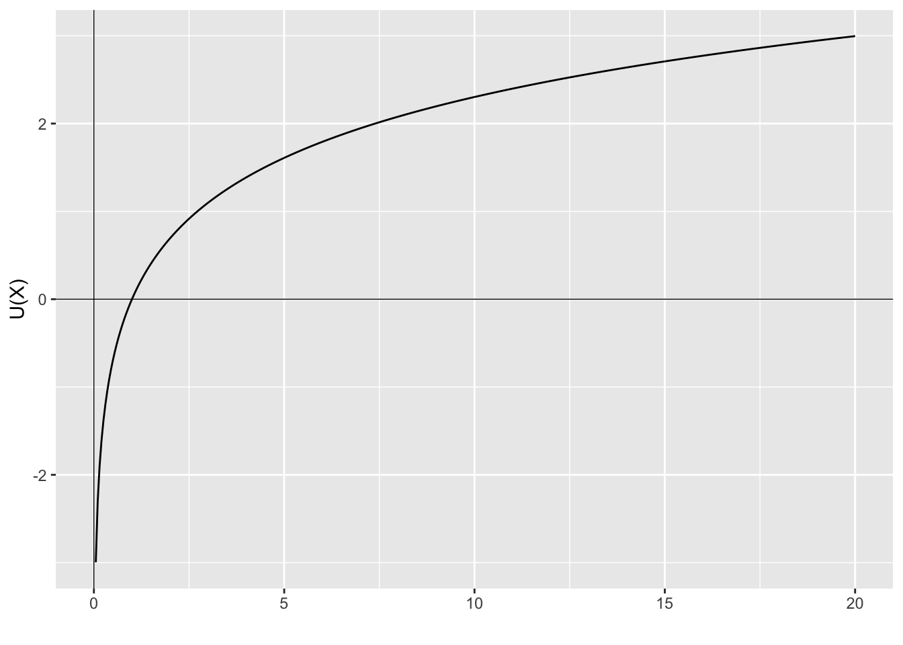
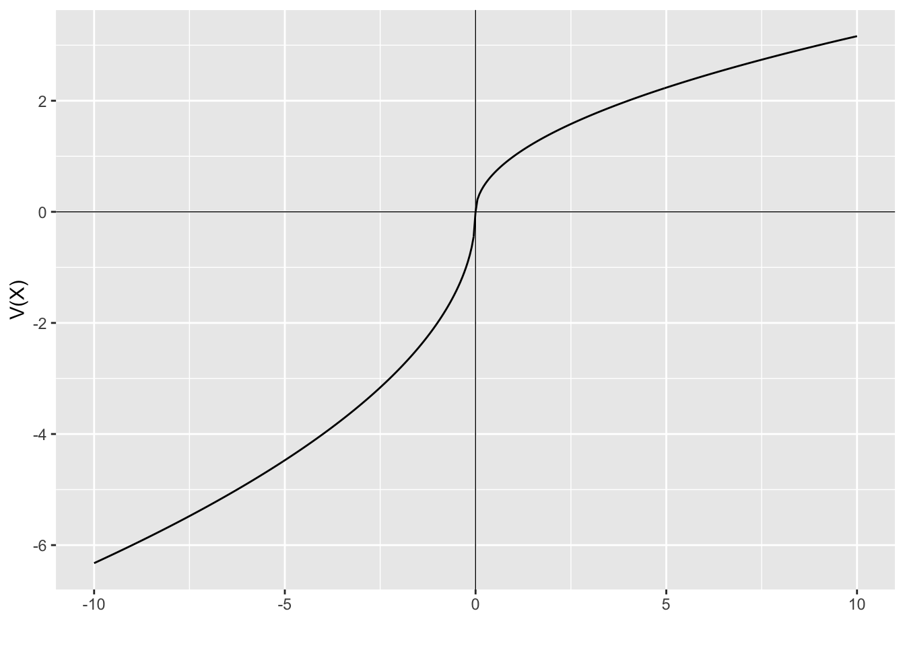

# Prospect theory implementation

Under Prospect theory, people evaluate the utility of a prospect by two phases: editing and evaluation.

## Editing

Editing involves simplification of prospects for subsequent evaluation.

@kahneman1979 describes the editing phase as having four main operations:

-   Coding: People perceive outcomes as gains or losses relative to some neutral reference position. The reference point is may be the status quo or some other expectation of agent.

-   Combination: Prospects are simplified by combining probabilities for identical outcomes: (200, 0.25; 200, 0.25) will become (200, 0.50).

-   Segregation: Riskless components are segregated out from risky components. For example (300, 0.80; 200, 0.20) corresponds to a a sure gain of 200 and the risky gamble (100, 0.80).

-   Cancellation: Components that are shared by two prospects are ignored.

## Evaluation

In the evaluation phase the prospects are evaluated and the option with the highest value chosen.

The value of a prospect is made up of:

1\. a decision weight applied to each probability $\pi(p_i)$

2\. the subjective value of each outcome $v(x_i)$

These are applied through the following formula (often called the value function):


```{=tex}
\begin{align*}
V(X)&=\sum_{i=1}^n\pi(p_i)v(x_i)\\[6pt]
&=\pi(p_1)v(x_1)+\pi(p_2)v(x_2)+...+\pi(p_n)v(x_n)
\end{align*}
```


Where $V(X)$ is the expected value of the outcomes from gamble $X$.

The following diagrams illustrate the different shapes of the expected utility function and the Prospect Theory value function.

The expected utility function has diminishing marginal utility as utility increases. Utility is measured from a base reference point.


::: {.cell}

```{.r .cell-code}
library(ggplot2)
df <- data.frame(
  x = seq(0.05,20,0.05),
  y=NA
)
df$y <- log(df$x)

ggplot(mapping = aes(x, y))+
  geom_line(data = df)+ 
  geom_vline(xintercept = 0, size=0.25)+ 
  geom_hline(yintercept = 0, size=0.25)+
  labs(x = "", y = "U(X)")
```

::: {.cell-output-display}
{width=672}
:::
:::


For the prospect theory function, you can see the kink at zero, with losses weighted more heavily than gains, with gains and losses determined relative to a reference point. There is diminishing sensitivity to further changes in both directions


::: {.cell}

```{.r .cell-code}
loss_fun <- function(x){
  -2*(-x)^0.5
}
gain_fun <- function(x){
  x^0.5
}

loss <- data.frame(
  x=seq(-10,0,0.05),
  y=NA
  )
loss$y <- loss_fun(loss$x)

gain <- data.frame(
  x=seq(0,10,0.05),
  y=NA
  )
gain$y <- gain_fun(gain$x)

ggplot(mapping = aes(x, y)) +
  geom_line(data = loss) +
  geom_line(data = gain) + 
  geom_vline(xintercept = 0, size=0.25)+ 
  geom_hline(yintercept = 0, size=0.25)+
  labs(x = "", y = "V(X)")
```

::: {.cell-output-display}
{width=672}
:::
:::


## Fourfold pattern of risk attitudes

Prospect theory results in a four-fold pattern of risk attitudes, as shown in this table. For moderate to high probability gambles, the reflection effect dominates and people are risk averse in the domain of gains and risk seeking in the domain of losses.

But for low probability gambles, the probability weighting shifts the decision calculus. The possibility of a gain is overweighted, making the gamble attractive and inducing risk seeking behaviour. A similar effect occurs for a low probability of loss, with the overweighted probability making the potential loss less attractive, inducing risk averse behaviour.

|                                          | Gains         | Losses        |
|------------------------------------------|---------------|---------------|
| **Medium to high probability**           | Risk aversion | Risk seeking  |
| **Low probability** (possibility effect) | Rick seeking  | Risk aversion |
