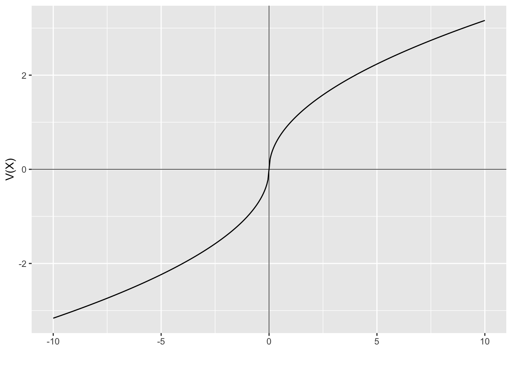

# The reflection effect

When people make a risky choice related to gains, they are risk averse. They prefer a certain option with lower expected utility than the expected utility of the risky choice. When making a choice in the loss domain, they become risk seeking. This phenomena is called the reflection effect.

This phenomena might also be thought of as diminishing sensitivity to gains or losses in either direction. This contrasts with expected utility theory where the pain of losses increases as they grow in size.

The reflection effect provides an explanation for the framing effects we observed in the question about the unusual disease. In the gain frame, the preferred option is risk averse. In the loss frame, the preferred option tends to be the risk seeking option.

## The reflection effect in the value function

The following value function is an example of a function where there is diminishing sensitivity to both gains and losses.

\begin{equation*}
v(x)= \Bigg\{
\begin{matrix}
x^\frac{1}{2} \space \text{where} \space x \geq 0\\
-(-x)^\frac{1}{2} \space \text{where} \space x<0
\end{matrix}
\end{equation*}

As $x$ increases in magnitude in either direction, the marginal increase in value from each additional unit of $x$ decreases.

The result of this is risk averse behaviour in the gain domain and risk seeking behaviour in the loss domain. The following plot shows the diminishing effect in each direction.


::: {.cell}

```{.r .cell-code}
library(ggplot2)

loss_fun <- function(x){
  -(-x)^0.5
}
gain_fun <- function(x){
  x^0.5
}

loss <- data.frame(
  x=seq(-10,0,0.05),
  y=NA
  )
loss$y <- loss_fun(loss$x)

gain <- data.frame(
  x=seq(0,10,0.05),
  y=NA
  )
gain$y <- gain_fun(gain$x)

ggplot(mapping = aes(x, y)) +
  geom_line(data = loss) +
  geom_line(data = gain) + 
  geom_vline(xintercept = 0, size=0.25)+ 
  geom_hline(yintercept = 0, size=0.25)+
  labs(x = "", y = "V(X)")
```

::: {.cell-output-display}
{width=672}
:::
:::


In the gain domain the function is convex, indicating risk aversion. In the loss domain the concave function indicates risk seeking behaviour.

The following numerical example illustrates further.

Suppose an agent with the above value function is offered a choice between \$10 for certain and a 50:50 bet to win \$20 or end up with nothing. The value of each choice is:

\begin{align*}
v(\text{certainty})&=v(10) \\
&=10^{\frac{1}{2}} \\
&=3.1622777 \\
\\
v(\text{bet})&=0.5*v(20)+0.5*v(0) \\
&=0.5*20^{\frac{1}{2}}+0.5*0 \\
&=2.236068
\end{align*}

The $10 for certain has a higher value for the agent. This agent is risk averse in the gain domain and therefore prefers an amount for certainty over a bet with the same expected value.

Suppose the agent is now offered another choice. They can now have a certain loss of \$10 or a 50:50 bet to lose \$20 or to lose nothing. The value of each choice is:

\begin{align*}
v(\text{certainty})&=v(-10) \\
&=-10^{\frac{1}{2}} \\
&=-3.1622777 \\
\\
v(\text{bet})&=0.5*v(-20)+0.5*v(0) \\
&=-0.5*20^{\frac{1}{2}}+0.5*0 \\
&=-2.236068
\end{align*}

This bet delivers higher value than the certain loss, despite the bet and the certain loss having the same expected value. The agent is willing to take a risk to avoid a loss. They are risk seeking in the loss domain.
