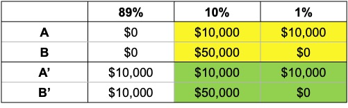

# Risk and uncertainty exercises

## Question 1: Expected value

You are playing roulette at the casino. There are 37 numbered pockets around the edge of the wheel (0 through 36). If you make a straight up bet on one of the 37 single numbers, you are paid \$35 for every dollar you bet. What is the expected value of a \$20 bet.

::: {.callout-tip collapse="true"}
## Question 1 answer

The expected value of the Roulette bet is:

\begin{align*}
E[X]&=\sum_{i=1}^n p_ix_i \\[6pt]
&=\frac{36}{37}*(-\$20)+\frac{1}{37}*(35*\$20) \\[6pt]
&=\$`r round(36/37*(-20)+1/37*(35*20), 2)`
\end{align*}
:::

## Question 2: Expected value

An agent is considering insurance against bushfire for its \$1,000,000 house. The house has a 1 in 1000 chance of burning down. An insurer is willing to offer full coverage for \$1100.

a\) What is the expected value of purchasing insurance?

b\) What is the expected value of not purchasing insurance?

::: {.callout-tip collapse="true"}
## Question 2 answer

a\) What is the expected value of purchasing insurance?

$$
E[\text{purchase}]=-\text{premium}=-\$1,100
$$

The expected value of purchasing insurance is the guaranteed loss of the premium.

b\) What is the expected value of not purchasing insurance?

\begin{align*}
E[\text{don't}]&=P_{\text{burn}}*-value_{\text{house}} \\
&=-0.001*1000000 \\
&=-\$1000
\end{align*}
:::

## Question 3: Expected utility

Anika is an expected utility maximiser with the following utility function:

$$U(x)=\sqrt{x}$$

Anika is offered the following choice:

A)  A 50% chance of winning \$10 and a 50% chance of winning nothing
B)  \$4 for certain

Anika has zero wealth besides this offer.

a\) What is the expected value of option A)?

::: {.callout-tip collapse="true"}
## Question 3(a) answer

The expected value of option A) is:

```{=tex}
\begin{align*}
E[A]&=\sum_{i=1}^n p_ix_i \\[12pt]
&=0.5*\$10+0.5*0 \\[6pt]
&=\$5
\end{align*}
```
:::

b\) Will Anika choose A) or B)? Why?

::: {.callout-tip collapse="true"}
## Question 3(b) answer

We need to determine the expected utility of each option. Anika will selection the option with the highest expected utility.

The expected utility of option A) is:

```{=tex}
\begin{align*}
EU(A)&=p_1U(x_1)+p_2U(x_2) \\
&=0.5*\sqrt{10}+0.5*\sqrt{0} \\
&=1.58
\end{align*}
```
The expected utility of option B) is:

```{=tex}
\begin{align*}
EU(B)&=U(4) \\
&=\sqrt{4} \\
&=2
\end{align*}
```

Anika will choose option B) as it gives her higher expected utility. Anika is risk averse.
:::

c\) What is the certainty equivalent of option A?

::: {.callout-tip collapse="true"}
## Question 3(c) answer

To calculate the certainty equivalent of option A, we calculate what payment with certainty would deliver equivalent expected utility. That is:

```{=tex}
\begin{align*}
EU(CE)&=1.58 \\
\sqrt{CE}&=1.58 \\
CE&=1.58^2 \\
&=2.5
\end{align*}
```

The certainty equivalent of option A is \$2.50. That is, Anika would be indifferent between option A and a payment of \$2.50 for certain.
:::

d\) Draw a graph showing Anika's utility curve, the expected value of option A, the expected utility of options A) and B) and the certainty equivalent of option A).

::: {.callout-tip collapse="true"}
## Question 3(d) answer


:::

## Question 4: Expected utility

Consider the following gamble:

> (0.5; \$550; 0.5, -\$500)

This gamble provides a 50% chance of winning \$550 and a 50% chance of losing \$500.

a\) Would a risk neutral agent (who maximises expected value) be willing to pay \$20 to play this gamble? What is the most they would be willing to pay to play?

::: {.callout-tip collapse="true"}
## Question 4(a) answer

The expected value of the gamble is:

```{=tex}
\begin{align*}
E[X]&=\sum_{i=1}^n p_ix_i \\[12pt]
&=0.5(550)+0.5(-500) \\[6pt]
&=25
\end{align*}
```

This is greater than \$20, so a risk neutral agent will be willing to pay \$20 to participate in the gamble.

We could also have solved this by determining the expected value if they had paid \$20:

```{=tex}
\begin{align*}
E[X]-c&=\sum_{i=1}^n p_ix_i-c \\[12pt]
&=0.5(550)+0.5(-500)-20 \\[6pt]
&=5
\end{align*}
```

As the expected value is positive, the agent would be willing to pay \$20.
:::

b\) Would a risk averse expected utility maximiser with wealth \$1000 and utility function $U(x)=x^{1/2}$ be willing to pay \$20 to play this gamble? What is the most they would be willing to pay to play?

::: {.callout-tip collapse="true"}
## Question 4(b) answer

The expected utility of the gamble for the risk averse agent if they paid \$20 to play is:

```{=tex}
\begin{align*}
EU(x)&=p_1(W+x_1-c)+p_2(W+x_2-c) \\[6pt]
&=0.5(1000+550-20)^{1/2}+0.5(1000-500-20)^{1/2} \\[6pt]
&=30.51
\end{align*}
```

The expected utility of not playing the gamble is:

```{=tex}
\begin{align*}
EU(x)&=(1000)^{1/2} \\[6pt]
&=31.62
\end{align*}
```

They would not pay \$20 as they would have higher utility if they turned down the gamble.

In fact, they would not pay any positive sum to participate in the gamble. If they were offered the gamble for free, their expected utility would be:

```{=tex}
\begin{align*}
EU(x)&=0.5(1000+550)^{1/2}+0.5(1000-500)^{1/2} \\[6pt]
&=30.86
\end{align*}
```

This is less than if they simply turned down the gamble. They would be willing to pay to avoid the gamble. How much?

We can determine this by asking what wealth a utility of 30.86 is:

```{=tex}
\begin{align*}
W^{1/2}&=30.86 \\[6pt]
W&=30.51^2 \\[6pt]
&=\$952.67
\end{align*}
```

The certainty equivalent of the gamble is \$952.67. The agent would be willing to pay up to \$47.33 to avoid the gamble.
:::

c\) Would the expected utility maximiser with utility function $U(x)=x^{1/2}$ change their decision if they had \$1 million in wealth? Explain.

::: {.callout-tip collapse="true"}
## Question 4(c) answer

If they now have \$1 million in wealth, we simply repeat the calculations above with the new wealth.

```{=tex}
\begin{align*}
EU(x)&=0.5(1000000+550-20)^{1/2}+0.5(1000000-500-20)^{1/2} \\[6pt]
&=`r EUc1<-0.5*(1000000+550-20)^(1/2)+0.5*(1000000-500-20)^(1/2); round(EUc1, 5)`
\end{align*}
```


The expected utility of not playing the gamble is:

```{=tex}
\begin{align*}
EU(x)&=(1000000)^{1/2} \\[6pt]
&=1000
\end{align*}
```

They would be willing to pay \$20 as they would have higher utility if they accepted the gamble.

What is the most they would be willing to pay? If they were offered the gamble for free, their expected utility would be:

```{=tex}
\begin{align*}
EU(x)&=0.5(1000000+550)^{1/2}+0.5(1000000-500)^{1/2} \\[6pt]
&=`r EUc2<-0.5*(1000000+550)^(1/2)+0.5*(1000000-500)^(1/2); round(EUc2, 4)`
\end{align*}
```

How much would they be willing to pay for this opportunity? We can determine this by asking what wealth a utility of `r round(EUc2, 4)` is:

```{=tex}
\begin{align*}
W&=(`r EUc2`)^2 \\[6pt]
&=\$`r options(scipen = 999); W<-round(EUc2^2, 2); W`
\end{align*}
```

The agent would be willing to pay up to \$`r W-1000000` for the gamble. This is close to the expected value of \$25.

Intuitively, as the agent's wealth increases their utility function becomes increasingly linear (second derivative approaches zero) and they become closer to risk neutral.
:::

## Question 5: Expected utility: insurance

An agent is considering insurance against bushfire for its \$1,000,000 house. The house has a 1 in 1000 chance of burning down. An insurer is willing to offer full coverage for \$1100.

a\) Would a risk neutral agent purchase the insurance?

::: {.callout-tip collapse="true"}
## Question 5a) answer
We have already calculated that purchasing insurance in this case has a lower expected value than not purchasing the insurance. A risk neutral agent would not purchase the insurance.
:::

b\) Suppose an agent has a logarithmic utility function ($U(x)=ln(x)$) and they have \$10,000 in cash in addition to their house, giving them wealth ($W$) of \$1,010,000. Would this agent purchase the insurance? Are they risk seeking, risk neutral or risk averse?

::: {.callout-tip collapse="true"}
## Question 5b) answer
\begin{align*}
E[U(\text{purchase})]&=ln(W-premium) \\
&=ln(`r formatC(1000000+10000-1100, format="d", big.mark=",")`) \\
&=`r round(log(1000000+10000-1100), 4)`\\
\\
E[U(\text{don't})]&=0.999*ln(W)+0.001*ln(W-value_{\text{house}}) \\
&=0.999*ln(1,010,000)+0.001*ln(10,000) \\
&=`r round(0.999*log(1010000)+0.001*log(10000), 4)`
\end{align*}

The expected utility of purchasing insurance is greater than the expected utility from not purchasing insurance. This agent will purchase insurance. They are risk averse.

What is the intuition for this agent's purchase of insurance? Diminishing marginal utility means that the utility of average wealth is greater than the average utility of wealth (e.g. $U(\$0)+U(\$200)<U(\$100)+U(\$100)$). Therefore, their expected utility is higher when wealth is distributed evenly across the possible states of the world rather than concentrated in one state - or in the case of a disaster, very low in one state. The consumer insures as a way of evenly distributing wealth across all possible states.
:::

## Question 6: An anomaly in expected utility

Consider the following two choices:

**Choice 1**: Choose one of the following bets:

Bet A:

-   \$10,000 with probability: 11%
-   \$0 with probability: 89%

Bet B:

-   \$50,000 with probability: 10%
-   \$0 with probability: 90%

**Choice 2**: Choose one of the following bets:

Bet A':

-   \$10,000 with probability: 100%

Bet B':

-   \$50,000 with probability: 10%
-   \$10,000 with probability: 89%
-   \$0 with probability: 1%

Many people pick B for Choice 1 and A' for Choice 2.

Does this pair of choices conform with Expected Utility Theory? Why?

::: {.callout-tip collapse="true"}
## Question 6 answer
According to Expected Utility Theory, if an agent selects B:

```{=tex}
\begin{align*}
0.10U(50,000)+0.90U(0)&> 0.11U(10,000)+ 0.89U(0) \\[6pt]
0.10U(50,000)+0.01U(0)&> 0.11U(10,000)
\end{align*}
```
According to Expected Utility Theory, if an agent selects A':

```{=tex}
\begin{align*}
U(10,000)&>0.10U(50,000)+0.89U(10,000)+0.01U(0) \\[6pt]
0.11U(10,000)&>0.89U(50,000)+0.01U(0)
\end{align*}
```
This is a contradiction. Under expected utility theory, if an agent chooses B it should choose B'. And if the agent chooses A it should choose A'.

This occurs due to a breach in the principle of independence.

Here is a representation of the choices.



The bets in the two shaded areas are the same. They are paired with an outcomes of either \$10,000 or \$0. Preferring B to A and A' to B' is a violation of the axiom of the [independence of irrelevant alternatives](@sec-independence): Under that axiom, two gambles mixed with an irrelevant third gamble will maintain the same order of preference as when the two are presented independently of the third gamble.

Using this representation in the table, here is another way of understanding why this combination of choices is an anomaly. Imagine there are 100 tickets numbered 1 to 100. One ticket will be drawn. If a ticket between 1 and 89 is drawn, you win the prize in the first column. If a ticket between 90 and 99 is drawn, you win the amount in the second. If a 100 is drawn, you win the sum in the third.

Suppose that you know the ticket that is drawn is between 1 and 89. Would you prefer A or B? As you would win \$0 with either choice, you will be indifferent. You will similarly be indifferent between A' and B', winning \$10,00 no matter what.

Suppose instead that a ticket between 90 and 100 is drawn, but you know which. You can see that if you prefer A to B, you should also prefer A' to B'. In each choice you are effectively facing the same bet. Let's assume for the moment that you prefer B and B'.

Finally, suppose you don't know what ticket will be drawn. We have just determined that if you know the ticket is between 1 and 89 you are indifferent between the options, but if between 90 and 100 is drawn you prefer B and B'. You do not prefer A or A' when the ticket range is 1 to 89 or 90 to 100, so you should not prefer A or A' when the ticket number is unknown.

Finally, using the formal definition for the independence of irrelevant alternatives axiom:

-   if $x$ and $y$ are lotteries with $x\succcurlyeq y$ and
-   $p$ is the probability that a third option $z$ is present, then: $$
    pz+(1-p)x\succcurlyeq pz+(1-p)y
    $$

For each of the choices in our lottery:

-   $p=89\%$

-   $x$ is a 100% chance of \$10,000

-   $y$ is a 0.01/(1-0.89) chance of \$0 and 0.10/(1-0.89) chance of \$50,000

-   $z$ is \$10,000 in choice 1 and \$0 in choice 2, although $z$'s value does not matter due to its assumed irrelevance.
:::
