# Anomalies in expected utility theory

In this part, I show several anomalies in expected utility theory.

## The Allais Paradox {#sec-allais}

The Allais paradox is one of the most famous anomalies in expected utility theory.

The paradox was first identified by Maurice @allais1953. It emerges from the pattern of response to two pairs of bets. The following example comes from @kahneman1979.

For choice 1, the player is asked to choose one of the following bets:

Under Bet A, the player wins:

-   \$2500 with probability 33%
-   \$2400 with probability 66%
-   \$0 with probability 1%

Under Bet B, the player wins:

-   \$2400 with probability 100%

Which do you prefer?

When @kahneman1979 ran this experiment, 82% of participants chose option B.

For choice 2, the player is again asked to choose one of two bets:

Under Bet C, the player wins:

-   \$2500 with probability 33%\
-   \$0 with probability 67%

Under Bet D, the player wins:

-   \$2400 with probability 34%
-   \$0 with probability 66%

Which do you prefer?

When @kahneman1979 ran this experiment, 83% of participants chose option C.

Let's examine this pair of preferences, with over 80% of experimental participants selecting B in Choice 1 and C in Choice 2.

According to expected utility theory, if an agent selects B, the expected utility of B must be greater than the expected utility of A. That is:

$$
U(2400)>0.33U(2500)+0.66U(2400)+0.01U(0)
$$

We can simplify that to:

$$
0.34U(2400)>0.33U(2500)+0.01U(0)
$$

We can do the same analysis with the second choice. According to expected utility theory, if an agent selects C, the expected utility of C must be greater than the expected utility of D. That is:

$$
0.33U(2500)+0.67U(0)> 0.34U(2400)+ 0.66U(0)
$$

We can simplify that to:

$$
0.33U(2500)+0.01U(0)> 0.34U(2400)
$$

This is a contradiction. The two inequalities point in opposite directions. Under expected utility theory, if an agent chooses A it should choose C. And if the agent chooses B, it should choose D.

Why does this occur? What axiom is being breached?

To understand this, I will show you another representation of the choices in this table. The left half of the table shows the bets for choice 1, and the right half for choice 2. Within each choice, the bets are represented as a payoff-chance pair. For example, I can read from the table that bet A involves a 66% chance of \$2400, a 1% chance of \$0, and a 33% chance of \$2500. Bet B involves a 100% chance of \$2400.

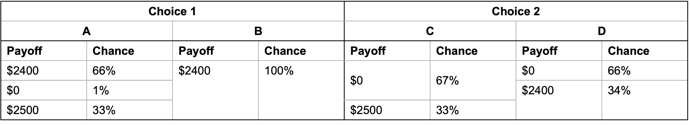

I can then break up these payoff-chance pairs to create an equivalent representation as in this second table. I have split the outcomes in bets B and C. For example, I have written the 100% chance of \$2400 in option B as a 66% chance of \$2400 and a 34% chance of \$2400. I have written the 67% chance of \$0 in bet C as a 66% chance of \$0 and a 1% chance of \$0.

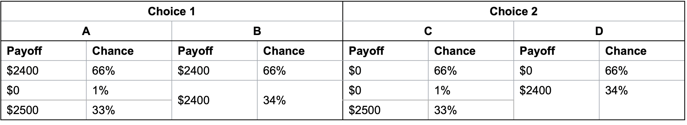

With this split, you can see that the bets in the bottom two rows of choice 1 and choice 2 are the same. Both choice 1 and choice 2 involve a choice between, in one bet, a 1% chance of nothing and a 33% chance of \$2,500 and in the other bet, a 34% chance of \$2,400.

That common bet in choice 1 and choice 2 is paired with a 66% chance of the same payoff regardless of the preferred bet. For choice 1 that common payoff across bet A and bet B is \$2400. For choice 2, that common payoff across bet C and bet D is \$0.

This representation allows us to see that preferring bet B to bet A and bet C to bet D violates the axiom of the [independence of irrelevant alternatives](@sec-independence). Under that axiom, two gambles mixed with an irrelevant third gamble will maintain the same order of preference as when the two are presented independently of the third gamble. In this case, the two bets are contained in the last two rows. The irrelevant alternative is the 66% chance of \$2400 or \$0. It is an irrelevant alternative as the payoff is the same regardless of whether you choose A or B, or C and D.

I can express this in terms of the formal definition of the independence of irrelevant alternatives axiom. The formal definition states that if:

-   $x$ and $y$ are lotteries with $x\succcurlyeq y$ and

-   $p$ is the probability that a third option $z$ is present, then:

$$
pz+(1-p)x\succcurlyeq pz+(1-p)y
$$

For each of the choices in our lottery:

-   $x$ is a 1 in 34 chance of \$0 and a 33 in 34 chance of \$2500

-   $y$ is a 100% chance of \$2400

-   $z$ is \$2400 in choice 1 and \$0 in choice 2.

If $p=0$, we simply have $x\succcurlyeq y$. For any non-zero value of $p$, such as the 66% in both choices, the preference between $x$ and $y$ should not change.

Here's another intuitive way to think about this bet.

Suppose I am going to generate one number between 1 and 100 randomly.

If a number between 1 and 66 is generated, you win the prize in the first row. If number 67 is generated, you win the amount in the second. If a number from 68 to 100 is generated, you win the sum in the third.

Suppose that you know that the number generated is between 1 and 66. Would you prefer bet A or B in choice 1? As you would win \$2400 with either choice, you will be indifferent. You will similarly be indifferent between bet C and D in choice 2, winning \$0 no matter what.

Suppose instead that a number between 67 and 100 is generated, but you don't know which. If you prefer A to B, you should also prefer C to D. In each choice, you effectively face the same bet. Let's assume for the moment that you prefer A and C.

Finally, suppose you don't know what number will be generated. We have just determined that if you know the ticket is between 1 and 66, you are indifferent between the options, but if between 67 and 100 is drawn, you prefer A and C. You do not prefer B or D when the ticket range is 1 to 66 or 67 to 100, so you should not prefer B or D when the ticket number is unknown.

However, the responses to the bets generated by @kahneman1979 and many other experimentalists suggest that when the number is unknown, the size of the certain amount for numbers 1 through 66 does matter. This irrelevant alternative is changing the preferences of the experimental participants.

## Absurd rates of risk aversion {#sec-absurd}

An important anomaly in expected utility theory concerns the level of risk aversion required to explain observed behaviour.

Consider the following one-off bet involving the flip of a coin:

> Head: You win \$550
>
> Tail: You lose \$500

Would you accept this bet?

@barberis2006 offered this bet to experimental participants, including those with substantial wealth such as professional investors with wealth above \$10 million.

70% of the sample turned down the bet.

Under the axiom of diminishing marginal utility, we could conclude people are risk averse to small bets.

But, for sufficiently high levels of wealth, the expected utility curve is approximately linear, and people tend to take favourable bets.

The minimum utility function curvature required to reconcile an investor with \$10 million declining a 50:50 bet as small as +\$550 or -\$500 would imply that they reject immensely favourable bets, which is not realistic.

@rabin2000 showed that rejection of bets over moderate stakes can require absurd rates of risk aversion. For instance, if a person who acts consistent with expected utility theory always turns down a 50:50 bet to win \$110 or lose \$100 whatever their initial level of wealth, they will also turn down a 50:50 bet to win \$1 billion, lose \$1,000.

At face value, that is ridiculous, and that is the crux of Rabin's argument. Rejection of the low-value bet to win \$110 and lose \$100 would lead to absurd responses to higher-value bets. This leads Rabin to argue that risk aversion or the diminishing value of money has nothing to do with the rejection of the low-value bets.

The intuition behind Rabin's argument is as follows.

Suppose we have someone who rejects a 50:50 bet to gain \$110, lose \$100. They are an expected utility maximiser with a weakly concave utility curve: that is, they are risk neutral or risk averse at all levels of wealth.

We can plot this on a chart. The horizontal axis is wealth and the vertical axis is utility. The current wealth and utility of that wealth is marked.

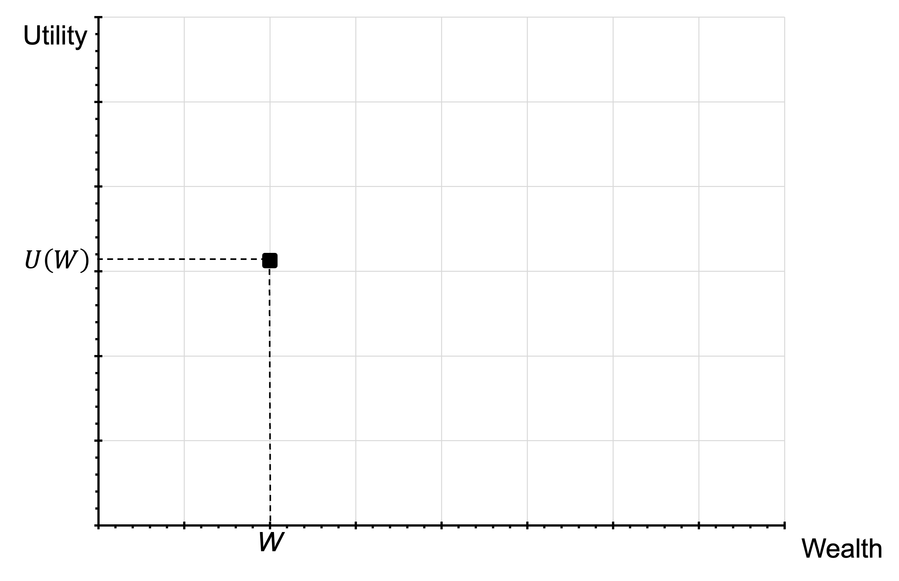

We can then mark the two possible outcomes of the bet, the gain of $110 and the loss of $100. This graph is not to scale: I am exaggerating the size of the gain to make the point visually stark, but the argument holds regardless. The utility of each outcome will be a point on these vertical lines.

The expected value of the bet is W+5. That is also marked.

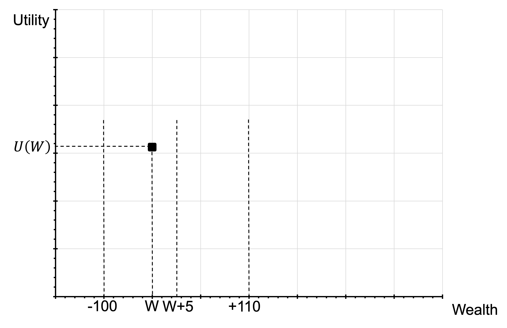

As the person rejected the bet, the expected utility of the bet must be less than or equal to the utility of current wealth. The point on the vertical line at W+5 where we mark expected utility must align with or below the point on the vertical line at W where we mark current utility.

The expected utility of the bet is the probability-weighted utility of each of the two possible outcomes. The angle of this new line doesn't matter, simply that it is of positive slope.

From this, we can infer the relative utility of winning and losing the bet.

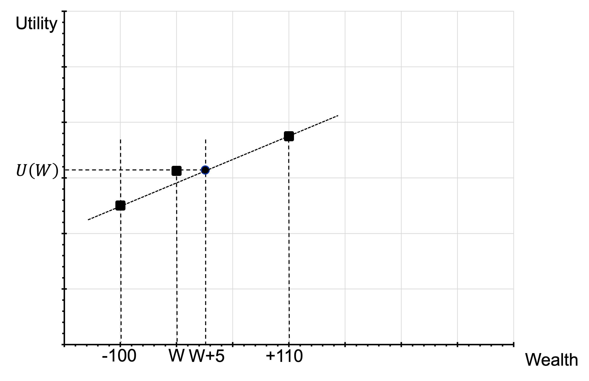

As the person is risk averse at all levels of wealth, we can draw the following lines as the least risk averse they could be while still rejecting the bet. We now have part of the utility curve.

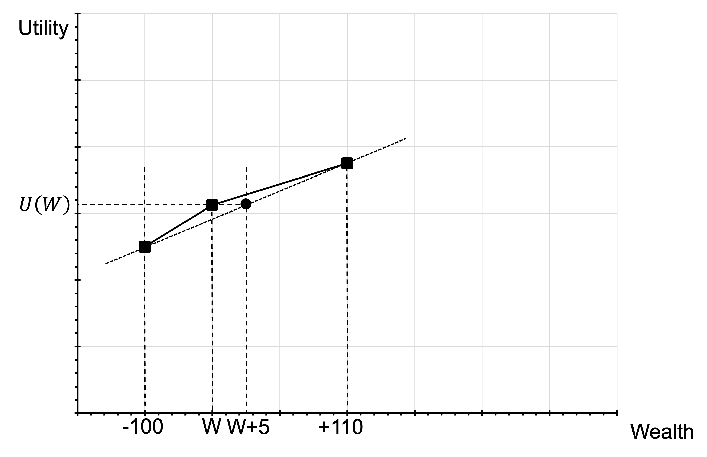

The slope of these two lines allows us to infer that they weight the average of each dollar between their current wealth (W) and their wealth if they win the bet (W+110) only 100/110$^{\text{ths}}$ (or 10/11$^{\text{ths}}$) as much as they weight the average dollar of the last \$100 of their current wealth (between W-100 and W). We can also say that they, therefore, weight their W+110th dollar at most 10/11$^{\text{ths}}$ as much as their W-100th dollar.

We can now do the same at W+210. We have assumed that they will reject the bet at all levels of wealth, so they will also reject at this wealth. We can therefore infer another piece of the utility curve (or, more specifically, a curve for the least risk averse they could be).

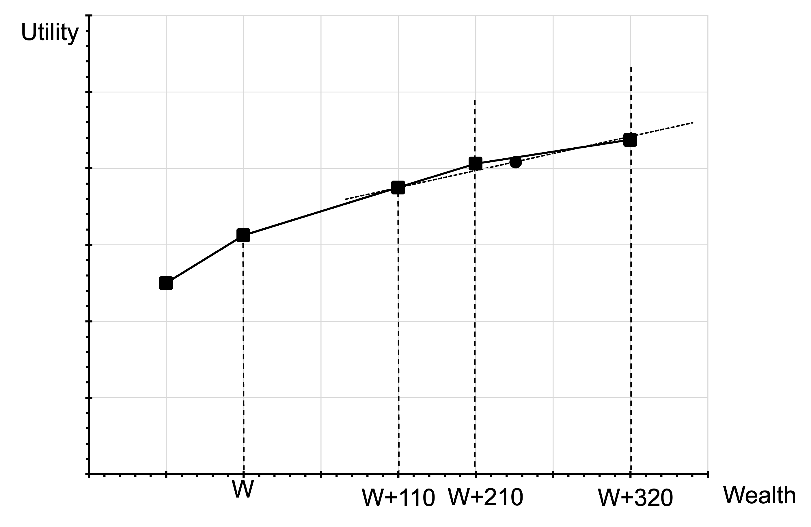

Iterating the previous calculations, we can say that they will weight their W+320nd dollar only 10/11 as much as their W+110th dollar. This means they value their W+320th dollar only (10/11)2 as much as their W-100th dollar.

As we infer additional pieces, we can see that this person rapidly declines in the rate at which they place utility on further wealth.

::: {layout-ncol=2}

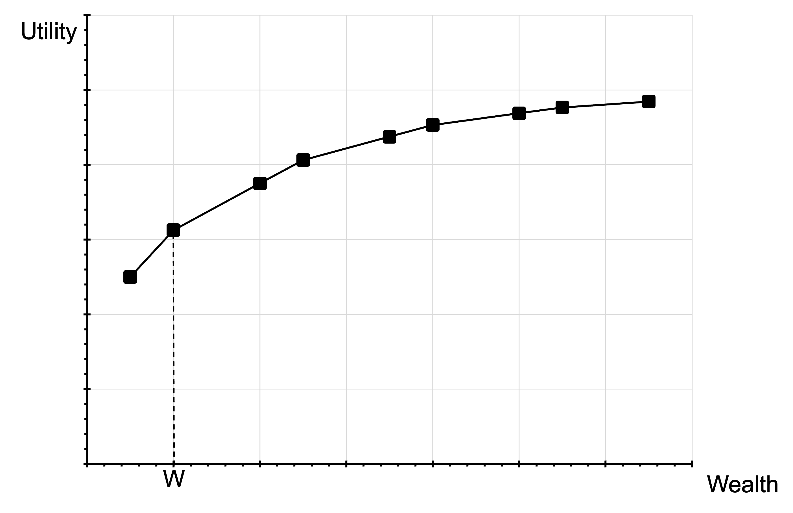

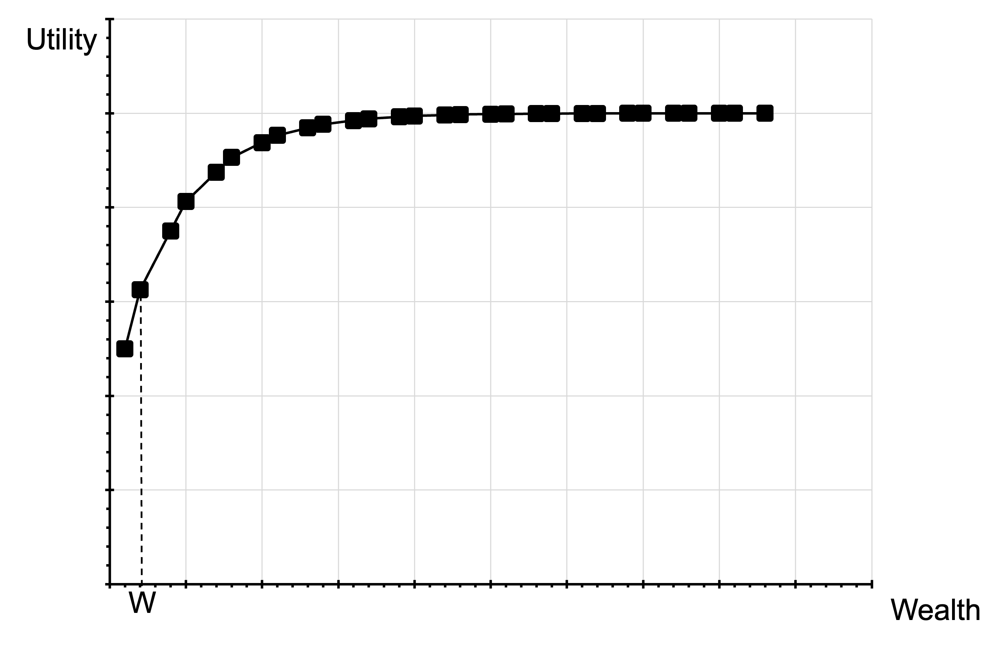

:::

We can also extended in the other direction, with losses below their current wealth.

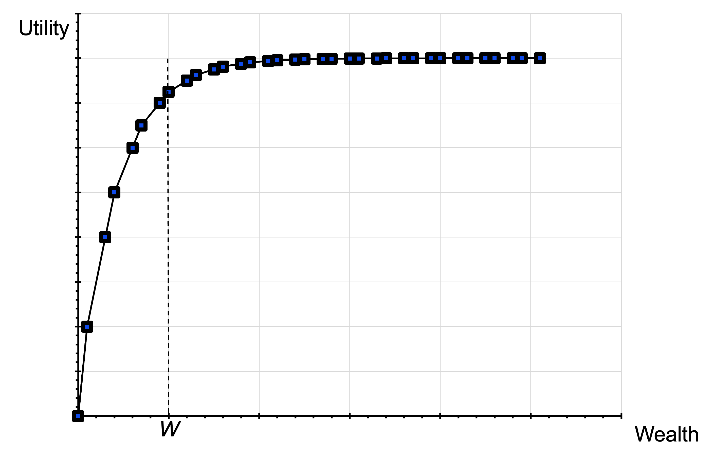

Keep iterating in this way and you end up with some ridiculous results. You value the 2100th dollar above your current wealth only 40% as much as your last current dollar of your wealth - (10/11)10\ - reducing by a constant factor of 10/11 every \$210. Or you value the 9000th dollar above your current wealth at only 2% of your last current dollar \[(10/11)40\]. This is an absurd rate of discounting.

Taking this iteration to the extreme, it doesn't take long for additional money to have effectively zero value. Hence the result, reject the 50:50 win \$110, lose \$100 bet, and you'll reject the win any amount, lose \$1,000 bet.

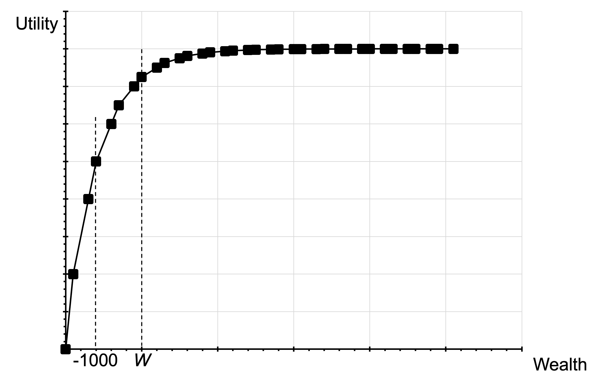

## Framing

Under expected utility theory, a person's choices should not be affected by how the options are described or by how their preferences are elicited.

@kahneman1984 reported the following experiment.

> A group of experimental participants were shown the following:
>
> Imagine that the U.S. is preparing for the outbreak of an unusual Asian disease, which is expected to kill 600 people. Two alternative programs to combat the disease have been proposed. Assume that the exact scientific estimates of the consequences of the programs are as follows:
>
> If Program A is adopted, 200 people will be saved.
>
> If Program B is adopted, there is a one-third probability that 600 people will be saved and a two-thirds probability that no people will be saved.
>
> Which of the two programs would you favour?

72% of participants chose option A.

Another group of experimental participants were shown the following:

> Imagine that the U.S. is preparing for the outbreak of an unusual Asian disease, which is expected to kill 600 people. Two alternative programs to combat the disease have been proposed. Assume that the exact scientific estimates of the consequences of the programs are as follows:
>
> If Program C is adopted, 400 people will die.
>
> If Program D is adopted, there is a one-third probability that nobody will die and a two-thirds probability that 600 people will die.
>
> Which of the two programs would you favour?

22% of participants chose option C.

72% of participants chose A and 22% of participants chose option C. Yet these two options are equivalent. The only difference is the framing of the options, which under expected utility theory should not matter.

## Reference points

An auxiliary axiom of expected utility theory is that people use a reference point of zero wealth. They consider the utility of the absolute outcomes.

However, consider the following two scenarios:

- You have not checked your share portfolio in a while. You expect that the portfolio is worth around \$40,000. Today when you check, it is worth \$30,000. Do you feel rich or poor?

- You have not checked your share portfolio in a while. You expect that the portfolio is worth around \$20,000. Today when you check, it is worth \$30,000. Do you feel rich or poor?

Under expected utility theory, those two scenarios should feel the same as you have $U(\$30,000)$ in both cases.

However, in the first case, you feel poor and in the second case you feel rich. This is because you are comparing the outcome to your reference point of \$40,000 in the first case and \$20,000 in the second case. You are not assessing the absolute outcome but appear to be using a reference point.
