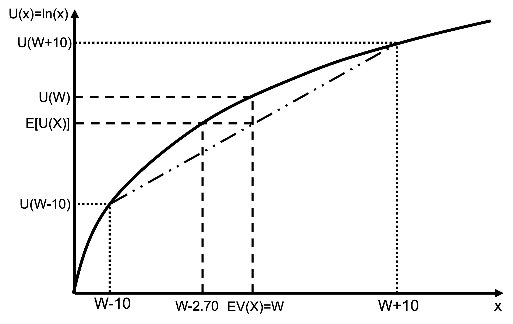
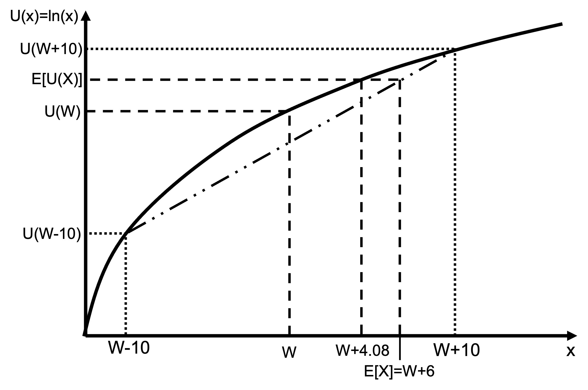

# Expected utility examples

## Example 1

Suppose your utility function is $U(x)=\text{ln}(x)$.

You have a 50% chance of winning \$10 and a 50% chance of losing \$10. Assume your starting wealth is \$20.

What is the expected value of this game?

\begin{align*}
E[X]&=\sum_{i=1}^n p_ix_i \\[6pt]
&=0.5*10+0.5*(-10) \\[6pt]
&=0
\end{align*}

The expected value of the game is \$0.

What is the expected utility of this game?

\begin{align*}
E[U(W+X)]&=\sum_{i=1}^n p_iU(x_i+W) \\[6pt]
&=0.5U(20-10)+0.5U(20+10) \\[6pt]
&=0.5\text{ln}(10)+0.5\text{ln}(30) \\[6pt]
&=2.85
\end{align*}

What does an expected utility of 2.85 mean? To make it tangible, we can ask what wealth would give that utility.

$$U(W)=\text{ln}(W)=2.85$$
$$W=e^{2.85}=\$17.30$$

This gamble with an expected value of zero reduces utility by an amount equivalent to \$2.70. 

We could also say that the certainty equivalent of this gamble is the final wealth of \$17.30, or a loss of $2.70.

This chart illustrates the example. On the x-axis, we have the outcomes and on the y-axis, we have the utility.

I have added points on the x-axis for the outcomes of the two gambles, being $W-10$ and $W+10$. They deliver utility $U(W+10)$ and $U(W-10)$ respectively. The expected utility of the gamble is the probability-weighted average of these two points. It sits on the straight dash-dot-dot line between those two outcomes.

You can see that the expected utility of the gamble is lower than the utility of the expected value (being current wealth).

Also plotted is the certainty equivalent. We can identify it as the point on the utility curve where the utility of that certainty equivalent is equal to the expected utility.



## Example 2

Suppose your utility function is $U(x)\text{ln}(x)$.

You have an 80% chance of winning \$10 and a 50% chance of losing \$10. Assume your starting wealth is \$20.

What are the expected value and the expected utility of this game?

\begin{align*}
E[X]&=\sum_{i=1}^n p_ix_i \\[6pt]
&=0.8*10+0.2*(-10) \\[6pt]
&=\$6
\end{align*}

The expected value of the game is \$6.

What is the expected utility of this game?

\begin{align*}
E[U(W+x)]&=\sum_{i=1}^n p_iU(x_i+W) \\[6pt]
&=0.8U(20+10)+0.2U(20-10) \\[6pt]
&=0.8\text{ln}(30)+0.2\text{ln}(10) \\[6pt]
&=3.18
\end{align*}

What does an expected utility of 3.18 mean? To make it tangible, we can ask what wealth would give that utility.

$$U(W)=\text{ln}(W)=3.18$$
$$W=e^{3.18}=\$24.08$$

This gamble with an expected value of \$6 increases utility by an amount equivalent to \$4.08.

We could also say that the certainty equivalent of this gamble is the final wealth of \$24.08.

This chart illustrates the example.

You can see that the expected utility of the gamble E[U(X)] is higher than the utility from current wealth but lower than the utility of the expected value. That is, they are risk averse but would still accept this highly favourable bet.

Also plotted is the certainty equivalent. We can identify it as the point on the utility curve where the utility of that certainty equivalent is equal to the expected utility. In this case, it is at $4.08 above current wealth.



## Example 3

Suppose your utility function is $U(x)=\text{ln}(x)$.

You have a 50% chance of increasing your wealth by 50% and a 50% chance of decreasing your wealth by 40%.

What are the expected value and the expected utility of this game?

\begin{align*}
E[X]&=\sum_{i=1}^n p_ix_i \\[6pt]
&=0.5\times 0.6W+0.5\times 1.5W \\[6pt]
&=0.3W+0.75W \\[6pt]
&=1.05W
\end{align*}

The expected value of the gamble is 5% of your wealth. The gamble has a positive expected value.

\begin{align*}
E[U(X)]&=\sum_{i=1}^n p_iU(X_i) \\[6pt]
&=0.5U(0.6W)+0.5U(1.5W) \\[6pt]
&=0.5\text{ln}(0.6)+0.5\times \text{ln}(W)+0.5\text{ln}(1.5)+0.5\times \text{ln}(W) \\[6pt]
&=-0.255+0.203+\text{ln}(W) \\[6pt]
&=−0.053+\text{ln}(W)
\end{align*}

Here we have a gamble with a positive expected value, 5% of your wealth, but lower expected utility. Someone with log utility would reject this bet.

This chart illustrates the example.

I have added points on the x-axis for the outcomes of the two gambles, a 40% reduction in wealth and a 50% gain in wealth. The expected utility of the gamble is the probability-weighted average of these two points. It sits on the straight dash-dot-dot line between those two outcomes.

You can see that the expected utility of the gamble is lower than the utility of current wealth. They would reject an offer of this bet.


## Example 4: The St. Petersburg game

The St. Petersburg game was invented by Swiss mathematician Nicolas Bernoulli.

The game starts with a pot containing \$2. A dealer then flips a coin. The pot doubles every time a head appears. The game ends and the player wins the pot as soon as a tail appears.

- A tail on the first flip leads to a payment of \$2.
- A tail on the second flip leads to a payment of \$4
- A tail on the third flip leads to a payment of  \$8

And so on.

The expected value of this game is equal to the sum of the following series.

\begin{align*}
E[X]&=\underbrace{\frac{1}{2}\times 2}_\textrm{Tail first}+\underbrace{\bigg(\frac{1}{2}\times \frac{1}{2}\bigg)\times 4}_\textrm{Tail second}+\underbrace{\bigg(\frac{1}{2}\times \frac{1}{2}\times \frac{1}{2}\bigg)\times 8}_\textrm{Tail third} \\[24pt]
&\qquad +\underbrace{\bigg(\frac{1}{2}\times \frac{1}{2}\times \frac{1}{2}\times \frac{1}{2}\bigg)\times 16}_\textrm{Tail fourth}+... \\[24pt]
&=1+1+1+1+... \\
&=\sum_{k=1}^\infty 1 \\
&=\infty
\end{align*}

The $\sum$ operator means “sum for $k=1$ to $k=\infty$”.

The first term in the series captures the 50% chance of a tail on the first flip, paying \$2. The second term represents the 50% chance of a head on the first flip followed by the 50% chance of the tail second flip, paying \$4. The third term represents the 50% chance of a head the first flip followed by the 50\% chance of a head second flip followed by the 50\% chance of a tail third flip, paying \$8. And so on.

The expected utility of this game is equal to:

\begin{align*}
E[U(X)]&=\underbrace{\frac{1}{2}\times U(W+2)}_\textrm{Tail first}+\underbrace{\bigg(\frac{1}{2}\times \frac{1}{2}\bigg)\times U(W+4)}_\textrm{Tail second} \\[24pt] 
&\qquad +\underbrace{\bigg(\frac{1}{2}\times \frac{1}{2}\times \frac{1}{2}\bigg)\times U(W+8)}_\textrm{Tail third}  \\[24pt]
&\qquad +\underbrace{\bigg(\frac{1}{2}\times \frac{1}{2}\times \frac{1}{2}\times \frac{1}{2}\bigg)\times U(W+16)}_\textrm{Tail fourth}+... \\[24pt]
&=\frac{1}{2}U(W+2)+\frac{1}{4}U(W+4)+\frac{1}{8}U(W+8)+\frac{1}{16}U(W+16)+...  \\[12pt]
&=\sum_{k=1}^{k=\infty}\frac{1}{2^k}U(W+2^k)
\end{align*}

Similar to the calculation of the expected value, the first term in the series captures the 50% chance of a tail on the first flip, paying \$2. The second term represents the 50\% chance of a head on the first flip followed by the 50\% chance of the tail second flip, paying \$4. And so on. But here we are using the utility function $U(x)$.

What is the maximum sum a risk-neutral player with $U(x)=x$ would be willing to pay to play the game? One strategy to determine this sum is to ask what sum the player would be indifferent between accepting and rejecting a chance to play. That is the maximum sum $c$ that they would be willing to pay. They will be indifferent when $U(W)=E[U(X-c)]$.

We can solve this equation as follows. In the second line, we use the sum we created earlier. In the third line, we substitute the utility function $U(x)=x$. We can then simplify as in the fourth line, which allows us to see that, given the infinite expected value of the game, the player would be willing to pay an infinite amount to play. 

\begin{align*}
U(W)&=E[U(X-c)] \\[6pt]
U(W)&=\sum_{k=1}^{k=\infty}\frac{1}{2^k}U(W+\$2^k-c) \\[6pt]
W&=\sum_{k=1}^{k=\infty}\frac{1}{2^k}(W+2^k-c) \\[6pt]
W&=W-c+\sum_{k=1}^{k=\infty}1 \qquad \Bigg(\text{as }\sum_{k=1}^{k=\infty}\frac{1}{2^k}=1\Bigg) \\[12pt]
c&=\infty
\end{align*}

That is, a risk-neutral player would pay any amount \$$c$ to play.

What is the maximum sum a risk-averse player with $U(x)=\text{ln}(x)$ would be willing to pay to play the game? How does their wealth affect their willingness to pay?

Again we will determine at what \$$c$ the player is indifferent between accepting and rejecting a chance to play, which occurs when $U(W)=E[U(X-c)]$.

\begin{align*}
U(W)&=E[U(X-c)] \\[6pt]
U(W)&=\sum_{k=1}^{k=\infty}\frac{1}{2^k}U(W+\$2^k-c) \\[6pt]
\text{ln}(W)&=\sum_{k=1}^{k=\infty}\frac{1}{2^k}\text{ln}(W+\$2^k-c)
\end{align*}

```{r}
#| output: false
# Calculation of value of gamble for the following paragraph
# Code based on: https://math.stackexchange.com/questions/2882484/log-utility-function-and-the-st-petersburg-paradox
EU = function(W, c, epsilon){
    ans = 0
    k = 1
    while(abs(val <- (log(max(epsilon, W + 2^k - c)) - log(W)) / 2^k) > epsilon){
        k <- k + 1;
        ans <- ans + val;
    }
    ans
}

find_c = function(W, epsilon=10^(-10)){
    low = 0
    c = 0
    high = 10^10
    while(abs(low - high) > epsilon){
        c = (high + low) / 2
        exp_value = EU(W, c, epsilon)
        ifelse(exp_value > 0, low <- c, high <- c)
    }
    c
}

# Value of bet to someone with wealth of $1,000,000
c1000000 <- round(find_c(10^6), 2)
# Value of bet to someone with wealth of $1,000
c1000 <- round(find_c(10^3), 2)
# Value of bet to someone with wealth of $0.01
c001 <- round(find_c(0.01), 2)
```

There is no closed-form solution to this equation to enable us to determine $c$. It needs to be solved via numerical methods (such as testing and iterating to a solution).

If we did solve, we would find that someone who has wealth of \$0.01 would be willing to pay up to \$`r c001`. They would need to borrow. Someone with wealth \$1000 would be willing to pay \$`r c1000`. A person with a wealth of \$1 million would be willing to pay \$`r c1000000`.

We cannot solve for a person with no wealth as $\text{ln}⁡(0)$ is undefined. 

Why does willingness to pay increase with wealth?

With log utility, as wealth increases, the slope of the log function increasingly approximates a linear function (the second derivative approaches zero). Hence, the gambler displays less risk-averse (closer to risk-neutral) behaviour.

One way to gain an intuition for why this gamble now has a finite value is to calculate the utility of a risk-averse player whose only asset is the opportunity to play this game.

\begin{align*}
E[U(X)]&=\sum_{k=1}^{k=\infty}\frac{1}{2^k}U(\$2^k) \\[12pt]
&=\sum_{k=1}^{k=\infty}\frac{1}{2^k}\text{ln}(2^k) \\[12pt]
&=\sum_{k=1}^{k=\infty}\frac{k}{2^k}\text{ln}(2) \\[12pt]
&=\frac{1}{2}\text{ln}(2)+\frac{2}{4}\text{ln}(2)+\frac{3}{8}\text{ln}(2)+\frac{4}{16}\text{ln}(2)+\frac{5}{32}\text{ln}(2)+... \\[12pt]
&=\bigg(\frac{1}{2}+\frac{1}{2}+\frac{3}{8}+\frac{1}{4}+\frac{5}{32}+...\bigg)\text{ln}(2) \\[12pt]
&=2\text{ln}(2)
\end{align*}

The change in the utility from each flip rapidly declines. Ultimately the series of fractions sum to two. 

We can then calculate what wealth is equivalent to this expected utility.

$$
U(W)=\text{ln}(W)=2\text{ln}(2) \\[12pt]
W=e^{2\text{ln}2}=4
$$

The expected utility from the game is equal to the utility of \$4 
