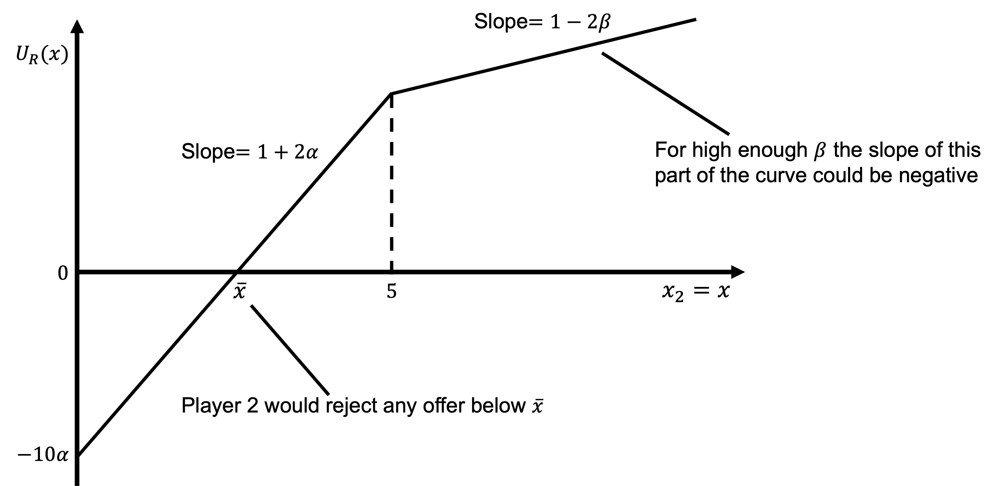
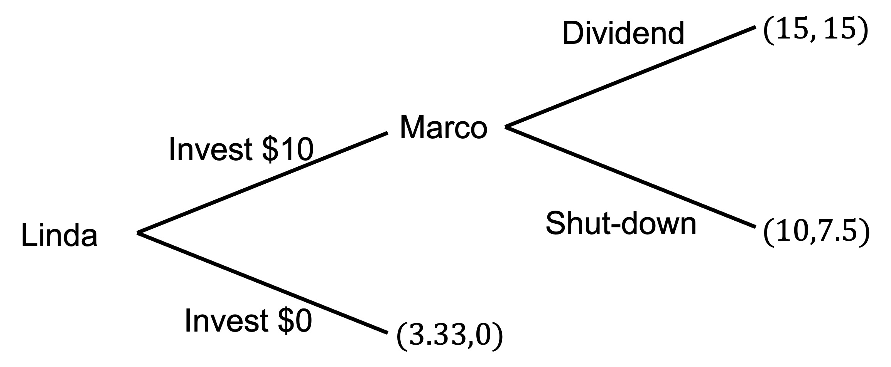
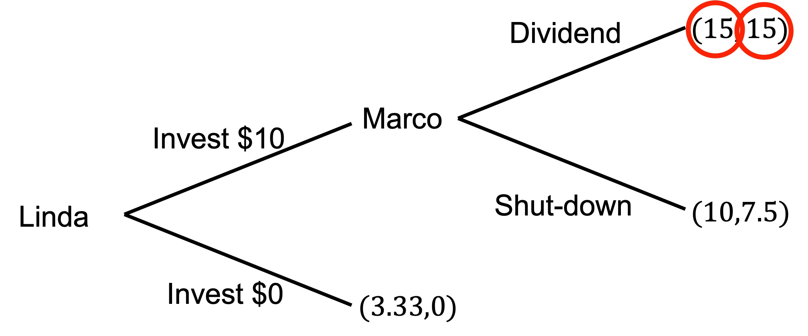

# Distribution

Distributional preferences are preferences that relate to the amount of money or resources each person gets or has.

It is often easy to incorporate distributional preferences into economic analysis as they are a natural extension of how economists think about individuals' preferences. We can extend the typical assumption that a person only cares about their own material outcomes to other people.

## Altruism

Altruism is concern for the outcomes of others.

To incorporate altruism, we simply need to provide a positive weight to the utility of others in the utility function $U_i(x_i,x_j)$, where $U_i$ is the utility of agent $i$, $x_i$ the outcome for agent $i$ and $x_i$ the outcome for agent $j$.

An example utility function might be:

$$
U_i(x_i,x_j)=x_i+\alpha x_j
$$

where $\alpha>0$.

Altruism might have different drivers:

-   Pure altruism: genuine concern for others' wellbeing.

-   Impure altruism: A "warm glow" where people feel good about doing good without actually caring about the others' wellbeing.

Altruism, however, is insufficient to explain the experimental results, such as those in the ultimatum game. While it could predict non-zero offers by the proposer, it does not predict rejection of any offers by the responder. Rejection harms both the responder and the proposer.

The proposer could only reject if a negative weight was applied to either their own or the proposer's outcome.

## Inequality aversion

The idea behind inequality aversion is that people may have:

-   A dislike of having less than other people

-   A dislike of having more than other people.

### The Fehr-Schmidt model

Consider the following version of the utility function in @fehr1999:

$$
U_i(x_i,x_j)=x_i-\alpha\text{max}\{x_j-x_i,0\}-\beta\text{max}\{x_i-x_j,0\}
$$

The three terms in this function represent:

-   The utility of their own outcome

-   Their dislike of having less than the other agent

-   Their dislike of having more than the other agent

This utility function has a kink at $x_j$ where the agent $i$ moves from having less to more than agent $j$. If $\beta<1$ as in this diagram, $U(x_i)$ continues to increase in $x_i$ above $x_j$, but at a decreasing rate as inequality degrades the benefits of having more.


### The ultimatum game

Suppose two players of the ultimatum game have preferences of this form.

What offers $x$ would the responder reject where the proposer has \$10 to split between them?

If the responder rejects, $x_P=x_R=0$.

If the responder accepts, $x_P=10−x$ and $x_R=x$.

The responder will accept if:

```{=tex}
\begin{align*}
U_R(\text{accept})&>U_R(\text{reject}) \\[6pt]
x_R−\alpha\text{max}\{x_P−x_R,0\}−\beta\text{max}\{x_R−x_P,0\}&>0 \\[6pt]
x−\alpha\text{max}\{10−x−x,0\}−\beta\text{max}\{x−(10−x),0\}&>0 \\[6pt]
x−\alpha\text{max}\{10−2x,0\}−\beta\text{max}\{2x−10, 0\}&>0 \\
\end{align*}
```
If the offer is more than \$5:

```{=tex}
\begin{align*}
x−\beta\text{max}\{2𝑥−10, 0\}>0 \\[6pt]
x−\beta(2x−10)>0 \\[6pt]
(1−\beta)x+\beta(10−x)>0
\end{align*}
```
This will always hold for any $\beta<1$, so the responder will always accept offers greater than \$5.

If the offer is less than \$5:

```{=tex}
\begin{align*}
x−\alpha\text{max}\{10−2x,0\}>0 \\
x−\alpha(10−2x)>0 \\
(1+\alpha)x−\alpha(10−𝑥)>0
\end{align*}
```
Whether this holds depends on the value of \$\alpha4 and the precise size of $x$. If $\alpha=1/2$, then:

```{=tex}
\begin{align*}
(1+1/2)x−1/2 (10−x)&>0 \\
2x−5&>0 \\
x&>2.5
\end{align*}
```
A responder with $\alpha=1/2$ will reject any offer under \$2.50.

We can plot the utility function for this game as the size of the offer increases. As the offer is not independent of the proposer's payoff, we will first derive the shape of the utility curve as a function of $x_R$.

```{=tex}
\begin{align*}
U_R(x_P,x_R)&=x_R-\alpha\text{max}\{x_P-x_R,0\}-\beta\text{max}\{x_R-x_P,0\} \\
&=x-\alpha\text{max}\{10-2x,0\}-\beta\text{max}\{2x-10,0\}
\end{align*}
```
$$
U_R(x_P,x_R)=\left\{\begin{matrix}
(1+2\alpha)x−10\alpha \quad &\textrm{if} \quad x \geq 0 \\[6pt]
(1−2\beta)x+10\beta \quad &\textrm{if} \quad x < 0 
\end{matrix}\right.
$$

The slope of each of these curves is twice that we saw earlier as any increase in outcome for the responder is matched by a decrease in outcome for the proposer (and vice versa).

This diagram shows the responder's utility curve as a function of the offer $x$.



## A general model of distributional preferences

@charness2002 offer a more general utility function that captures the possible forms of distributional preference:

$$
u_i(x_i,x_j)=\left\{\begin{matrix}
\rho x_j+(1-\rho)x_i \quad &\textrm{if} \quad x_i \geq x_j \\[6pt]
\sigma x_j+(1-\sigma)x_i \quad &\textrm{if} \quad x_i < x_j 
\end{matrix}\right.
$$

An agent's attitudes toward others depends on their relative position: When the agent is ahead of other, the other player's welfare enters their utility via $\rho$ When the agent is behind the other, the other player's welfare enters dictator's utility via σ For most of people $\rho>\sigma$. They are more willing to give weight to others' utility when they are better off. It can also be that $\sigma<0$. If they are behind the other they place negative weight on further gains by that other.

Consider the following example.

Suppose a dictator has $\sigma=−1/2$ (they have less than the other player, so $\sigma$ is the relevant parameter) and must decide between the two discrete allocations (1, 0) and (5, 1):

```{=tex}
\begin{align*}
U(1,0)&=\sigma\times 1+(1−\sigma)\times 0 \\
&=−1/2×1+(1+1/2)\times 0 \\
&=−1/2 \\[6pt]
U(5,1)&=\sigma\times 5+(1−\sigma)\times 1 \\
&=−1/2×5+(1+1/2)\times 1 \\
&=−1
\end{align*}
```
$\sigma<0$ can also account for the rejection of low offers in the ultimatum game.

This model can capture distributional preferences as follows.

$1≥\rho≥\sigma≥0$: altruism

$1≥\rho≥0≥\sigma$: inequality aversion

$0≥\rho≥\sigma$: status-seeking

$\rho=\sigma=0$: the classical self-interested utility function

$\rho=1$, $\sigma=0$: $u_i(x_i,x_j)=\text{min}\{x_i,x_j\}$, which equates to Rawlsian preferences whereby the agent seeks greatest benefit for the least advantaged

$\rho=\sigma=1/2$: $u_i(x_i,x_j)=x_i+x_j$, which equates to utilitarian preferences whereby the agent seeks to maximise total utility

### Example: the trust game

In Tutorial 9 we considered whether Linda should invest in Marco's startup:

> Linda is looking for investment opportunities. She identifies a promising crypto-based start-up created by an Marco. Marco is looking for seed funding.
>
> Linda can invest \$10.
>
> If Linda invests, her investment will triple in value. Marco can then decide to either shut down the start-up and keep the \$30 or maintain the start-up in the market and pay a \$15 dividend to each of Linda and himself.
>
> If Linda does not invest, Linda keeps the \$10. The start-up gets \$0.

We determined that Linda would not invest.

Suppose now that Linda and Marco have preferences as follows:

$$
U_L(x_L,x_M)=\left\{\begin{matrix}
\frac{1}{3}x_L+\frac{2}{3}x_M \quad &\textrm{if} \quad x_L \geq x_M\\[6pt]
\frac{2}{3}x_L+\frac{1}{3}x_M \quad &\textrm{if} \quad x_L < x_M 
\end{matrix}\right. \\
\\[12pt]
U_M(x_L,x_M)=\left\{\begin{matrix}
\frac{3}{4}x_L+\frac{1}{4   }x_M \quad &\textrm{if} \quad x_M \geq x_L\\[6pt]
x_M \quad &\textrm{if} \quad x_M < x_L 
\end{matrix}\right.
$$

Where $x_L$ and $x_M$ are the outcomes for Linda and Marco respectively.

Marco and Linda know each others utility functions.

What is the equilibrium with these distributional preferences? Explain the intuition.

If Linda chooses trust, Marco has a choice between \$15 each and \$30 for himself.

$$
U_M(x_L,x_M)=\left\{\begin{matrix}
\frac{3}{4}x_L+\frac{1}{4}x_M \quad &\textrm{if} \quad x_M \geq x_L\\[6pt]
x_M \quad &\textrm{if} \quad x_M < x_L 
\end{matrix}\right. \\
\\[12pt]
U_M(15,15)=\frac{3}{4}(15)+\frac{1}{4}(15)=15 \\
\\[12pt]
U_M(0,30)=\frac{3}{4}(0)+\frac{1}{4}(30)=7.5
$$

Marco receives higher utility by paying the dividend to Linda.

Linda also has utility from each distribution.

$$
U_L(x_L,x_M)=\left\{\begin{matrix}
\frac{1}{3}x_L+\frac{2}{3}x_M \quad &\textrm{if} \quad x_L \geq x_M\\[6pt]
\frac{2}{3}x_L+\frac{1}{3}x_M \quad &\textrm{if} \quad x_L < x_M 
\end{matrix}\right. \\
\\[12pt]
U_L(15,15)=\frac{1}{3}(15)+\frac{2}{3}(15)=15 \\
\\[12pt]
U_L(0,30)=\frac{2}{3}(0)+\frac{1}{3}(30)=10
$$

For the other node, if Linda does not invest, she will keep \$10. Marco will have nothing.

```{=tex}
\begin{align*}
U_M(10,0)=0 \\
\\
U_L(10,0)=\frac{1}{3}(10)+\frac{2}{3}(0)=3.33
\end{align*}
```
Putting those payoffs into the extensive form of the game, we get the following:



The new equilibrium is that Macro will return a dividend, so Linda invests.



## Model limitations

These two models of distributional preferences cannot explain all of the social preferences that we observe.

For example, suppose we have an agent that has @fehr1999 preferences and rejects an offer of \$2.

That agent then plays another game, but this time the proposer is restricted to offering either \$0 or \$2. Under the Fehr and Schmidt model (and the Charness and Rabin model) the only thing that matters are the final outcomes. If you reject \$2 in the ultimatum game, you should also reject even if \$2 was all that the proposer was able to offer. However, experimental evidence suggests that receivers are more likely to accept the \$2 where the proposer's choice is constrained. Social preferences must involve more than just distributional concerns.
