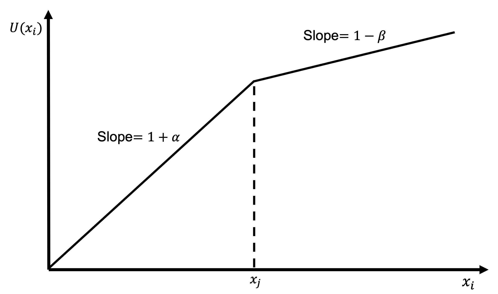

# Distribution

Distributional preferences are preferences that relate to the relative amount of money or resources each person gets or has.

It is often easy to incorporate distributional preferences into economic analysis as they are a natural extension of how economists think about individuals' preferences. We can extend to other people the typical assumption that a person cares about their own material outcomes.

We will examine two types of distributional preferences, altruism and inequality aversion.

## Altruism

Altruism is concern for the outcomes of others.

To incorporate altruism, we simply need to provide a positive weight to the utility of others in the utility function. An example utility function might be:

$$
U_i(x_i,x_j)=x_i+\alpha x_j
$$

where $U_i$ is the utility of agent $i$, $x_i$ the outcome for agent $i$ and $x_j$ the outcome for agent $j$. $\alpha$ is some number greater than zero.

Altruism might have different drivers.

For example, the agent might exhibit pure altruism, where the agent has a genuine concern for others' wellbeing.

Alternatively, the agent might exhibit impure altruism. They experience a "warm glow" about doing good without actually caring about the other's wellbeing.

Altruism, however, is insufficient to explain some experimental results, such as those in the ultimatum game. While it could predict non-zero offers by the proposer, it does not predict the rejection of any offers by the responder. Rejection harms both the responder and the proposer.

The proposer could only reject if a negative weight was applied to either their own or the proposer's outcome.

## Inequality aversion

An alternative distributional preference model that may explain some of these results is inequality aversion.

The idea behind inequality aversion is that people may dislike having less than other people and dislike having more than other people.

### The Fehr-Schmidt model

One basic mode of inquality aversion comes from the utility function in @fehr1999:

It is of the following form:

$$
u_i(x_i,x_j)=x_i-\alpha\text{max}\{x_j-x_i,0\}-\beta\text{max}\{x_i-x_j,0\}
$$

The three terms in this function represent:

-   The utility of their own outcome $x_i$

-   Their dislike of having less than the other agent (where $\alpha>0$)

-   Their dislike of having more than the other agent (where $\beta>0$)

We can also write this utility function as:

$$
u_i(x_i,x_j)=x_i-\left\{\begin{matrix}
\beta(x_i-x_j) \quad &\textrm{if} \quad x_i \geq x_j \\[6pt]
\alpha(x_j-x_i) \quad &\textrm{if} \quad x_i < x_j 
\end{matrix}\right.
$$

Typically $\alpha>\beta$ as people dislike having less than others than they dislike having more than others. We could also set $\beta<0$ for an agent that likes to be better off than others.

This utility function has a kink at $x_j$ where agent $i$ moves from having less to more than agent $j$. If $0<\beta<1$ as in this diagram, the utility of agent $i$, $U(x_i)$ continues to increase in $x_i$ above $x_j$, but at a decreasing rate as inequality degrades the benefits of having more.



### The ultimatum game

We can examine the Fehr-Schmidt model in the context of the ultimatum game.

Suppose two players of the ultimatum game have Fehr-Schmidt preferences.

What offers $x$ would the responder reject where the proposer has \$10 to split between them?

If the responder rejects, the payoff to the proposer and responder is zero. That is:

$$
x_P=x_R=0
$$

If the responder accepts, the responder receives $x$ and the proposer keeps the remainder. That is:

\begin{align*}
x_P&=10−x \\[6pt]
x_R&=x
\end{align*}

The responder will accept if the utility of accepting is greater than the utility of rejecting. That is:

```{=tex}
\begin{align*}
U_R(\text{accept})&>U_R(\text{reject}) \\[6pt]
\underbrace{x_R−\alpha\text{max}\{x_P−x_R,0\}−\beta\text{max}\{x_R−x_P,0\}}_{\text{Substituting in the Fehr-Schmidt utility function}}&>0 \\[24pt]
\underbrace{x−\alpha\text{max}\{10−x−x,0\}−\beta\text{max}\{x−(10−x),0\}}_{\text{Substituting in the payoffs when accepted}}&>0 \\[24pt]
x−\alpha\text{max}\{10−2x,0\}−\beta\text{max}\{2x−10, 0\}&>0 \\
\end{align*}
```

If the offer is more than \$5, the $\alpha$ term is multiplied by zero and the inequality becomes:

```{=tex}
\begin{align*}
x−\beta\text{max}\{2𝑥−10, 0\}>0 \\[6pt]
x−\beta(2x−10)>0 \\[6pt]
(1−\beta)x+\beta(10−x)>0
\end{align*}
```

This will always hold for any $\beta<1$. Recall that if $\beta<1$ the responder has higher utility from a higher payoff but at a decreasing rate when they have more than the proposer. In this case, if $\beta<1$ the responder will always accept offers greater than \$5.

If the offer is less than \$5, the $\beta$ term is multiplied by zero and the inequality becomes:

```{=tex}
\begin{align*}
x−\alpha\text{max}\{10−2x,0\}>0 \\[6pt]
x−\alpha(10−2x)>0 \\[6pt]
(1+\alpha)x−\alpha(10−𝑥)>0
\end{align*}
```

Whether this holds depends on the value of $\alpha$ and the size of the offer $x$. If $\alpha=1/2$, then:

```{=tex}
\begin{align*}
\bigg(1+\frac{1}{2}\bigg)x−\frac{1}{2} (10−x)&>0 \\
2x−5&>0 \\[6pt]
x&>2.5
\end{align*}
```
A responder with $\alpha=1/2$ will reject any offer under \$2.50.

We can plot the utility function for this game as the size of the offer increases. As the offer is not independent of the proposer's payoff, I will derive the shape of the utility curve as a function of $x_R$.

```{=tex}
\begin{align*}
U_R(x_P,x_R)&=x_R-\alpha\text{max}\{x_P-x_R,0\}-\beta\text{max}\{x_R-x_P,0\} \\[6pt]
&=x-\alpha\text{max}\{10-2x,0\}-\beta\text{max}\{2x-10,0\}
\end{align*}
```

We can also write this as:

$$
U_R(x_P,x_R)=\left\{\begin{matrix}
(1+2\alpha)x−10\alpha \quad &\textrm{if} \quad x \geq 0 \\[6pt]
(1−2\beta)x+10\beta \quad &\textrm{if} \quad x < 0 
\end{matrix}\right.
$$

The slope of each of these curves is twice that we saw earlier as any increase in outcome for the responder is matched by a decrease in outcome for the proposer (and vice versa).

This diagram shows the responder's utility curve as a function of the offer $x$.


## The Charness-Rabin model

@charness2002 developed a utility function that captures the possible forms of distributional preference. An agent's attitude toward others depends on their relative position. The utility function is:

$$
u_i(x_i,x_j)=\left\{\begin{matrix}
\rho x_j+(1-\rho)x_i \quad &\textrm{if} \quad x_i \geq x_j \\[6pt]
\sigma x_j+(1-\sigma)x_i \quad &\textrm{if} \quad x_i < x_j 
\end{matrix}\right.
$$

Where $x_i$ is the payoff to player $i$ and $x_j$ is the payoff to the other player.

$\rho$ and $\sigma$ capture the agent's attitudes toward others. When the agent is ahead the other player's welfare enters their utility via $\rho$. When the agent is behind the other player's welfare enters agent's utility via $\sigma$. For most people $\rho>\sigma$. They give more weight to others' utility when they are better off. $\sigma$ can also be less than zero. If they are behind someone they place negative weight on further gains by that person.

This utility function is equivalent to that of @fehr1999. You can rearrange the terms to show that $\beta=\rho$ and $\alpha=-\sigma$. However, @charness2002 argued that there was evidence for distributional preferences beyond inequality aversion and that a broader range of parameters for $\rho$ and $\sigma$ were needed.

Consider the following example of the dictator game. In the dictator game, the dictator makes a unilateral offer to the receiver. The game then ends. The receiver has an empty strategy set.

In this version of the game, the dictator must decide between the allocations (0, 1) and (1, 5), where $(x_D,x_R) represent the payoffs for the dictator and receiver respectively. Under each distribution they have less than the other player. Their $\sigma=−1/2$. As they have less than the other player, $\sigma$ is the relevant parameter.

```{mermaid}
%%| fig-width: 4
%%| label: fig-dictator-game-distribution
%%| fig-cap: A constrained dictator game
%%| mermaid-format: png

graph LR
    classDef default fill:#FFF
    A(Dictator) ---B["Choose (0, 1)"] --> D["(0, 1)"]
    A ---C["Choose (1, 5)"] --> E["(1, 5)"]
    style A stroke:#000
    style B stroke:#FFF
    style C stroke:#FFF
    style D stroke:#FFF
    style E stroke:#FFF
```

The dictator calculates the utility of each allocation.

```{=tex}
\begin{align*}
U(0,1)&=\sigma\times 1+(1−\sigma)\times 0 \\[6pt]
&=−1/2×1+(1+1/2)\times 0 \\[6pt]
&=−1/2 \\[12pt]
U(1,5)&=\sigma\times 5+(1−\sigma)\times 1 \\[6pt]
&=−1/2×5+(1+1/2)\times 1 \\[6pt]
&=−1
\end{align*}
```

The dictator prefers to allocate (0,1), even though it is worse for them, because it is also worse for the other player.

$\sigma<0$ can also account for the rejection of low offers in the ultimatum game.

The @charness2002 model can capture many forms of distributional preferences. Some are as follows.

If $\sigma>0$ and $\rho>0$, the agent is altruistic. A higher payoff to the other player increases the agent's utility

If $1\geq\rho\geq 0>\sigma$, the agent is inequality averse. If the other player has more, the agent's utility decreases with further gains for the other player. If the other player has less, the agent's utility increases with further gains for either agent.

If $0>\rho\geq\sigma$, the agent is status-seeking. They gain more utility by having more than the other player. Their utility goes up when either they get more or the other player gets less.

If $\rho=\sigma=0$ we are left with the classical self-interested utility function. The agent only cares about their own payoff.

If $\rho=1$ and $\sigma=0$: $u_i(x_i,x_j)=\text{min}\{x_i,x_j\}$, the agent has Rawlsian preferences whereby the agent seeks the greatest benefit for the least advantaged.

If $\rho=\sigma=1/2$: $u_i(x_i,x_j)=x_i+x_j$, the agent has utilitarian preferences whereby the agent seeks to maximise total utility.

### Example: advice

Agent A is going to their financial adviser to buy some life insurance. The adviser can sell them insurance that does not cover heart attacks but for which the adviser receives a huge sales commission (bad insurance). Or the adviser can sell Agent A comprehensive insurance for which their sales commission is lower (good insurance).

The payoffs $(x,y)$ for each decision are indicated in the game tree below, with $x$ being the satisfaction of Agent A and $y$ being the satisfaction of the adviser.

{width=60%}

Earlier we determined that if the adviser only cares about the payoffs, the adviser will choose to sell bad insurance.

Agent A will therefore compare a payoff of 0 for no purchase and a payoff of -2 for purchase (knowing that they will be sold bad insurance). They will choose not to buy insurance.

But uppose the adviser has social preferences, with a distaste for inequality. If the payoffs $x$ for Agent A and $y$ for the adviser are unequal, the adviser experiences dissatisfaction and their payoff becomes $y-3$. What would happen to the outcome in this case?

The adviser's payoff for selling the bad insurance is now $4-3=1$. This is less than the payoff of 2 they receive for selling good insurance. They will now sell good insurance.

Agent A now has a choice of a payoff of 0 for not purchasing insurance, and 2 for purchasing. They make the purchase.

{width=60%}

### Example: the trust game

In the exercises in @sec-investment, I considered whether Linda should invest in Marco's startup:

> Linda is looking for investment opportunities. She identifies a promising crypto-based start-up created by an Marco. Marco is looking for seed funding.
>
> Linda can invest \$10.
>
> If Linda invests, her investment will triple in value. Marco can then decide to either shut down the start-up and keep the \$30 or maintain the start-up in the market and pay a \$15 dividend to each of Linda and himself.
>
> If Linda does not invest, Linda keeps the \$10. The start-up gets \$0.

```{mermaid}
%%| fig-width: 5
%%| label: fig-trust-game-example-1
%%| fig-cap: The trust game
%%| mermaid-format: png

graph LR
    classDef default fill:#FFF
    A(Linda) ---B[Invest $10] --> C{Multplied by 3} --> D(Marco)
    A ---E((Invest 0)) --> F["(10,0)"]
    D ---G[Dividend] --> H["(15, 15)"]
    D ---I[Shut down] --> J["(0, 30)"]

    classDef node fill:#FFF, stroke:#000;
    class A,D node;

    classDef edge fill:#FFF, stroke:#FFF;
    class B,E,G,I edge;

    classDef payoff fill:#FFF, stroke:#FFF;
    class F,H,J payoff;

```


Macro, who is effectively playing a dictator game, would shut down and keep the \$30. As a result, Linda would not invest.

Suppose now that Linda and Marco have @charness2002 preferences as follows:

$$
U_L(x_L,x_M)=\left\{\begin{matrix}
\frac{1}{3}x_L+\frac{2}{3}x_M \quad &\textrm{if} \quad x_L \geq x_M\\[6pt]
\frac{2}{3}x_L+\frac{1}{3}x_M \quad &\textrm{if} \quad x_L < x_M 
\end{matrix}\right.
$$

$$
U_M(x_L,x_M)=\left\{\begin{matrix}
\frac{3}{4}x_L+\frac{1}{4   }x_M \quad &\textrm{if} \quad x_M \geq x_L\\[6pt]
x_M \quad &\textrm{if} \quad x_M < x_L 
\end{matrix}\right.
$$

Where $U_L$ and $U_M$ are Linda and Marco's utility functions. $x_L$ and $x_M$ are the outcomes for Linda and Marco.

Both Marco and Linda give positive weight to the payoff of the other in most circumstances, except for Marco, who only cares about himself when he is behind Linda.

Marco and Linda know each other's utility functions.

What is the equilibrium with these distributional preferences?

If Linda chooses trust, Marco has a choice between \$15 each and \$30 for himself. Marco calculates the utility of each option.

$$
U_M(x_L,x_M)=\left\{\begin{matrix}
\frac{3}{4}x_L+\frac{1}{4}x_M \quad &\textrm{if} \quad x_M \geq x_L\\[6pt]
x_M \quad &\textrm{if} \quad x_M < x_L 
\end{matrix}\right.
$$

\begin{align*}
U_M(15,15)&=\frac{3}{4}(15)+\frac{1}{4}(15)=15 \\[12pt]
U_M(0,30)&=\frac{3}{4}(0)+\frac{1}{4}(30)=7.5
\end{align*}

Marco receives higher utility by paying the dividend to Linda.

Linda also has utility from each distribution.

$$
U_L(x_L,x_M)=\left\{\begin{matrix}
\frac{1}{3}x_L+\frac{2}{3}x_M \quad &\textrm{if} \quad x_L \geq x_M\\[6pt]
\frac{2}{3}x_L+\frac{1}{3}x_M \quad &\textrm{if} \quad x_L < x_M 
\end{matrix}\right.
$$

\begin{align*}
U_L(15,15)&=\frac{1}{3}(15)+\frac{2}{3}(15)=15 \\[12pt]
U_L(0,30)&=\frac{2}{3}(0)+\frac{1}{3}(30)=10
\end{align*}

Linda would prefer that Marco pay a dividend.

For the other node, if Linda does not invest, she will keep \$10. Marco will have nothing.

```{=tex}
\begin{align*}
U_M(10,0)=0 \\
\\
U_L(10,0)=\frac{1}{3}(10)+\frac{2}{3}(0)=3.33
\end{align*}
```

Putting those payoffs into the extensive form of the game, we get the following:

```{mermaid}
%%| fig-width: 5
%%| label: fig-trust-game-example-2
%%| fig-cap: The trust game
%%| mermaid-format: png

graph LR
    classDef default fill:#FFF
    A(Linda) ---B[Invest $10] --> C{Multplied by 3} --> D(Marco)
    A ---E((Invest 0)) --> F["(3.33,0)"]
    D ---G[Dividend] --> H["(15, 15)"]
    D ---I[Shut down] --> J["(10, 7.5)"]

    classDef node fill:#FFF, stroke:#000;
    class A,D node;

    classDef edge fill:#FFF, stroke:#FFF;
    class B,E,G,I edge;

    classDef payoff fill:#FFF, stroke:#FFF;
    class F,H,J payoff;

```

In this game, Marco can return a dividend for utility 15 or shut down for utility 7.5. He chooses to return the dividend. As a result, Linda will invest for utility 15, rather than not invest for utility 3.33.

```{mermaid}
%%| fig-width: 5
%%| label: fig-trust-game-example-3
%%| fig-cap: The trust game
%%| mermaid-format: png

graph LR
    classDef default fill:#FFF
    A(Linda) ---B[Invest $10] --> C{Multplied by 3} --> D(Marco)
    A ---E((Invest 0)) --> F["(3.33,0)"]
    D ---G[Dividend] --> H["(<b>15</b>, <b>15</b>)"]
    D ---I[Shut down] --> J["(10, 7.5)"]

    classDef node fill:#FFF, stroke:#000;
    class A,D node;

    classDef edge fill:#FFF, stroke:#FFF;
    class B,E,I edge;

    classDef payoff fill:#FFF, stroke:#FFF;
    class F,H,J payoff;

    classDef action stroke:#F00, stroke-width:4px;
    class B,G action;

```
