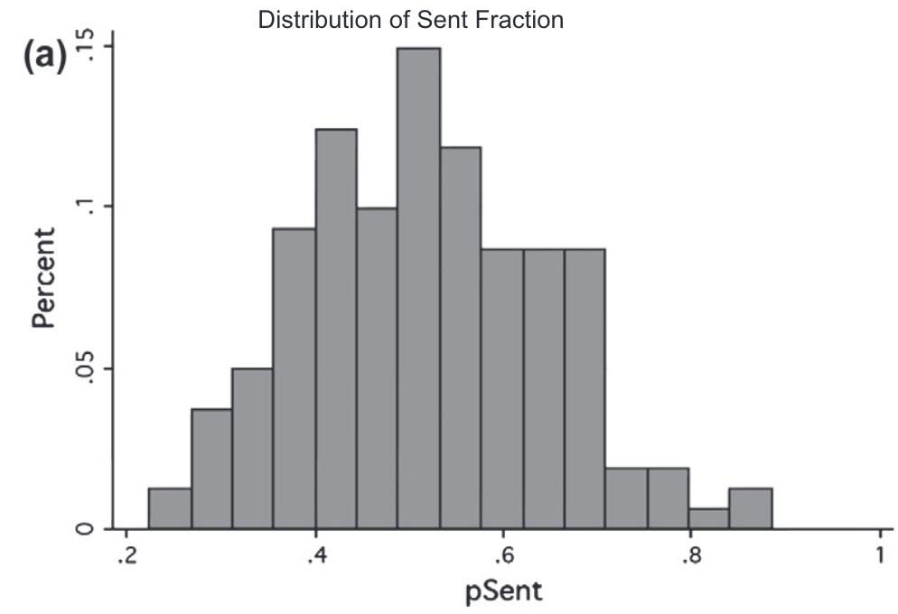

# Reciprocity

Reciprocity is the response of like for like behaviour. Kindness is responded to with kindness. Unkindness is responded to with unkindness.

Reciprocity might be considered to have two forms:

-   Instrumental reciprocity: Agents reciprocate behaviour due to the long-term benefits of sustained cooperation. The behaviour is motivated by the positive trade-off between long-term and short-term gains.

-   Intrinsic reciprocity: Agents reciprocate behaviour despite the absence of long-term gains.

## Intentions

Consider this variation of the ultimatum game.

Scenario 1:

-   A proposer has a choice between offering a split of (\$8, \$2) or (\$5, \$5).

-   Responders tend to reject offers of (\$8, \$2).

Scenario 2:

-   A proposer has a choice between offering a split of (\$8, 2) or (\$10, 0).

-   Responders tend to accept offers of (\$8, \$2).

How can (\$8, \$2) be better than (\$0, \$0) in one scenario but not in the other?

We often reject "unfair" offers.

Rejection in this case cannot be explained by distributional concerns. Rejection is sensitive to disclosure about the remaining part of the decision tree.

Responders do not base their decision on the final outcome alone. They consider the proposer's intentions and reciprocate them.

A proposer who offers \$2 instead of \$0 is seen as having good intentions. A proposer who offers \$2 instead of \$5 is seen as having bad intentions.

## The trust game

Recall the trust game.

> The trust game involves two players: a sender and a receiver
>
> Both the sender and receiver are given an initial sum $m$.
>
> The sender sends a share $x$ of their $m$ to the receiver (the investment).
>
> Before the investment is received by the receiver, it is multiplied by some factor $k$.
>
> The receiver receives $kx$.
>
> The receiver then returns to the sender some share $y$ of their total allocation $m+kx$.
>
> The final outcome is: ($m−x+y$, $m+kx−y$)

We identified that the game theoretic equilibrium was for the receiver to return nothing, so the sender sends nothing.

What happens in experimental settings?

-   Senders tend to send a positive amount, typically around half of their endowment.

-   Receivers tend to send back a bit less than is sent.

::: {#fig-trust layout-ncol="2"}
{#fig-johnson1a}

{#fig-johnson1b}

Distribution of proportion sent and proportion returned in 162 replications of the trust game [@johnson2011].
:::

Why do players do this? Possible explanations are:

-   The receiver feels that they must reciprocate the sender's investment (they are responding to their intentions). The amount returned might be considered a measure of "trustworthiness".

-   The sender trusts that due to these factors some of their investment will be repaid.

The receiver's behaviour is also consistent with altruism and inequality aversion.

## The public goods game

Recall the public goods game.

> N participants are given an initial endowment.
>
> Each secretly and simultaneously chooses how much of their endowment they wish to contribute to a public pot.
>
> The money in the public pot is multiplied by some amount $m$ and split evenly between the players.
>
> For example, players might each be given \$10, with the pot doubled.

In Nash equilibrium in the public goods game, nobody transfers anything to the pot. Any contributions are split between all players, so if there are more players than $m$ (which is normally the case by design), contributions result in a loss.

What do people do when playing the public goods game in the lab?

In a meta-analysis, @zelmer2003 found an average contribution of 38% of the endowment. This was larger the higher the marginal per capita return (i.e. the higher $m/N$)

One possible explanation is that players trust that the other players will contribute, so they desire to reciprocate the expected contributions from others.

Another explanation hinges on social norms. Where a norm of behaviour exists, people tend to follow it.
