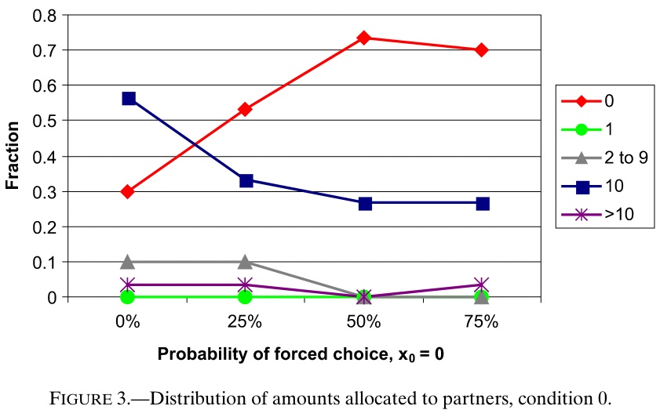

# Reputation

People care about what other people think. They fear the social stigma that can result from "selfish" behaviour.

Partly this is for strategic reasons. For example, to attract reciprocal behaviour, people may need to be aware of your intentions.

However, there is also evidence that people simply care about what other people think.

## Saving face

@andreoni2009 ran a non-anonymous dictator game.

Each dictator was endowed with \$20.

A computer then chose a distribution between the dictator and the receiver, selecting either (\$0, \$20) or (\$20, \$0) with equal probability. The dictator observes the allocation chosen by the computer, but the receiver does not.

The computer's allocation is then implemented with a probability $p$. This probability is known to both the dictator and receiver.

If the dictators choice is to be implemented, the dictator makes a split of the \$20. The receiver learns only the allocation. They do not learn the dictator's choice.

Distributional preferences predict that $p$ should not affect the dictator's choice. The dictator should just think about the situation in which their choice matters.

However, the experimental results did not conform with this prediction. Dictators condition their decision on the common knowledge of $p$.

This chart shows how offers change with $p$ where the computer will offer 0 if selected.

For high $p$ and a computer allocation of 0 to the receiver, most dictators will offer 0.

For $p$ close to 0 and a computer allocation of 0 to the receiver, the majority of dictators will offer \$10 to the receiver.

For low $p$, if the receiver receives a low allocation, they will likely infer it is due to the dictator's decision. The dictator appears to care about their reputation in the eyes of the receiver.
