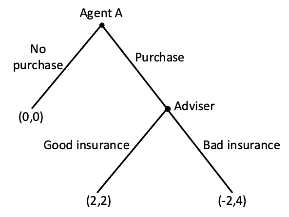
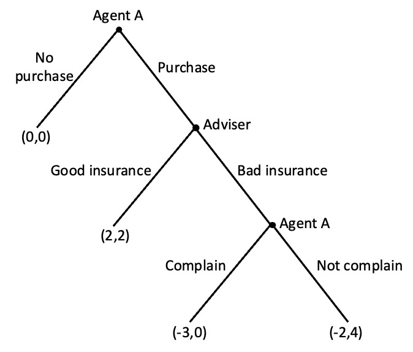
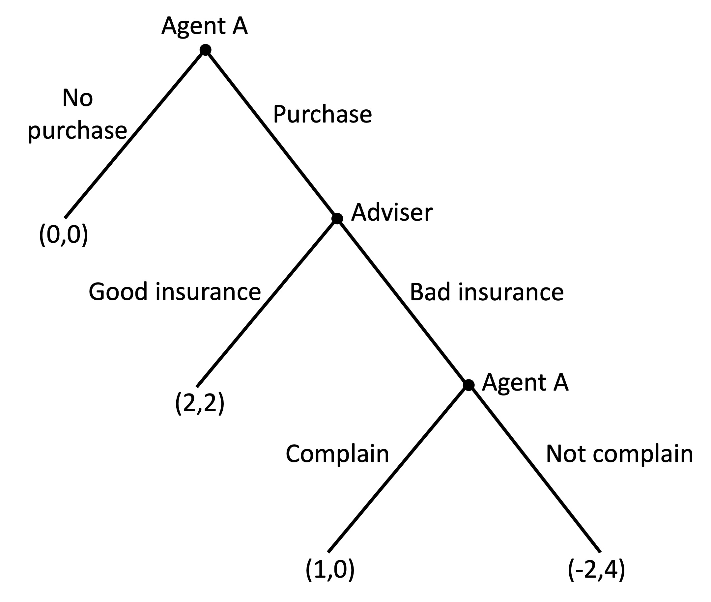

# Social preferences examples

## Advice

Agent A is going to their financial adviser to buy some life insurance. The adviser can sell them insurance that does not cover heart attacks but for which the adviser receives a huge sales commission (bad insurance). Or the adviser can sell Agent A comprehensive insurance for which their sales commission is lower (good insurance).

The payoffs $(x,y)$ for each decision are indicated in the game tree below, with $x$ being the satisfaction of Agent A and $y$ being the satisfaction of the adviser.

{width=60%}

a) Assume the adviser only cares about the payoffs indicated. What would the adviser do if Agent A chooses to purchase?

The adviser will compare payoffs of 4 for selling bad insurance and 2 for selling good insurance. They will choose to sell bad insurance.

b) What would Agent A do, anticipating the choice of the adviser?

Agent A will compare a payoff of 0 for no purchase and a payoff of -2 for purchase (knowing that they will be sold bad insurance). They will choose not to buy insurance.

c) Suppose the adviser has social preferences, with a distaste for inequality. If the payoffs $x$ for Agent A and $y$ for the adviser are unequal, the adviser experiences a dissatisfaction and their payoff becomes $y-3$. What would happen to the outcome in this case?

The adviser's payoff for selling the bad insurance is now $4-3=1$. This is less than the payoff of 2 they receive for selling good insurance. They will now sell good insurance.

Agent A now has a choice of a payoff of 0 for not purchasing insurance, and 2 for purchasing. They make the purchase.

{width=60%}

d) Suppose now that Agent A can complain to the regulator if they are sold bad insurance. If Agent A is successful, they can cancel the insurance but would suffer a cost of -3 due to the effort involved. Would this change the outcome of the game?

{width=60%}

Working by backward induction: Agent A has a choice between complaining for a payoff of -3 or not complaining for a payoff of -2. They do not complain.

The rest of the game plays out as per questions a) and b). There is no change to the outcome as they cannot commit to complain in advance (at least in this version of the game). The threat to complain is not credible.

e) Suppose Agent A has a reputation for seeking revenge and would experience satisfaction of +4 from complaining to the regulator (in addition to the effort cost of -3) as reciprocation for the action of the adviser. How would this change the outcome of the game?

{width=60%}

The agent now has a choice between a payoff of 0 for selling bad insurance (as Agent A complains and the insurance is cancelled) and 2 for selling good insurance. They sell the good insurance.

Agent A now has a choice of a payoff of 0 for not purchasing insurance and 2 for purchasing. They make the purchase.
