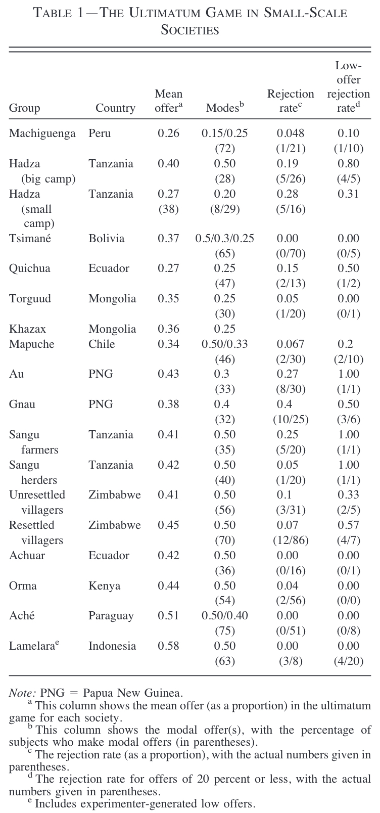
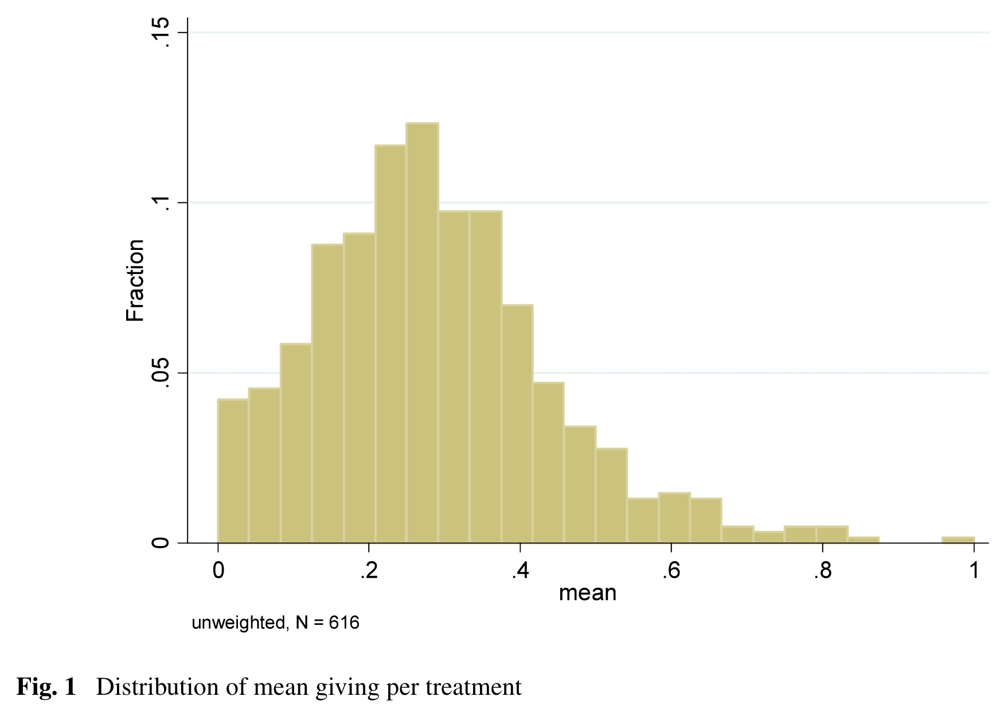

# Social preferences

People do not care solely about their own outcomes. They care about the outcomes and actions of others. These preferences are known as social preferences, or sometimes "other-regarding preferences".

In this part, I will examine the three types of social preferences: distribution, reputation, and reciprocity.

Distribution refers to how people care about the division of resources. This can be driven by either altruism, which is the desire to help others, or inequality aversion, which is concerned with the fairness of the distribution and the relative gaps between individuals.

Reputation relates to how people care about what other people think. People fear the social stigma that can result from "selfish" behaviour.

Reciprocity relates to how people care about the intentions of others and how they often respond in kind to their actions.

## Two examples

The results of the following games are evidence of social preferences.

### The ultimatum game

Recall our earlier discussion of the ultimatum game.

The ultimatum game involves two players: the proposer and the responder.

The proposer is given a fixed amount of money $m$. They then offer a portion $x$ of the sum $m$ to the responder.

The responder can either accept or reject the offer. They make this decision knowing the fixed amount $m$ held by the proposer and the offer $x$.

If the responder accepts, the responder receives the offer $x$ and the proposer gets the remainder $m-x$. If the responder rejects, both players receive nothing.

```{mermaid}
%%| fig-width: 5
%%| label: fig-ultimatum-game-2
%%| fig-cap: The ultimatum game
%%| mermaid-format: png

graph LR
    A(Proposer) ---B[Offer x] --> C(Responder)
    C ---D[Accept] --> E["(m-x, <b>x</b>)"]
    C ---F[Reject] --> G["(0, 0)"]

    classDef node fill:#FFF, stroke:#000;
    class A,C node;

    classDef edge fill:#FFF, stroke:#FFF;
    class B,D,F edge;

    classDef payoff fill:#FFF, stroke:#FFF;
    class E,G payoff;
```

Generally, if the players have monotonic preferences and the offer strategy set is discrete:

-  The responder accepts any $x>0$.

-  The proposer offers the smallest non-zero amount the proposer can offer.

The other (weak) subgame perfect Nash equilibrium is an offer of \$0 and acceptance.

What do people do in the ultimatum game?

Unlike the game theoretic predictions, proposers rarely offer the minimum amount, and responders often reject non-zero offers.

For example, @henrich2001 recruited subjects from 15 small-scale societies to play the ultimatum game. The mean offer in all societies was substantially above zero. The rejection rate was low but non-zero.



These results cannot be explained by examining only the outcomes to the individual. We need to consider their social preferences.

### The dictator game

Recall our earlier discussion of the dictator game.

In the dictator game, the dictator is given a fixed amount of money $m$. They then offer a portion $x$ of the sum $m$ to the receiver. The game then ends.

Exchange is unilateral. Receivers have an empty strategy set.

```{mermaid}
%%| fig-width: 4
%%| label: fig-dictator-game-1
%%| fig-cap: The dictator game
%%| mermaid-format: png

graph LR
    classDef default fill:#FFF
    A(Dictator) ---B[Send x] --> C["(m-x, x)"]
    style A stroke:#000
    style B stroke:#FFF
    style C stroke:#FFF
```

The standard game theory prediction is no interaction whatsoever. The dictator maximises their payoff by keeping all of the endowment themselves, receiving payoff $m$.

However, in experiments, dictators tend to give a positive sum of money. The following shows distributions reported by @engel2011. Most players offer more than zero, suggesting preferences beyond simply maximising their own payoff.

::: {#fig-dictator layout-ncol="2"}
{#fig-engel1}

{#fig-engel2}

Distribution of amount given in the dictator game [@engel2011].
:::


