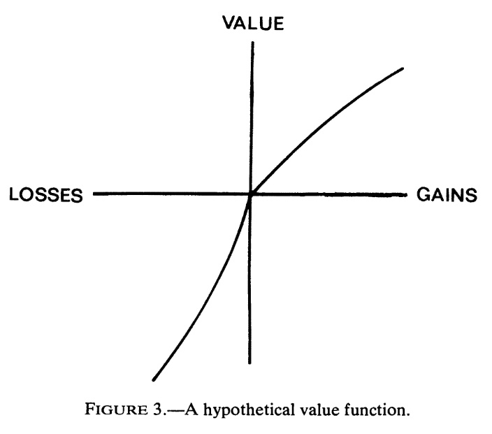

# The value function

These three phenomena: loss aversion, the reflection effect and reference dependence are reflected in the Prospect Theory value function in the following way:

1\. The value function of Prospect Theory is defined on changes in wealth or welfare, rather than on final wealth levels. In other words, gains and losses are defined relative to a reference point. The reference point can be current wealth, a social or psychological status quo, or an expectation about the outcome.

Utility from an outcome depends on distance to the relevant reference level. A multi-millionaire may not accept a 50:50 bet to win \$550, lose \$500 because they are not comparing to their total wealth but relative to the reference point of the status quo.

2\. Perceptions of both gains and losses are characterised by diminishing marginal sensitivity in either direction. Successive incremental changes have a smaller marginal impact.

This is similar to decreasing marginal utility to wealth of expected utility theory. The two differ in the baseline. In expected utility theory, the starting value is zero wealth, with increases from there decreasing in marginal utility. In prospect theory, the starting value is the reference point, with both increases and decreases having smaller marginal effect as they increase in magnitude.

3\. Losses loom larger than gains. People feel more strongly about a loss than they do an equivalent gain. They are often willing to reject gambles with a materially positive expected value.

These phenomena result in the following famous figure (from @kahneman1979) with:

1\. The Value Function defined upon the variation from a reference point

2\. A kink at the origin: losses count more than gains.

3\. Diminishing sensitivity to further changes from the reference point in both directions

